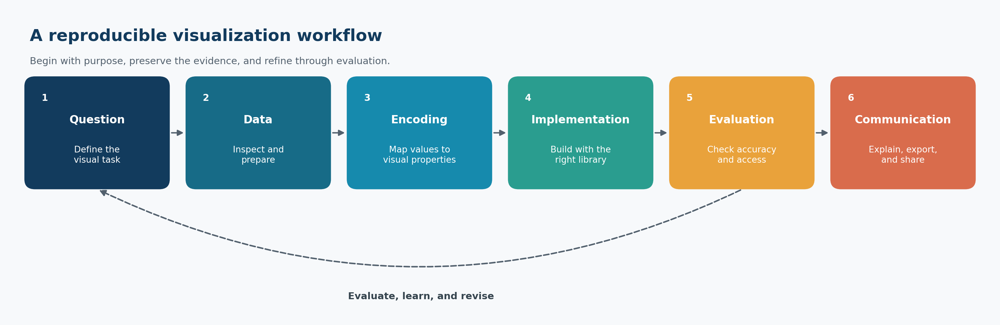

# Preface {#sec-preface}

::: {.cdi-message}
- **ID:** DVP-000
- **Type:** Guide orientation and reproducible workflow
- **Audience:** Learners, analysts, researchers, and practitioners using Python for data visualization
- **Theme:** Turning analytical questions into clear, accurate, and reproducible visual communication
:::

## Welcome

Data visualization is not simply the final decorative step in an analysis. It is a way to investigate data, test assumptions, reveal structure, communicate uncertainty, and help people make better decisions.

**Visualization with Python** develops that capability as a disciplined, reproducible practice. The guide moves from visual reasoning and chart choice to the major Python visualization libraries, then to analytical, specialized, interactive, and publication-ready graphics. Throughout the guide, the emphasis remains on the relationship between the question, the data, the visual encoding, and the intended audience.

The central principle is simple:

> A successful visualization makes the important pattern easier to see without making the evidence easier to misunderstand.

## Why this guide exists

Python offers a rich visualization ecosystem. That strength can also create confusion: several libraries can produce similar charts, each library has different abstractions, and attractive defaults do not guarantee an honest or useful result.

This guide addresses those challenges by treating visualization as a sequence of connected decisions:

1. What question should the visual answer?
2. What data structure supports that question?
3. Which visual encoding represents the values faithfully?
4. Which Python library best fits the required level of control and interaction?
5. How should the result be evaluated, refined, exported, and reproduced?

The goal is not to memorize every plotting function. It is to build transferable judgment that remains useful when datasets, audiences, and tools change.

## What you will learn

By the end of the guide, you should be able to:

- translate an analytical question into an appropriate visual task;
- choose chart forms based on data type, comparison, and audience;
- prepare tidy, plot-ready data with transparent transformations;
- construct and customize figures with Matplotlib;
- create efficient statistical graphics with Seaborn;
- apply a grammar-of-graphics approach with Plotnine;
- build interactive analytical views with Plotly;
- create declarative interactive graphics with Altair;
- visualize distributions, relationships, time, geography, networks, and uncertainty;
- design multi-panel figures, dashboards, and narrative visual sequences;
- apply accessible color, typography, annotation, and layout choices;
- identify misleading encodings and common visual failures;
- export figures reproducibly for reports, presentations, publications, and the web; and
- document the data, code, assumptions, and decisions behind a visual result.

## The visualization workflow

The guide uses a reusable workflow rather than treating plotting as an isolated command.

{#fig-visualization-workflow fig-alt="A horizontal workflow with six rounded boxes. The stages are Question, Data, Encoding, Implementation, Evaluation, and Communication, connected by arrows. A return arrow from Evaluation to Question indicates iteration." width=100%}

The workflow in @fig-visualization-workflow is iterative:

- **Question:** Define the comparison, pattern, change, relationship, or uncertainty that matters.
- **Data:** Confirm that the observations, variables, units, and transformations support the question.
- **Encoding:** Map values to position, length, color, shape, size, or other visual properties.
- **Implementation:** Use an appropriate Python library to construct the figure.
- **Evaluation:** Check accuracy, readability, accessibility, and robustness to alternative choices.
- **Communication:** Add the context, annotations, captions, and export settings required by the audience.

Evaluation often reveals that the question, data preparation, or encoding needs revision. Iteration is therefore evidence of careful work, not a failure of planning.

## How the guide is organized

### Visual foundations

The opening chapters establish visualization thinking, chart selection, environment setup, data preparation, and reproducible workflows. These foundations are deliberately library-independent: good judgment should guide the code, not follow it.

### Core visualization libraries

The next part develops practical fluency across five complementary libraries:

| Library | Primary strength | Typical use |
|---|---|---|
| Matplotlib | Detailed figure-level control | Custom static and publication figures |
| Seaborn | Concise statistical visualization | Exploratory and comparative analysis |
| Plotnine | Grammar-of-graphics composition | Layered, declarative static graphics |
| Plotly | Rich interactive graphics | Exploration, reports, and web delivery |
| Altair | Declarative encoding and interaction | Compact, composable analytical views |

The aim is not to declare one universal winner. You will learn how the libraries relate, where each is most expressive, and when a simpler tool is the better choice.

### Analytical and specialized visuals

Later chapters organize visualization around analytical tasks and data structures. They address distributions, relationships, multivariate patterns, time series, geospatial data, networks, uncertainty, and other specialized settings.

### Communication and delivery

The final part brings the pieces together through accessibility, annotation, storytelling, dashboards, export, reproducibility, and an end-to-end case study. This is where a technically correct chart becomes a defensible communication artifact.

## A shared standard for every figure

Figures in this guide are assessed against six questions.

| Criterion | Diagnostic question |
|---|---|
| Purpose | Is the question or message clear? |
| Accuracy | Do scales and encodings represent the data faithfully? |
| Readability | Can the intended audience interpret the figure efficiently? |
| Context | Are units, definitions, uncertainty, and comparisons explained? |
| Accessibility | Are color, contrast, text, and alternatives inclusive? |
| Reproducibility | Can the figure be regenerated from documented data and code? |

Visual polish matters, but it cannot compensate for a weak question, inappropriate data, or misleading encoding.

## Reproducibility conventions

Examples follow a consistent repository-first pattern:

- source data remain separate from processed data;
- transformations are performed in code rather than by undocumented manual editing;
- scripts use repository-relative paths;
- generated figures are saved under `results/figures/`;
- chapter-specific files begin with the chapter number;
- random processes use explicit seeds where applicable;
- exported graphics include deliberate dimensions and resolution; and
- prose explains why a visual choice was made, not only how it was coded.

The workflow figure in this chapter can be regenerated from the repository root with:

```bash
#| eval: false
bash scripts/bash/00-generate-visualization-workflow.sh
```

The wrapper calls `scripts/python/00-visualization-workflow.py` and writes the image used in @fig-visualization-workflow.

## Learning approach

The chapters are designed for active use. For each major technique:

1. begin with the analytical purpose;
2. inspect the structure and quality of the data;
3. build a minimal correct chart;
4. refine the encoding, scales, labels, and layout;
5. interpret what the chart reveals and what it cannot establish; and
6. save the result through a reproducible script.

When possible, change one design decision at a time. This makes the effect of a scale, color palette, aggregation, annotation, or layout choice easier to evaluate.

## What this guide assumes

The guide assumes basic familiarity with Python, tabular data, and a development environment. Prior expertise with every visualization library is not required. Readers who have completed **Data Science Foundations** will recognize the emphasis on tidy data, explicit transformations, repository structure, and reproducible analysis.

Some chapters introduce concepts from statistics, design, geography, or interactive systems. Each concept is explained to the depth required for responsible visual use, with the focus kept on practical analytical work.

## What this guide does not promise

No chart can rescue unsuitable data or answer a question the evidence does not support. A visualization can reveal association without proving causation, display model output without validating the model, and communicate uncertainty without eliminating it.

This guide therefore does not treat visualization as proof by appearance. Interpretations must remain consistent with the study design, measurement process, analytical method, and limitations of the data.

## A note on responsible visualization

Visual decisions affect what audiences notice, compare, and remember. Truncated axes, inconsistent scales, inappropriate aggregation, selective time windows, overloaded color, and missing uncertainty can distort interpretation even when every plotted number is technically correct.

Responsible visualization requires three commitments:

- **show the evidence faithfully;**
- **make important limitations visible;** and
- **design for the audience without manipulating the audience.**

These commitments apply to exploratory notebooks, scientific figures, executive dashboards, public graphics, and every format in between.

## Repository conventions

The examples use the following general structure:

```text
.
├── data/
│   ├── raw/
│   ├── processed/
│   └── reference/
├── scripts/
│   ├── bash/
│   └── python/
├── results/
│   └── figures/
├── library/
│   └── references.bib
├── notebooks/
├── docs/
└── 00-preface.qmd
```

Individual chapters may use only a subset of these directories. Generated artifacts should never replace the scripts and source data required to reproduce them.

## Before continuing

Confirm that you can:

- open the repository in your editor;
- activate the repository-specific `.venv` environment;
- run Python from the repository root;
- render a Quarto chapter; and
- locate generated outputs under `results/`.

The environment and reproducibility workflow are developed in detail in the setup chapter. If the repository has just been scaffolded, it is acceptable to read this preface first and complete the technical setup next.

## Closing perspective

Visualization sits between analysis and human understanding. Code produces the marks, but judgment determines whether those marks form an honest and useful explanation.

The chapters ahead develop both sides of that practice: the technical fluency to build a wide range of visuals and the analytical discipline to decide what should be built. The objective is not merely to create charts with Python. It is to create visual evidence that can be examined, reproduced, and trusted.

## Chapter checklist

- [ ] I can explain why visualization is part of analysis, not only presentation.
- [ ] I understand the six-stage visualization workflow.
- [ ] I recognize the complementary roles of the core Python visualization libraries.
- [ ] I know the criteria used to evaluate figures in this guide.
- [ ] I understand the repository and reproducibility conventions.
- [ ] I am ready to begin with visual thinking and chart choice.

