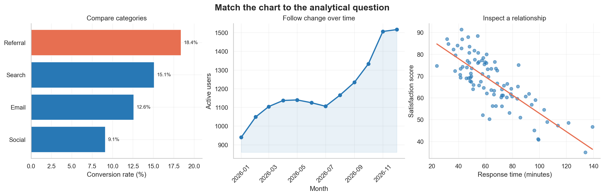

# Visualization Thinking and Chart Choice {#sec-visualization-thinking-chart-choice}

::: cdi-message
- **ID:** DVP-001
- **Type:** Conceptual and practical chapter
- **Audience:** Analysts, researchers, data scientists, and technical communicators
- **Theme:** Start with the decision and analytical question, then choose the visual form
:::

## Learning objectives

By the end of this chapter, you will be able to:

1. translate a broad communication goal into a precise analytical question;
2. identify the data relationships that a chart must reveal;
3. choose defensible chart families for comparison, change, distribution, relationship, composition, and spatial questions;
4. separate exploratory visualization from explanatory communication;
5. recognize common chart-choice failures and repair them; and
6. apply a repeatable chart-selection workflow before writing plotting code.

## Visualization begins before plotting

Data visualization is not the act of adding a chart to a report. It is the process of turning data into a visible argument that a reader can inspect. The plotting library matters, but it comes late in the reasoning sequence.

A useful visual starts with four questions:

1. **Who will use it?**
2. **What do they need to understand or decide?**
3. **Which data relationship supplies the evidence?**
4. **Which visual encoding makes that relationship easiest to judge?**

This ordering protects a project from a familiar failure: choosing a visually attractive chart first and then forcing the data into it. A chart is successful when its structure matches the question, its encodings support accurate comparison, and its annotations make the intended reading clear without hiding uncertainty.

::: callout-tip
## The chart is not the question

“Create a dashboard” or “make a scatter plot” specifies an output. “Which services have the longest delays, and are those delays improving?” specifies an analytical question. Start with the latter.
:::

## From decision to visual task

An effective visualization can be planned as a chain of reasoning:

> **Decision context → audience question → analytical task → data relationship → visual encoding → chart form**

Suppose a programme manager asks, “How are our clinics performing?” The request is too broad to determine a chart. It might mean:

- compare current waiting times across clinics;
- show whether waiting time has changed over the past year;
- examine whether staffing and waiting time are related;
- display the distribution of waiting times within each clinic; or
- identify clinics whose performance falls outside a target.

Each formulation produces a different visual task. Refining the question is therefore part of visualization work, not a preliminary administrative step.

### Write the intended takeaway

Before choosing a chart, complete this sentence:

> After viewing this figure, the audience should understand that **_____**.

For exploration, the blank may be tentative: “some clinics may have unusually variable waiting times.” For explanation, it should be evidence-based and specific: “Clinic C has the highest median waiting time and the widest variation.”

If the sentence contains several unrelated claims, the figure may be trying to do too much. Split it into a sequence of focused views.

## The six core analytical questions

Most everyday chart choices can be organized around six analytical questions. The categories overlap, but they provide a reliable starting point.

| Analytical question | What the reader must judge | Strong starting choices | Frequent mistake |
|---|---|---|---|
| **Comparison** | Which value is larger, smaller, highest, or lowest? | Ordered bar, dot, or lollipop chart | Using area or angle when length would be clearer |
| **Change over time** | What is the direction, pace, or pattern of change? | Line, step, or slope chart | Treating dates as unordered categories |
| **Distribution** | What values are typical, unusual, concentrated, or variable? | Histogram, density, box, violin, ECDF, or strip plot | Showing only a mean and hiding spread |
| **Relationship** | How do two or more variables move together? | Scatter, bubble, heatmap, or connected scatter plot | Suggesting causation from association |
| **Composition** | How is a total divided, and how does that division change? | Stacked bar, 100% stacked bar, or small multiples | Comparing many pie slices across groups |
| **Spatial pattern** | Where are values or events located? | Symbol, choropleth, flow, or density map | Mapping data merely because a location field exists |

### Comparison

Comparison asks readers to judge magnitudes across categories, groups, conditions, or periods. Position and length along a common scale usually support that judgment well.

Use an **ordered horizontal bar chart** when category labels are long or ranking matters. Use a **dot plot** when a lighter display is desirable or when several series share the same categories. Use a **slope chart** when the central question is how a modest number of entities changed between two points.

Useful design decisions include:

- sort values when rank is meaningful;
- retain a meaningful category order when sequence matters;
- start bar-chart axes at zero because bar length encodes magnitude;
- highlight only the categories that support the intended comparison; and
- show direct labels when exact values matter.

### Change over time

Time-series charts preserve temporal order and reveal direction, turning points, cycles, and unusual events. A line chart is a strong default for continuous observations over time because adjacent points are understood as a sequence.

Use:

- a **line chart** for trends across many ordered periods;
- a **step chart** when values change at discrete moments and remain constant between them;
- a **column chart** for discrete period totals, especially with few periods;
- a **slope chart** for before-and-after comparisons; and
- **small multiples** when many series would overlap in a single panel.

Do not automatically connect observations when measurements are sparse or when the intervals have no meaningful continuity. Also check whether unequal time intervals are represented honestly.

### Distribution

A distribution describes more than a typical value. It reveals spread, skewness, clusters, gaps, and extreme observations.

- **Histogram:** communicates counts or proportions within bins; bin width changes the visible pattern.
- **Density plot:** provides a smoothed shape; bandwidth controls the amount of smoothing.
- **Box plot:** summarizes median, quartiles, and potential outliers compactly.
- **Violin plot:** combines distribution shape with group comparison but needs sufficient observations.
- **ECDF:** shows the proportion of observations at or below each value without selecting bins.
- **Strip or swarm plot:** shows individual observations and is especially valuable for small samples.

Whenever possible, pair a summary with the underlying observations. Two groups can share the same mean and have radically different distributions.

### Relationship

A scatter plot uses position on two quantitative axes to reveal association, clusters, nonlinear patterns, and unusual observations. It is often the first view for two continuous variables.

Before interpreting the pattern, ask:

- Could a third variable explain the association?
- Does overplotting hide dense regions?
- Is the relationship nonlinear?
- Are a few influential points driving the pattern?
- Does the visible pattern remain within meaningful subgroups?

Transparency, smaller markers, jitter, binning, faceting, or density contours can reduce overplotting. A fitted line may summarize a pattern, but it does not establish causality.

### Composition

Composition focuses on part-to-whole structure. A stacked bar works when both totals and components matter. A 100% stacked bar emphasizes proportional composition while intentionally removing total magnitude.

Pie and donut charts can communicate a simple part-to-whole message with very few, clearly different categories. They become difficult to compare when slices are numerous, similar in size, repeated across panels, or dependent on precise judgments. In those cases, bars provide a shared baseline and are usually more effective.

### Spatial pattern

Maps answer questions where location is analytically meaningful. A choropleth shades geographic areas and is appropriate for normalized values such as rates or percentages—not raw counts that mostly reflect population size or area. Proportional-symbol maps can show magnitude at specific locations, while flow maps show movement between places.

Every map requires attention to:

- the geographic unit and boundary definitions;
- the coordinate reference system and projection;
- missing or suppressed regions;
- classification thresholds and colour scale;
- normalization by population, area, or another exposure; and
- whether a non-spatial chart would support comparison more accurately.

::: callout-warning
## A map is not automatically the best view of geographic data

If the question is “Which region has the highest rate?”, an ordered bar chart may be easier to read. Use a map when spatial neighbourhood, proximity, or regional pattern is part of the question.
:::

## Match variables to encodings

Chart choice depends on variable type as well as analytical task.

| Variable type | Examples | Appropriate visual roles |
|---|---|---|
| Nominal | district, species, product | position by category, colour, shape, facets |
| Ordinal | low/medium/high, stage I–IV | ordered position, ordered colour lightness |
| Quantitative | age, revenue, temperature | position on a numeric scale, length, size, colour intensity |
| Temporal | date, month, duration | ordered position, intervals, animation when justified |
| Spatial | longitude, region, route | map position, geographic area, connection |

Visual channels do not support equally accurate judgments. Position on a shared scale generally enables more precise comparison than length, angle, area, volume, or colour intensity. This is why a dot plot often makes small differences easier to judge than a bubble chart and why bars usually outperform repeated pie charts for comparisons.

Choose encodings intentionally:

- use **position** for the most important quantitative comparison;
- use **length** when magnitude begins at a meaningful baseline;
- use **colour hue** primarily to distinguish categories;
- use **colour lightness or saturation** for ordered magnitude;
- use **area** cautiously because readers compare it less precisely;
- use **shape** for a small number of categorical distinctions; and
- avoid encoding critical information only through colour.

## One dataset, three different questions

The figure below demonstrates that chart form follows the question. The examples use synthetic data generated with a fixed random seed.

{#fig-chart-choice-workbench fig-alt="Three panels demonstrate chart choice: ordered bars for comparison, a line for time, and a scatter plot with a trend line for relationship." width=100%}

The categories, time series, and observations are different because each panel represents a distinct analytical structure. The point is not to memorize one chart for every situation. It is to recognize what the audience needs to compare and select encodings that make that comparison direct.

The figure is generated by:

```bash
python scripts/python/01-chart-choice-workbench.py
```

The script saves @fig-chart-choice-workbench to `results/figures/` and does not require external data.

## Exploratory and explanatory visualization

Exploratory and explanatory graphics share visual principles but serve different stages of analysis.

| Dimension | Exploratory visualization | Explanatory visualization |
|---|---|---|
| Primary purpose | Discover patterns and test questions | Communicate a supported finding |
| Audience | Analyst or close collaborators | A defined external audience |
| Number of views | Often many and disposable | Usually few and carefully selected |
| Annotation | Minimal while iterating | Clear title, context, labels, and takeaway |
| Complexity | Can expose many variables at once | Removes detail that does not serve the message |
| Uncertainty | Investigated and diagnosed | Communicated in audience-appropriate form |

During exploration, generate several views, change scales, inspect subgroups, and look for data-quality problems. The objective is not polish; it is understanding. During explanation, choose the view that best represents the evidence, remove distractions, and add the context needed for correct interpretation.

Do not publish an exploratory chart unchanged merely because it revealed the finding. Rebuild it for the audience and verify that the explanatory version still represents the evidence faithfully.

## A practical chart-selection workflow

Use the following workflow before plotting.

### 1. Define the audience and decision

Identify the reader's knowledge, constraints, and intended action. A technical diagnostic plot for a modelling team may be inappropriate for a public programme report even when both use the same data.

### 2. Formulate one primary question

Replace broad requests with a testable question. Prefer “How did monthly retention change after the intervention?” over “Show retention.”

### 3. Identify the analytical task

Classify the main task as comparison, time, distribution, relationship, composition, spatial pattern, or a carefully defined combination.

### 4. Audit the variables

For every variable, record:

- semantic meaning and unit;
- data type and valid range;
- missingness and suppression rules;
- level of aggregation;
- sample size and grouping structure; and
- whether transformation or normalization is required.

### 5. Choose the simplest viable chart family

Start from a dependable form rather than an exotic one. Complexity is justified only when it reveals an important structure that a simpler chart cannot show.

### 6. Assign visual channels by importance

Place the most important comparison on the strongest available channel, usually position on a common scale. Reserve colour and annotation for grouping, emphasis, or context.

### 7. Make a rough version

Create the smallest plot that allows you to assess whether the form works. At this point, inspect scales, ordering, overlap, missing values, and subgroup patterns.

### 8. Stress-test the interpretation

Ask what else could explain the visible pattern. Try alternative denominators, scales, bin widths, time windows, and groupings. Check whether the main conclusion depends on one design choice.

### 9. Add explanatory structure

Use an informative title, clear units, direct labels, source or method notes, uncertainty displays, and selective emphasis. An annotation should guide attention without replacing evidence.

### 10. Test accessibility and reproducibility

Confirm that the figure remains understandable in grayscale or with common colour-vision differences, that text is legible, and that the chart can be regenerated from code and documented inputs.

## Common chart-choice failures

### Choosing by software menu

Tool menus encourage selection by chart name. Repair this by writing the question and analytical task before opening the plotting interface.

### Showing every variable

Adding variables often produces competing encodings, crowded legends, and unclear priorities. Repair this by identifying the primary comparison and moving secondary questions into facets or separate views.

### Using a dual axis without a defensible scale relationship

Two vertical axes can make unrelated series appear correlated because either scale can be adjusted. Prefer aligned panels with a shared time axis, indexed values, or a direct analysis of the relationship.

### Truncating a bar-chart axis

Because bar length represents value, a nonzero baseline exaggerates differences. Use a zero baseline for bars. If change around a reference is the real question, consider dots or a line with a clearly labelled scale.

### Hiding the distribution

A bar of means can conceal skewness, multimodality, sample size, and outliers. Add intervals and observations, or use a distribution-focused chart.

### Encoding magnitude with area or three-dimensional volume

Decorative bubbles and 3D shapes make exact comparison difficult and can introduce perspective distortion. Prefer position or length on a common scale.

### Treating correlation as causation

A fitted trend line summarizes association. It does not prove that the horizontal variable caused the vertical variable to change. Use careful language and incorporate study design, temporal order, confounding, and uncertainty.

### Using a rainbow colour scale

Rainbow scales contain abrupt perceptual transitions, lack a clear magnitude order, and can be inaccessible. Use a perceptually ordered sequential scale, a diverging scale around a meaningful midpoint, or distinct categorical hues as appropriate.

### Overloading a single figure

A chart can be technically correct and still fail because it contains too many messages. Use a figure sequence or small multiples when the audience must reason through several related comparisons.

## Evaluation checklist

Before accepting a chart, ask:

### Question and audience

- Is the intended audience defined?
- Does the figure answer one primary analytical question?
- Is the expected takeaway supported by the data?

### Data and transformation

- Are units, denominators, filters, and aggregation levels correct?
- Are missing values and sample sizes handled transparently?
- Are transformations and statistical summaries defensible?

### Encoding and form

- Does the chart family match the analytical task?
- Is the most important comparison placed on a strong visual channel?
- Are ordering, axes, scales, and baselines appropriate?

### Communication

- Does the title state the topic or finding precisely?
- Can labels replace unnecessary legend lookups?
- Are uncertainty and limitations visible where they matter?
- Does colour carry meaning rather than decoration?

### Accessibility and reproducibility

- Is the figure readable at its final display size?
- Is information available without relying only on colour?
- Does useful alternative text describe the chart's message?
- Can the complete output be regenerated from documented code and inputs?

## Practice: choose before you code

For each scenario, identify the primary task and a strong starting chart.

1. A hospital team wants to compare the distribution of patient waiting times across four departments.
2. A product team wants to show monthly retention for three user cohorts.
3. A researcher wants to examine the association between dose and response, while distinguishing treatment groups.
4. A policy team wants to compare the share of the annual budget allocated to five programmes across three years.
5. A public-health analyst wants to identify geographic clusters of incidence after adjusting for population.

Suggested starting points:

1. box or violin plots with individual observations;
2. cohort-specific lines or small multiples;
3. a scatter plot with treatment encoded by colour or facets;
4. 100% stacked bars if shares are primary, or grouped dots if precise programme comparisons are primary; and
5. a choropleth or spatial-rate map, supported by an ordered non-spatial comparison.

Different answers can be defensible. The important requirement is that the chart supports the intended judgment and preserves the meaning of the data.

## Chapter summary

Chart choice is a reasoning problem before it is a coding problem. Begin with the audience and decision, refine the analytical question, identify the data relationship, and assign the most important comparison to an effective visual channel. Comparison, change, distribution, relationship, composition, and spatial pattern provide a practical set of starting tasks. Exploration helps discover the evidence; explanation reshapes the strongest evidence for a defined audience. A reliable workflow makes these choices explicit, testable, accessible, and reproducible.

## Reproducibility note

This chapter's figure is produced by `scripts/python/01-chart-choice-workbench.py` with a fixed NumPy random seed. The script writes only the chapter-specific PNG under `results/figures/`, allowing the visual to be regenerated without changing other repository files.
