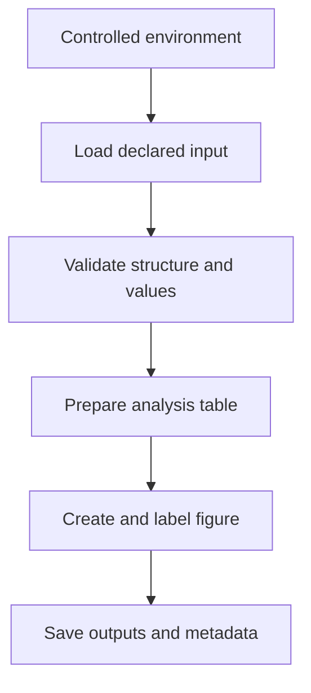
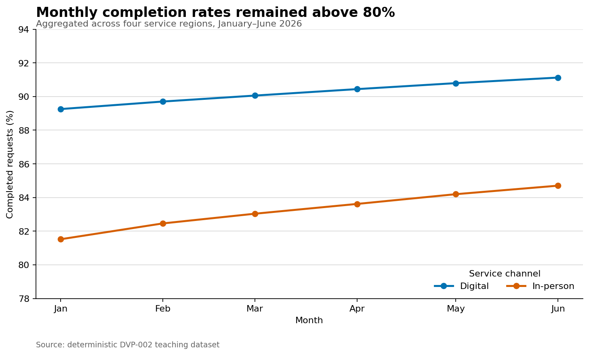

# Environment, Data, and Reproducible Workflows {#sec-environment-data-workflows}

:::cdi-message
- **ID:** DVP-002
- **Type:** Core lesson and guided practical
- **Audience:** Data practitioners building reproducible Python visualizations
- **Theme:** Creating a dependable path from source data to an auditable figure
:::

A chart is reproducible when another person—or your future self—can rebuild it from the same inputs and understand the decisions that shaped it. That standard depends on more than plotting syntax. It requires a controlled environment, clearly located data, explicit transformations, validation checks, stable output paths, and enough metadata to trace the result.

This chapter establishes that workflow before the guide turns to individual visualization libraries. The practical uses a small, deterministic dataset of monthly service indicators. The subject is intentionally simple so that the focus remains on project structure and figure production.

## Learning objectives

By the end of this chapter, you will be able to:

- create and activate a repository-specific Python environment;
- organize source data, scripts, results, and figures by responsibility;
- load tabular data with explicit expectations about types and grain;
- validate a dataset before plotting it;
- separate data preparation from visual encoding;
- save figures with stable dimensions, resolution, and filenames;
- record enough metadata to reproduce an output; and
- run an end-to-end visualization workflow from one command.

## Why the workflow matters {#sec-why-reproducibility-matters}

An attractive chart can still be analytically weak. Common failures occur upstream of the plotting call:

- a script reads a different file on another computer;
- a category changes spelling and silently becomes a new group;
- a date column remains text and sorts incorrectly;
- missing values disappear without being counted;
- a notebook depends on cells executed out of order;
- an output is overwritten with no record of the inputs; or
- a figure uses defaults that change across library versions.

Reproducibility reduces these risks by making the path from input to output explicit:



Each stage has a different responsibility. Keeping those responsibilities visible makes failures easier to diagnose and results easier to review.

## Create a repository-specific environment {#sec-python-environment}

A virtual environment isolates a project's Python packages from system Python and from unrelated projects. From the repository root, create one with:

```bash
python3 -m venv .venv
source .venv/bin/activate
python -m pip install --upgrade pip
python -m pip install -r requirements.txt
```

On Windows PowerShell, activate it with:

```powershell
.venv\Scripts\Activate.ps1
```

Use `python -m pip` rather than a bare `pip` when you want to make the interpreter-package relationship explicit. Confirm the active interpreter:

```bash
python -c "import sys; print(sys.executable)"
```

The printed path should point inside `.venv`. Do not commit the environment directory; commit the dependency declaration instead. A minimal visualization stack for this guide includes NumPy, pandas, Matplotlib, Seaborn, Plotnine, Plotly, Altair, Jupyter, and supporting renderers. Exact versions may be pinned in a lock file when byte-for-byte environment reconstruction is required.

## Organize files by responsibility {#sec-project-layout}

A predictable repository structure removes path guesswork:

```text
.
├── 02-environment-data-and-reproducible-workflows.qmd
├── data/
│   ├── raw/
│   └── processed/
├── results/
│   ├── figures/
│   └── 02-reproducible-workflow/
└── scripts/
    ├── bash/
    └── python/
```

The distinction between `data/raw/` and `data/processed/` is important. Raw data should remain unchanged after acquisition. Cleaning, type conversion, filtering, and aggregation produce processed data that can be recreated from the raw source. Scripts hold the procedure; `results/` holds derived artifacts.

All chapter scripts resolve paths from the repository root rather than from a user's home directory. Avoid absolute paths such as `/Users/name/project/data.csv`: they encode one computer into the analysis.

## Treat data as an analytical contract {#sec-data-contract}

Before plotting, state what one row represents. In the practical dataset, one row represents one **region-month-service combination**. This grain determines which comparisons and aggregations are valid.

The input contains:

| Column | Expected type | Meaning | Validation rule |
|---|---|---|---|
| `month` | date | First day of reporting month | Parseable and within 2026 |
| `region` | category | Reporting region | One of four declared regions |
| `service` | category | Service channel | `Digital` or `In-person` |
| `requests` | integer | Requests received | Positive |
| `completed` | integer | Requests completed | Between zero and `requests` |
| `median_wait_minutes` | numeric | Median waiting time | Non-negative |

This is a lightweight **data contract**: a set of expectations that the script can test. It turns assumptions into executable checks.

## Load data with explicit types {#sec-load-data-explicitly}

pandas can parse dates while reading a CSV:

```python
from pathlib import Path
import pandas as pd

project_root = Path(__file__).resolve().parents[2]
input_path = project_root / "data" / "raw" / "02-service-indicators.csv"

indicators = pd.read_csv(
    input_path,
    parse_dates=["month"],
    dtype={"region": "string", "service": "string"},
)
```

The `Path` construction is portable across operating systems. Declared parsing also prevents a date column from remaining an arbitrary string.

Immediately inspect the structure:

```python
print(indicators.shape)
print(indicators.dtypes)
print(indicators.head())
```

These checks are exploratory. Reusable workflows should add assertions that stop execution when a contract is violated.

## Validate before visualizing {#sec-validate-before-plotting}

Validation should cover structure, identity, missingness, domains, and logical relationships:

```python
required = {
    "month", "region", "service", "requests",
    "completed", "median_wait_minutes",
}
assert required.issubset(indicators.columns)
assert not indicators[list(required)].isna().any().any()
assert not indicators.duplicated(["month", "region", "service"]).any()
assert indicators["region"].isin(
    ["Central", "Coastal", "Lake", "Northern"]
).all()
assert indicators["service"].isin(["Digital", "In-person"]).all()
assert (indicators["requests"] > 0).all()
assert indicators["completed"].between(0, indicators["requests"]).all()
assert (indicators["median_wait_minutes"] >= 0).all()
```

Assertions are appropriate here because a violation means the chapter workflow should not continue. In a production pipeline, replace bare assertions with informative exceptions or a formal validation framework.

### Profile missingness

Even when critical columns are complete, recording missingness is useful:

```python
missingness = (
    indicators.isna()
    .sum()
    .rename("missing_count")
    .to_frame()
    .assign(missing_percent=lambda x: 100 * x["missing_count"] / len(indicators))
)
```

A missing-value profile distinguishes “no missing data observed” from “missing data never checked.”

## Prepare a plotting table {#sec-prepare-plotting-table}

Keep transformations separate from rendering. The practical derives a completion rate and aggregates it by month and service channel:

```python
plot_data = (
    indicators.assign(
        completion_rate=lambda x: 100 * x["completed"] / x["requests"]
    )
    .groupby(["month", "service"], as_index=False, observed=True)
    .agg(
        requests=("requests", "sum"),
        completed=("completed", "sum"),
    )
    .assign(completion_rate=lambda x: 100 * x["completed"] / x["requests"])
    .sort_values(["service", "month"])
)
```

The rate is recalculated from summed counts rather than averaged across regions. That weighted calculation respects differences in request volume.

Saving `plot_data` as CSV creates an auditable bridge between the raw input and the figure. A reviewer can inspect the exact values plotted without reverse-engineering graphical marks.

## Create a deterministic figure {#sec-create-deterministic-figure}

Matplotlib's object-oriented interface makes figure ownership explicit:

```python
import matplotlib.pyplot as plt

fig, ax = plt.subplots(figsize=(9, 5.4), constrained_layout=True)

for service, group in plot_data.groupby("service", sort=True):
    ax.plot(
        group["month"],
        group["completion_rate"],
        marker="o",
        linewidth=2.2,
        label=service,
    )

ax.set(
    title="Monthly completion rates remained above 80%",
    xlabel="Month",
    ylabel="Completed requests (%)",
)
ax.legend(title="Service channel", frameon=False)
ax.grid(axis="y", alpha=0.25)
```

The full script also fixes colors, date formatting, the visible y-range, font sizes, output dimensions, and resolution. Explicit choices reduce accidental variation and make the visual contract reviewable.

Save through the figure object:

```python
figure_path = project_root / "results" / "figures" / "02-monthly-completion-rate.png"
fig.savefig(figure_path, dpi=160, bbox_inches="tight", facecolor="white")
plt.close(fig)
```

Closing the figure releases memory during batch generation. A white face color prevents unexpected transparency when the image is embedded in different themes.

{#fig-monthly-completion-rate fig-alt="Line chart showing monthly completion percentages for Digital and In-person services from January through June 2026. Both remain above 80 percent, with Digital consistently higher."}

## Record provenance {#sec-record-provenance}

A figure file does not explain how it was produced. The practical writes a JSON manifest containing:

- the script and input filenames;
- the number of source and plotting rows;
- the reporting period;
- a SHA-256 checksum of the input file;
- the Python, pandas, and Matplotlib versions; and
- the generated output paths.

The checksum identifies the exact input bytes. If the CSV changes, its checksum changes even when the filename does not.

Provenance is not a substitute for version control. Together, however, versioned code, declared dependencies, immutable raw data, and a generated manifest provide a strong audit trail.

## Run the complete chapter workflow {#sec-run-chapter-workflow}

From the repository root:

```bash
bash scripts/bash/02-run-reproducible-workflow.sh
```

The wrapper selects the repository's `.venv/bin/python` when available and otherwise uses `python3`. It creates missing output directories, validates the source data, writes the analysis table and profiles, generates the figure, and records provenance.

Expected output:

```text
Validated 48 rows at grain: region-month-service.
Saved plotting data: results/02-reproducible-workflow/02-monthly-completion-rate.csv
Saved data profile: results/02-reproducible-workflow/02-data-profile.csv
Saved figure: results/figures/02-monthly-completion-rate.png
Saved manifest: results/02-reproducible-workflow/02-run-manifest.json
All validation checks passed.
```

The workflow is **idempotent**: rerunning it with the same input produces the same analytical values and replaces only its declared derived outputs.

## Reproducibility checklist {#sec-reproducibility-checklist}

Before publishing a visualization, verify that:

- the active interpreter belongs to the intended environment;
- dependencies are declared in a tracked file;
- source data has a stable, repository-relative path;
- raw data is not modified in place;
- row grain and required columns are documented;
- missingness, duplicates, categories, ranges, and relationships are checked;
- the plotting table is created by code rather than manual editing;
- colors, dimensions, resolution, labels, and sort order are explicit;
- the figure includes useful alternative text in the Quarto source;
- derived data and the figure use stable output paths; and
- provenance connects the output to its input, code, and environment.

## Common mistakes {#sec-workflow-common-mistakes}

### Depending on the working directory

`pd.read_csv("data.csv")` succeeds only when execution starts in the expected directory. Resolve paths from a known project root.

### Editing raw data manually

Manual corrections are difficult to audit and repeat. Encode corrections in a script and write a processed copy.

### Plotting before validating

A plotting library may accept duplicate, missing, or mistyped values and still produce a plausible image. Validate first.

### Averaging rates without their denominators

An unweighted mean gives small and large groups equal influence. Aggregate numerators and denominators, then calculate the combined rate.

### Relying on global plotting state

The object-oriented interface—`fig, ax = plt.subplots()`—makes it clear which figure receives each change and which object is saved.

### Saving only the image

Retain the plotting table and a small manifest when traceability matters. The image alone is a weak analytical record.

## Exercises {#sec-workflow-exercises}

1. Add an assertion that every month contains all eight region-service combinations.
2. Extend the data profile with minimum, median, and maximum waiting times.
3. Produce a second figure showing monthly median waiting time by service channel.
4. Change one input value, rerun the workflow, and confirm that the manifest checksum changes.
5. Add SVG output beside the PNG and explain when a vector format is preferable.
6. Introduce a duplicate row in a temporary copy of the CSV and confirm that validation stops the workflow.
7. Explain why the processed plotting table is derived data rather than raw data.

## Chapter summary

Reproducible visualization is a system, not a final plotting call. A controlled environment, stable project structure, explicit data contract, automated validation, separate plotting table, deterministic rendering, and recorded provenance turn a chart into a rebuildable analytical artifact. These practices provide the foundation for the Matplotlib, Seaborn, Plotnine, Plotly, and Altair workflows developed in the chapters ahead.
