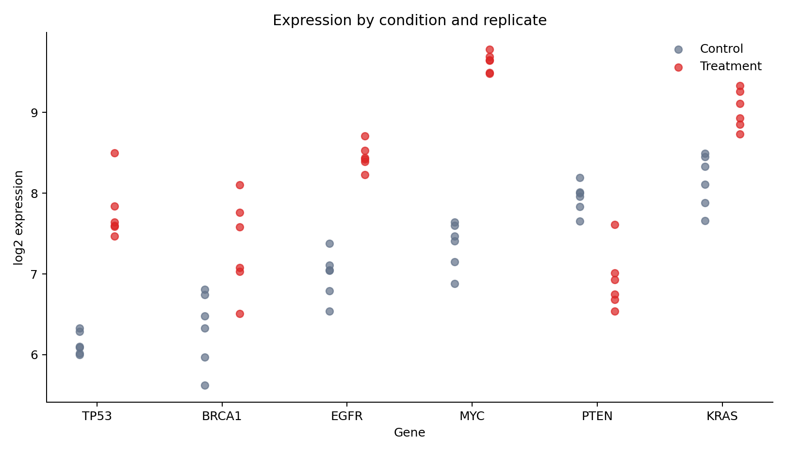
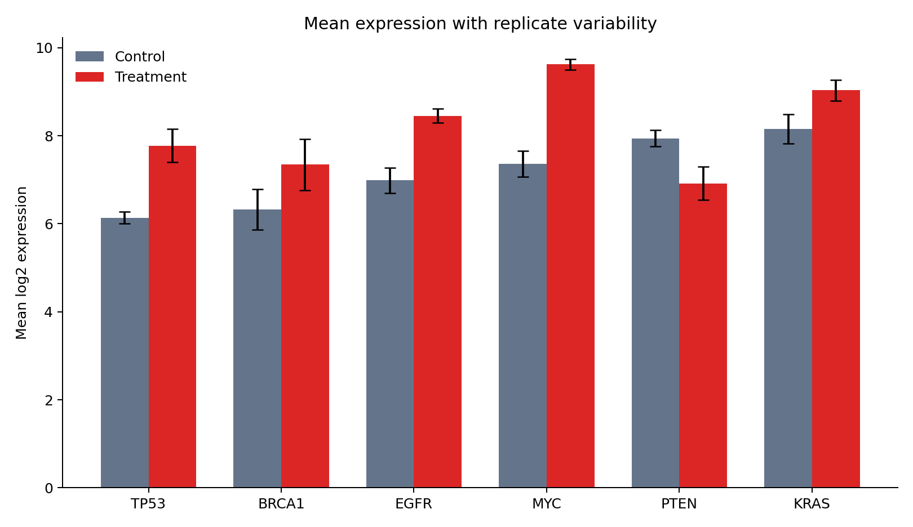

# Matplotlib Foundations {#sec-matplotlib-foundations}

::: {.cdi-message}
- **ID:** DVP-L03
- **Type:** Core visualization
- **Audience:** Beginner / Intermediate
- **Theme:** Precise, composable static graphics
:::

Matplotlib is Python's foundational plotting library. Its real strength is not a gallery of chart types, but an explicit object model that gives you control over layout, scales, annotations, and export. This chapter uses a reproducible gene-expression dataset to build figures that remain readable in notebooks, reports, and publications.

## Learning objectives

By the end of this chapter, you should be able to:

- distinguish a `Figure` from an `Axes`;
- draw lines, points, bars, and uncertainty marks;
- control labels, ticks, scales, legends, and panels;
- annotate evidence without cluttering the display;
- define a reusable visual style; and
- export deterministic PNG, SVG, and PDF figures.

## The figure–axes model

A `Figure` is the complete canvas. An `Axes` is one plotting region inside it.

```python
import matplotlib.pyplot as plt

fig, ax = plt.subplots(figsize=(8, 5))
ax.set_title("A deliberate plotting surface")
```

Use the object-oriented interface (`ax.plot`, `ax.scatter`, and `ax.set`) in reusable work. It makes the target of each instruction explicit and scales naturally to multi-panel layouts.

## Prepare the data

The generator creates 72 observations: six genes, two conditions, and six replicates.

```python
import pandas as pd

expression = pd.read_csv("data/processed/03-gene-expression.csv")
expression.groupby(["gene", "condition"]).log2_expression.agg(["mean", "std"])
```

Each point is a biological replicate. Keeping these points visible prevents a mean bar from hiding within-group variation.

## Encode observations with marks

Choose marks according to the analytical question:

| Mark | Best use | Main caution |
|---|---|---|
| point | individual observations | overplotting |
| line | ordered change | implies continuity |
| bar | magnitude from a baseline | normally requires zero |
| area | cumulative magnitude | comparison can be difficult |

The replicate view uses position for gene and expression, color for condition, and slight horizontal displacement to reduce overlap.

{#fig-matplotlib-replicates fig-alt="Points show log2 expression for six genes under control and treatment conditions."}

## Summaries and uncertainty

A summary should state what its uncertainty mark represents. Here the bar height is the mean and the error bar is one sample standard deviation—not a confidence interval.

{#fig-matplotlib-summary fig-alt="Grouped bars compare mean gene expression, with error bars showing replicate standard deviations."}

Use raw observations whenever practical. Add summaries to clarify a pattern, not to replace the evidence that supports it.

## Labels, scales, ticks, and legends

Write labels that expose units and transformations:

```python
ax.set(
    xlabel="Gene",
    ylabel="log2 expression",
    title="Expression by condition and replicate",
)
ax.legend(title="Condition", frameon=False)
```

A logarithmic scale is appropriate for multiplicative change, but transformed measurements such as `log2_expression` should not be logged again. Treat axis limits as analytical decisions: clipping points or truncating a bar-chart baseline can distort the claim.

## Multiple panels

Use panels when views share a question and benefit from aligned scales.

```python
fig, axes = plt.subplots(1, 2, figsize=(12, 4.5), sharey=True)
for ax, condition in zip(axes, ["Control", "Treatment"]):
    subset = expression.query("condition == @condition")
    ax.scatter(subset["gene"], subset["log2_expression"])
    ax.set_title(condition)
```

Avoid panels that merely place unrelated charts beside one another. Shared axes should mean shared measurement.

## Annotation and reference lines

Reference lines should represent a meaningful threshold or baseline.

```python
ax.axhline(0, color="#475569", linewidth=1, linestyle="--")
ax.annotate("expected baseline", xy=(0, 0), xytext=(12, 18),
            textcoords="offset points", arrowprops={"arrowstyle": "->"})
```

Direct labels often outperform legends when only a few series are present. Annotate conclusions sparingly; the chart should still reveal the evidence.

## Reusable style and export

```python
plt.rcParams.update({"axes.spines.top": False, "axes.spines.right": False})
fig.savefig("results/figures/figure.png", dpi=300, bbox_inches="tight")
fig.savefig("results/figures/figure.svg", bbox_inches="tight")
```

PNG is dependable for screens, SVG is ideal for editable vector graphics, and PDF is common in publication workflows. Always set physical size and inspect text at the final display size.

## Reproduce the chapter

```bash
bash scripts/bash/03-generate-matplotlib-visualizations.sh
```

The script writes the dataset, two figures, and `results/03-matplotlib-figure-manifest.csv`.

## Chapter practice

1. Replace standard deviations with 95% confidence intervals and label them accurately.
2. Build a two-panel figure that separates up-regulated and down-regulated genes.
3. Export the same figure as PNG and SVG, then compare file size and text sharpness.

## Key takeaways

- Build figures through explicit `Figure` and `Axes` objects.
- Keep replicate-level evidence visible when summaries could conceal variation.
- Treat scales, limits, labels, and uncertainty definitions as part of the claim.
- Export with explicit dimensions and resolution so results are reproducible.
