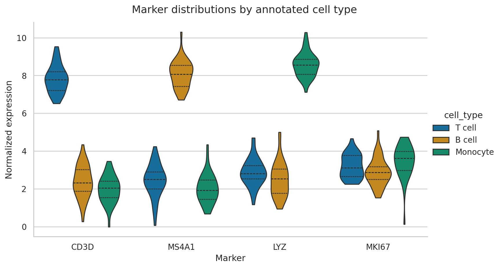
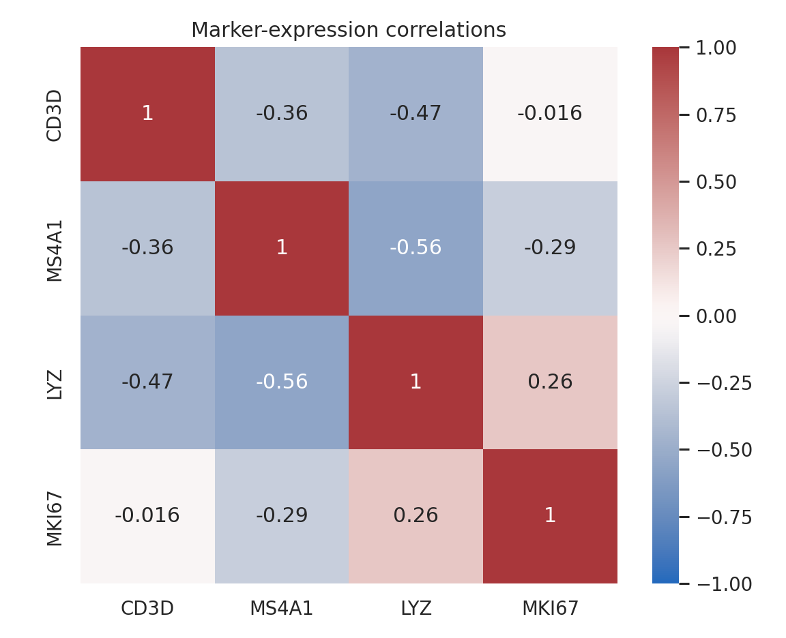

# Statistical Visualization with Seaborn {#sec-statistical-visualization-with-seaborn}

::: {.cdi-message}
- **ID:** DVP-L04
- **Type:** Core visualization
- **Audience:** Beginner / Intermediate
- **Theme:** Distribution-aware statistical graphics
:::

Seaborn adds semantic mappings and statistical summaries to Matplotlib. Its concise interface is especially useful for exploring distributions, group differences, and multivariate structure. This chapter uses simulated single-cell marker measurements to show how high-level convenience and statistical care work together.

## Learning objectives

By the end of this chapter, you should be able to:

- select axes-level or figure-level Seaborn functions;
- compare distributions without hiding sample structure;
- map variables consistently to color, style, and facets;
- interpret regression and uncertainty displays cautiously;
- construct correlation heatmaps; and
- refine Seaborn output through Matplotlib.

## Prepare tidy marker data

```python
import pandas as pd

cells = pd.read_csv("data/processed/04-cell-markers.csv")
long = cells.melt(
    id_vars=["cell_type", "cell_id"],
    var_name="marker",
    value_name="expression",
)
```

The wide table is convenient for correlations; the long table is convenient for semantic plotting. Reshaping is part of chart preparation, not a cosmetic afterthought.

## Axes-level and figure-level functions

Axes-level functions such as `scatterplot()` and `boxplot()` draw on a supplied `Axes`. Figure-level functions such as `relplot()`, `displot()`, and `catplot()` manage their own figure and can create facets.

```python
import seaborn as sns

sns.scatterplot(data=cells, x="CD3D", y="MS4A1", hue="cell_type")

g = sns.catplot(
    data=long, x="marker", y="expression",
    hue="cell_type", kind="violin", inner="quart", cut=0,
)
```

Use axes-level functions when composing a custom Matplotlib layout. Use figure-level functions when faceting is central to the design.

## Compare full distributions

{#fig-seaborn-distributions fig-alt="Four violin groups show marker expression distributions for T cells, B cells, and monocytes."}

The width of a violin represents estimated density, not observation count. Quartile lines summarize location and spread. With small samples, show raw points or prefer boxplots because a smooth density can suggest more precision than the data support.

## Semantic mappings

Seaborn can map columns to `hue`, `style`, and `size`. Use redundant mappings selectively: color plus marker shape can improve accessibility, but too many channels make a plot harder to decode.

```python
sns.scatterplot(
    data=cells,
    x="CD3D", y="MS4A1",
    hue="cell_type", style="cell_type",
    palette="colorblind",
)
```

Keep category colors stable across figures. The same cell type should not silently change color from one plot to the next.

## Regression displays are model displays

```python
sns.lmplot(data=cells, x="LYZ", y="MKI67", hue="cell_type", ci=95)
```

The fitted line assumes a model; the shaded band summarizes uncertainty under that model. It does not prove causation, and it does not describe the range of future observations. Inspect residuals and group structure before treating a trend as evidence.

## Correlation heatmaps

```python
corr = cells[["CD3D", "MS4A1", "LYZ", "MKI67"]].corr()
sns.heatmap(corr, annot=True, cmap="vlag", center=0, vmin=-1, vmax=1)
```

{#fig-seaborn-correlation fig-alt="A diverging heatmap displays pairwise correlations among four expression markers."}

A correlation matrix compresses many pairwise relationships, but it can conceal nonlinearity, clusters, and outliers. Follow important cells with scatter plots. Remember that mixing distinct cell populations can create correlations driven by group separation.

## Refine the result with Matplotlib

Seaborn returns Matplotlib objects, so finishing work remains available:

```python
ax = sns.boxplot(data=long, x="marker", y="expression", hue="cell_type")
ax.set_title("Marker expression by annotated cell type")
ax.legend(title="Cell type", frameon=False, bbox_to_anchor=(1.02, 1))
ax.figure.tight_layout()
```

## Reproduce the chapter

```bash
bash scripts/bash/04-generate-seaborn-visualizations.sh
```

The script writes 120 cell records, two figures, and `results/04-seaborn-figure-manifest.csv`.

## Chapter practice

1. Overlay jittered observations on a boxplot without obscuring quartiles.
2. Facet the marker distributions by cell type instead of using hue.
3. Investigate the strongest absolute correlation with a scatter plot and group-specific fits.

## Key takeaways

- Use tidy data to make semantic mappings explicit.
- Choose distribution views based on sample size and the question being asked.
- Treat regression lines and uncertainty bands as statistical assumptions, not decoration.
- Use heatmaps as indexes to relationships that deserve deeper inspection.
