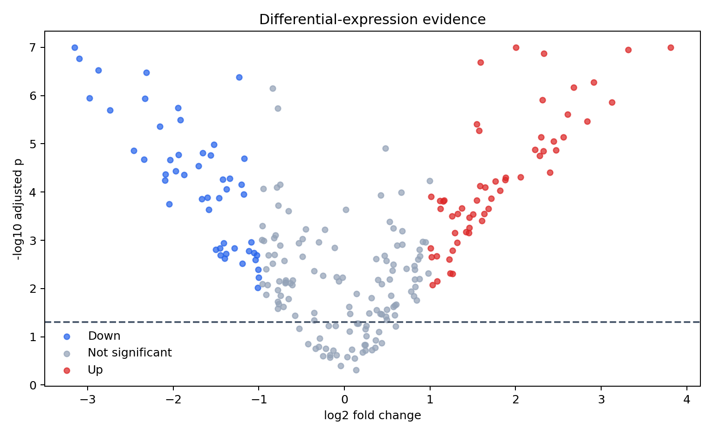
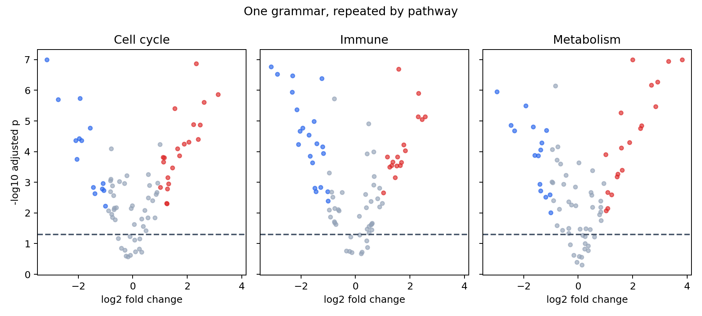

# Grammar of Graphics with Plotnine {#sec-grammar-of-graphics-with-plotnine}

::: {.cdi-message}
- **ID:** DVP-L05
- **Type:** Core visualization
- **Audience:** Intermediate
- **Theme:** Compose graphics from data, mappings, marks, scales, and facets
:::

Plotnine brings a grammar-of-graphics approach to Python. Rather than selecting a finished chart type, you build a graphic from compatible components. This chapter develops a differential-expression display to show how mappings, geoms, scales, statistics, coordinates, facets, and themes form one coherent specification.

## Learning objectives

By the end of this chapter, you should be able to:

- describe the main components of a grammar of graphics;
- distinguish mapped aesthetics from fixed properties;
- layer geoms without duplicating data preparation;
- control scales, guides, facets, and themes;
- recognize implicit statistical transformations; and
- save a Plotnine graphic reproducibly.

## A graphic as a specification

```python
from plotnine import aes, geom_point, ggplot

p = (
    ggplot(data, aes(x="log2_fold_change", y="minus_log10_p"))
    + geom_point()
)
```

The data supplies variables; `aes()` maps them to visual channels; a geom draws marks. Additional layers can add thresholds, summaries, labels, and models while preserving a shared coordinate system.

## Mapped versus fixed properties

```python
# mapped: status determines point color
geom_point(aes(color="status"))

# fixed: every point uses the same color
geom_point(color="#2563EB")
```

Putting a literal color inside `aes()` creates a category and usually an unwanted legend. This distinction is one of the most important habits in grammar-based plotting.

## Construct a volcano plot

```python
import numpy as np
import pandas as pd
from plotnine import geom_hline, labs, scale_color_manual, theme_minimal

data = pd.read_csv("data/processed/05-differential-expression.csv")
data["minus_log10_p"] = -np.log10(data["adjusted_p"])

p = (
    ggplot(data, aes("log2_fold_change", "minus_log10_p", color="status"))
    + geom_point(alpha=0.72)
    + geom_hline(yintercept=-np.log10(0.05), linetype="dashed")
    + scale_color_manual(values={
        "Down": "#2563EB", "Not significant": "#94A3B8", "Up": "#DC2626"
    })
    + labs(x="log2 fold change", y="-log10 adjusted p")
    + theme_minimal()
)
```

{#fig-plotnine-volcano fig-alt="Points show effect size against statistical evidence, colored as up, down, or not significant."}

The horizontal rule encodes the adjusted-p threshold. The status classification also requires an effect-size threshold, so the legend communicates a derived analytical rule rather than a raw field.

## Statistics and geoms

Many geoms apply an implicit statistic. A bar chart may count rows; a boxplot calculates quartiles; a smoother fits a model. Make that transformation explicit in your interpretation.

```python
from plotnine import geom_smooth

p + geom_smooth(method="lowess", se=False, color="#0F172A")
```

A smoother reveals broad structure but can distract from thresholds in a volcano plot. Layers are easy to add; that does not mean every layer strengthens the argument.

## Facets as small multiples

```python
from plotnine import facet_wrap

p + facet_wrap("~pathway")
```

{#fig-plotnine-facets fig-alt="Three aligned panels show differential-expression evidence for immune, cell-cycle, and metabolism pathways."}

Faceting preserves the visual grammar while partitioning the data. Fixed scales support direct comparison; free scales reveal within-panel structure but weaken cross-panel magnitude comparisons.

## Scales, coordinates, and themes

Scales translate data values into visual values and create axes or legends. Coordinates determine how positions are displayed. Themes govern non-data ink.

```python
from plotnine import coord_cartesian, theme

p + coord_cartesian(xlim=(-4, 4)) + theme(legend_position="right")
```

`coord_cartesian()` zooms without discarding observations before statistical calculations. Filtering the data or setting destructive scale limits can change computed summaries.

## Save the specification

```python
p.save(
    "results/figures/05-volcano-grammar.png",
    width=8.5, height=5.2, dpi=300,
)
```

Pin package versions in `requirements.txt`; grammar implementations evolve, and a reproducible figure depends on software as well as data and code.

## Reproduce the chapter

```bash
bash scripts/bash/05-generate-plotnine-visualizations.sh
```

The script writes 240 gene records, two figures, and `results/05-plotnine-figure-manifest.csv`.

## Chapter practice

1. Add direct labels for the five strongest significant genes.
2. Compare fixed and free facet scales, and explain which claim each supports.
3. Replace color-only status encoding with an accessible redundant encoding.

## Key takeaways

- Think in composable layers rather than finished chart types.
- Keep mapped aesthetics separate from fixed properties.
- Understand the statistical transformation performed by every layer.
- Use facets to repeat one visual argument across meaningful subsets.
