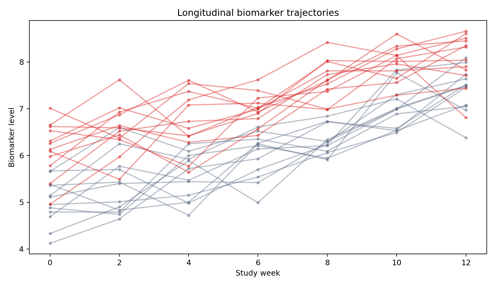
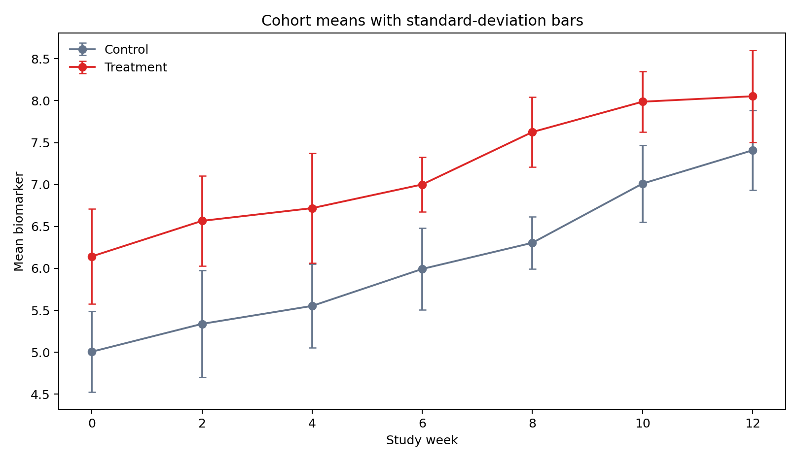

# Interactive Visualization with Plotly {#sec-interactive-visualization-with-plotly}

::: {.cdi-message}
- **ID:** DVP-L06
- **Type:** Applied visualization
- **Audience:** Intermediate
- **Theme:** Purposeful exploration, inspection, and communication
:::

Plotly produces browser-native graphics with hover, zoom, pan, legend filtering, and export controls. Interactivity is valuable when it helps a reader inspect detail or test a focused question. This chapter uses longitudinal biomarker measurements to build interactive subject trajectories and cohort summaries, with static fallbacks for non-interactive formats.

## Learning objectives

By the end of this chapter, you should be able to:

- build interactive figures with Plotly Express;
- refine figures through the graph-object API;
- design concise, useful hover content;
- add uncertainty without overwhelming the display;
- export self-contained or CDN-backed HTML;
- provide static fallbacks; and
- decide when interaction is analytically justified.

## Prepare longitudinal data

```python
import pandas as pd

biomarkers = pd.read_csv("data/processed/06-longitudinal-biomarkers.csv")
biomarkers.head()
```

Each row represents one subject at one study week. `subject` determines line grouping, `cohort` determines comparison color, and `biomarker` supplies vertical position.

## Build quickly with Plotly Express

```python
import plotly.express as px

fig = px.line(
    biomarkers,
    x="week", y="biomarker",
    color="cohort", line_group="subject",
    markers=True,
    hover_data=["subject"],
    title="Longitudinal biomarker trajectories",
)
fig.update_layout(template="plotly_white")
fig.show()
```

Hover reveals subject identity and exact values without permanently labeling every point. Legend clicks allow cohort filtering. Zoom supports local inspection, but the initial view must still communicate the overall structure.

```{=html}
<iframe src="results/figures/06-biomarker-trajectories.html" title="Interactive longitudinal biomarker trajectories" width="100%" height="560" style="border:0;"></iframe>
```

{#fig-plotly-trajectories fig-alt="Individual biomarker trajectories are shown across study weeks for control and treatment cohorts."}

## Refine hover and layout

```python
fig.update_traces(
    hovertemplate=(
        "Subject: %{customdata[0]}<br>"
        "Week: %{x}<br>Biomarker: %{y:.2f}<extra></extra>"
    )
fig.update_layout(
    xaxis_title="Study week",
    yaxis_title="Biomarker level",
    legend_title="Cohort",
    hovermode="closest",
)
```

Tooltips should provide identity, units, and values needed for interpretation. Avoid dumping every column into the hover box.

## Summaries and uncertainty

```python
summary = (
    biomarkers.groupby(["cohort", "week"], as_index=False)
    .biomarker.agg(mean="mean", sd="std")
)

summary_fig = px.line(
    summary, x="week", y="mean", color="cohort",
    markers=True, error_y="sd",
)
```

```{=html}
<iframe src="results/figures/06-biomarker-summary.html" title="Interactive cohort biomarker summaries" width="100%" height="540" style="border:0;"></iframe>
```

{#fig-plotly-summary fig-alt="Cohort mean biomarker trajectories include standard-deviation error bars at each study week."}

These error bars describe subject variability, not uncertainty in the mean. State the definition in the chart or surrounding text.

## Use graph objects for precise control

Plotly Express returns a regular `Figure`, so you can add shapes and annotations through graph objects:

```python
fig.add_hline(
    y=7.5, line_dash="dash", line_color="#475569",
    annotation_text="review threshold",
)
```

Use controls only when they answer a plausible question. A range slider may help dense time series; a dropdown may help compare biomarkers; neither belongs by default.

## Export and portability

```python
fig.write_html(
    "results/figures/06-biomarker-trajectories.html",
    include_plotlyjs="cdn",
)
fig.write_image("results/figures/06-biomarker-trajectories.png", scale=2)
```

CDN-backed HTML is smaller but needs network access. Use `include_plotlyjs=True` for a larger self-contained file. Static image export requires Kaleido and supports formats where JavaScript cannot run.

## Accessibility and graceful fallback

- Write a meaningful title and adjacent interpretation.
- Use color palettes with sufficient contrast.
- Avoid color as the only important distinction when possible.
- Provide a static image for PDF and offline reading.
- Provide a table or downloadable data when exact values matter.
- Test keyboard behavior and the chart at narrow widths.

## Reproduce the chapter

```bash
bash scripts/bash/06-generate-plotly-visualizations.sh
```

The script writes 168 observations, two interactive HTML charts, two PNG fallbacks, and `results/06-plotly-figure-manifest.csv`.

## Chapter practice

1. Add a dropdown that filters the display to one cohort or both cohorts.
2. Replace standard-deviation bars with a clearly labeled confidence interval.
3. Compare CDN-backed and self-contained HTML exports.

## Key takeaways

- Add interaction to support inspection or comparison, not novelty.
- Design hover content as carefully as visible labels.
- State exactly what summaries and uncertainty marks mean.
- Ship static fallbacks so the analytical message survives every output format.
