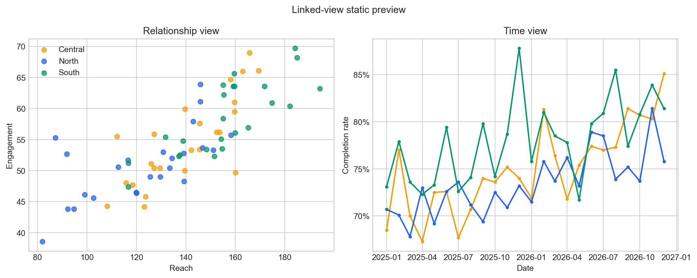
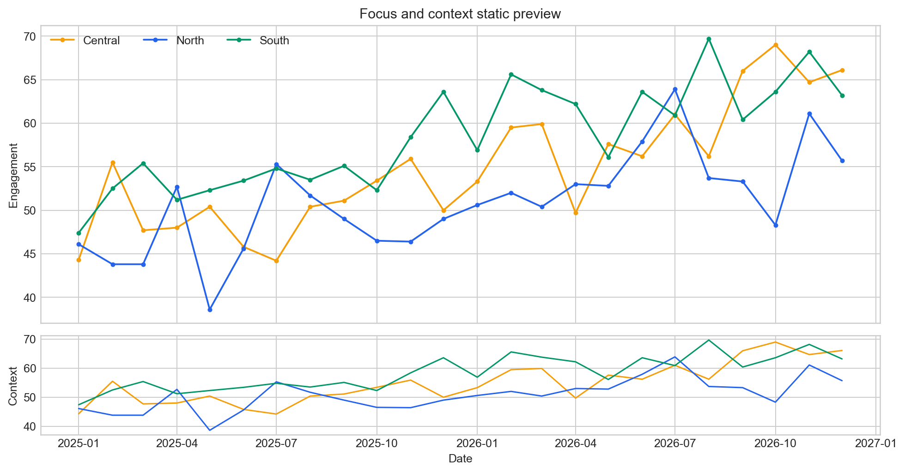

# Declarative Interactivity with Altair {#sec-declarative-interactivity-with-altair}

::: {.cdi-message}
- **ID:** DVP-L07
- **Type:** Applied visualization
- **Audience:** Intermediate
- **Theme:** Build interactive graphics by declaring visual intent
:::

Interactive visualization is most useful when interaction helps a reader answer a question. Altair supports this goal through a declarative grammar: instead of manually drawing marks and wiring browser events, you describe the data, transformations, encodings, selections, and relationships among views. Altair then produces a Vega-Lite specification that can be rendered in notebooks, Quarto, and web pages.

This chapter develops two coordinated analytical views from one reproducible teaching dataset. The first links a scatter plot to a time-series plot through a selection. The second uses focus and context to inspect change through time. Together they show how interaction can become part of the analytical argument rather than decoration.

## Learning objectives

By the end of this chapter, you should be able to:

- explain the declarative model behind Altair and Vega-Lite;
- map data fields to marks, channels, scales, and guides;
- transform data inside a chart specification;
- add parameters for filtering, highlighting, and zooming;
- compose linked views with shared selections;
- design useful tooltips and accessible fallback views;
- export interactive HTML and static previews reproducibly; and
- recognize when interactivity adds complexity without analytical value.

## From plotting commands to visual specifications

An imperative plotting workflow describes *how* to draw a chart: create an axis, draw points, assign colors, and register event handlers. A declarative workflow describes *what* the chart should represent.

```{mermaid}
flowchart TD
    A["Tidy data"] --> B["Marks and encodings"]
    B --> C["Transforms and parameters"]
    C --> D["Vega-Lite specification"]
    D --> E["Interactive rendered view"]
```

The specification is inspectable and serializable. It can be saved as JSON, embedded in HTML, versioned with the analysis, and rendered by another compatible environment. That portability is one of Altair's strongest advantages.

## Prepare the chapter dataset

The generator creates a deterministic monthly dataset for three regions. Each row contains a date, region, reach, engagement, and completion rate.

```python
import pandas as pd

data = pd.read_csv(
    "data/processed/07-altair-observations.csv",
    parse_dates=["date"],
)

print(data.shape)
print(data.head())
```

The table is in tidy form: one observation per row, one variable per column, and one value per cell. This structure makes fields easy to assign to visual channels.

| Field | Role | Altair type |
|---|---|---|
| `date` | monthly time position | temporal |
| `region` | comparison group | nominal |
| `reach` | horizontal measure | quantitative |
| `engagement` | vertical measure | quantitative |
| `completion_rate` | bounded performance measure | quantitative |

## Build a chart from marks and encodings

An Altair chart begins with data and a mark. Encodings map fields to properties such as horizontal position, vertical position, color, size, and tooltip content.

```python
import altair as alt

points = (
    alt.Chart(data)
    .mark_circle(size=85, opacity=0.8)
    .encode(
        x=alt.X("reach:Q", title="Reach"),
        y=alt.Y("engagement:Q", title="Engagement"),
        color=alt.Color("region:N", title="Region"),
        tooltip=[
            alt.Tooltip("date:T", title="Month", timeUnit="yearmonth"),
            alt.Tooltip("region:N", title="Region"),
            alt.Tooltip("reach:Q", format=".1f"),
            alt.Tooltip("engagement:Q", format=".1f"),
        ],
    )
    .properties(width=560, height=360)
)

points
```

The shorthand `reach:Q` identifies both the field and its measurement type. The common type codes are `Q` for quantitative, `N` for nominal, `O` for ordinal, `T` for temporal, and `G` for geographic. Explicit types make the intended interpretation visible and prevent accidental inference.

## Control scales, axes, and legends

Altair chooses sensible defaults, but defaults are starting points rather than decisions. For a bounded rate, formatting the axis as a percentage communicates meaning more directly.

```python
rate_axis = alt.Y(
    "completion_rate:Q",
    title="Completion rate",
    scale=alt.Scale(domain=[0.5, 0.9], zero=False),
    axis=alt.Axis(format=".0%"),
)
```

Truncating a quantitative scale can exaggerate differences. Here it is appropriate for a line chart concerned with changes within a limited operating range, but the domain should remain explicit. Bar charts, which encode magnitude by length, normally require a zero baseline.

Use a stable color domain and range when the same groups recur across chapters:

```python
region_color = alt.Color(
    "region:N",
    title="Region",
    scale=alt.Scale(
        domain=["North", "Central", "South"],
        range=["#2563EB", "#F59E0B", "#059669"],
    ),
)
```

## Transform data within the specification

Altair can express filters, calculated fields, aggregates, bins, and window operations without mutating the source table. The following chart calculates the monthly mean engagement across regions:

```python
monthly_mean = (
    alt.Chart(data)
    .transform_aggregate(
        mean_engagement="mean(engagement)",
        groupby=["date"],
    )
    .mark_line(point=True, color="#334155")
    .encode(
        x=alt.X("date:T", title="Month"),
        y=alt.Y("mean_engagement:Q", title="Mean engagement", scale=alt.Scale(zero=False)),
        tooltip=[
            alt.Tooltip("date:T", timeUnit="yearmonth"),
            alt.Tooltip("mean_engagement:Q", format=".1f"),
        ],
    )
)
```

Specification-level transforms are useful when they make the visual logic inspectable. Substantial cleaning, joins, validation, and domain calculations should still happen in pandas so they can be tested independently.

## Treat parameters as analytical controls

A parameter stores a value or selection that can influence encodings, filters, and scales. This is the central mechanism for declarative interaction.

```python
region_pick = alt.selection_point(
    fields=["region"],
    on="click",
    clear="dblclick",
    empty=True,
)
```

The selection records a region when a reader clicks a mark. A double-click clears the selection, and `empty=True` means all regions are included before a choice is made.

Parameters can also bind to interface controls:

```python
minimum_reach = alt.param(
    name="Minimum_reach",
    value=80,
    bind=alt.binding_range(min=60, max=180, step=5, name="Minimum reach: "),
)

filtered_points = (
    points
    .add_params(minimum_reach)
    .transform_filter(alt.datum.reach >= minimum_reach)
)
```

A control is worthwhile when its possible values support a meaningful question. Do not add widgets simply because the library makes them easy to create.

## Coordinate multiple views

Linked views allow one selection to govern more than one chart. Here, clicking a region in the scatter plot highlights that region and filters the time-series view.

```python
region_pick = alt.selection_point(
    fields=["region"],
    on="click",
    clear="dblclick",
    empty=True,
)

scatter = (
    alt.Chart(data)
    .mark_circle(size=85, opacity=0.8)
    .encode(
        x=alt.X("reach:Q", title="Reach"),
        y=alt.Y("engagement:Q", title="Engagement"),
        color=alt.condition(region_pick, region_color, alt.value("#D1D5DB")),
        tooltip=["date:T", "region:N", "reach:Q", "engagement:Q"],
    )
    .add_params(region_pick)
    .properties(width=420, height=280)
)

trend = (
    alt.Chart(data)
    .mark_line(point=True)
    .encode(
        x=alt.X("date:T", title="Month"),
        y=rate_axis,
        color=region_color,
        tooltip=[
            alt.Tooltip("date:T", timeUnit="yearmonth"),
            "region:N",
            alt.Tooltip("completion_rate:Q", format=".1%"),
        ],
    )
    .transform_filter(region_pick)
    .properties(width=420, height=280)
)

linked_view = alt.hconcat(scatter, trend).resolve_scale(color="shared")
linked_view
```

[Open the interactive linked view](results/figures/07-altair-linked-view.html).

{#fig-altair-linked-view fig-cap="Static fallback for the coordinated linked view. In the HTML version, selecting a region coordinates both panels." width=100%}

The selection performs two related jobs. It conditions the color encoding in the scatter plot and filters the trend chart. This makes the interaction itself part of the specification.

## Add focus and context for temporal exploration

Long time series often require more detail than a fixed chart can show. A focus-and-context design preserves the overall sequence while allowing a reader to inspect a narrower window.

```python
time_window = alt.selection_interval(encodings=["x"], bind="scales")

detail = (
    alt.Chart(data)
    .mark_line(point=True)
    .encode(
        x=alt.X("date:T", title=None),
        y=alt.Y("engagement:Q", scale=alt.Scale(zero=False)),
        color=region_color,
        tooltip=["date:T", "region:N", "engagement:Q"],
    )
    .add_params(time_window)
    .properties(width=860, height=300)
)

context = (
    alt.Chart(data)
    .mark_line()
    .encode(
        x=alt.X("date:T", title="Month"),
        y=alt.Y("engagement:Q", title="Context", scale=alt.Scale(zero=False)),
        color=region_color,
    )
    .properties(width=860, height=90)
)

focus_context = alt.vconcat(detail, context)
```

[Open the interactive focus-and-context view](results/figures/07-altair-focus-context.html).

{#fig-altair-focus-context fig-cap="Static fallback for the focus-and-context view. The HTML version supports zooming and panning." width=95%}

Zoom and pan are effective when readers need to inspect dense temporal detail. They are poor substitutes for showing the important time range directly when the author already knows which period matters.

## Compose charts deliberately

Altair provides several composition operators:

| Composition | Python form | Best use |
|---|---|---|
| Layer | `base + annotation` | reference lines, labels, intervals |
| Horizontal | `left | right` | linked side-by-side comparisons |
| Vertical | `top & bottom` | focus and context, related sequences |
| Concatenate | `alt.concat(...)` | custom arrangements |
| Facet | `.facet(...)` | repeated small multiples by category |
| Repeat | `.repeat(...)` | systematic views over several fields |

Composition should preserve a clear reading order. Share scales when direct comparison matters; keep scales independent when the measures have different meanings or ranges. Never let a shared legend imply that unrelated encodings are comparable.

## Design tooltips as details on demand

Tooltips should add precise information without forcing the reader to decode raw field names.

```python
tooltips = [
    alt.Tooltip("date:T", title="Month", timeUnit="yearmonth"),
    alt.Tooltip("region:N", title="Region"),
    alt.Tooltip("engagement:Q", title="Engagement", format=".1f"),
    alt.Tooltip("completion_rate:Q", title="Completion", format=".1%"),
]
```

Keep the list short, use human-readable labels, and format dates and rates explicitly. A tooltip must not be the only place where the chart communicates its main conclusion because it is invisible until interaction occurs and may be difficult to access using a keyboard or assistive technology.

## Export interactive and static outputs

Altair can save a chart as HTML:

```python
linked_view.save("results/figures/07-altair-linked-view.html")
```

Static export normally requires an additional renderer such as `vl-convert-python`:

```python
linked_view.save("results/figures/07-altair-linked-view.png", scale_factor=2)
```

Use HTML for full interaction and a PNG or SVG fallback for PDF output, repository previews, and contexts where JavaScript is disabled. The generated `results/07-altair-chart-manifest.csv` records both forms and their purposes.

::: {.callout-note}
The packaged generator writes portable Vega-Lite HTML and static PNG previews from the same deterministic dataset. The chapter examples use Altair syntax directly so learners can see the Python API that produces equivalent specifications.
:::

## Accessibility and progressive disclosure

Interactivity does not automatically make a graphic accessible. Apply the following safeguards:

- state the chart's analytical message in surrounding prose;
- provide a descriptive title, axis labels, legend title, and figure caption;
- avoid using color as the only selection cue;
- retain adequate contrast for selected and unselected marks;
- make the unselected state informative;
- provide a table or static image when hover is essential;
- keep instructions close to the chart; and
- test the output at narrow viewport widths and with keyboard navigation.

Progressive disclosure is valuable when the overview remains meaningful and interaction reveals secondary detail. It fails when readers must explore blindly before they can understand the basic result.

## Performance and data volume

Altair embeds chart data into a specification unless a different data transformer or URL is used. Very large datasets can create heavy HTML files and slow browser rendering.

For large data:

1. aggregate to the level required by the visual question;
2. filter irrelevant fields and rows before chart construction;
3. consider sampling for dense point clouds;
4. store data externally when deployment conditions allow it; and
5. use a server-backed tool when interaction requires querying millions of records.

Aggregation is not merely a performance trick. It changes the unit represented by each mark, so document it clearly.

## Common failure modes

| Failure | Why it matters | Better approach |
|---|---|---|
| Every channel is interactive | Readers cannot identify the intended action | Choose one primary interaction |
| Hover carries the conclusion | Touch, keyboard, and static readers may miss it | Put the main message in visible annotations and prose |
| Selections have no reset | Readers can become trapped in a filtered state | Define a clear or double-click reset |
| Unselected marks disappear | Context is lost | De-emphasize with gray or opacity |
| Huge row-level data is embedded | Output becomes slow and fragile | Aggregate, filter, or sample intentionally |
| Scale domains change silently | Comparisons become misleading | Fix or visibly communicate domains |
| HTML is the only output | PDF and repository previews fail | Save a static fallback |

## Run the reproducible workflow

From the repository root, run either command:

```bash
bash scripts/bash/07-generate-altair-visualizations.sh
```

```bash
python scripts/python/07-generate-altair-visualizations.py
```

The workflow writes:

```text
data/processed/07-altair-observations.csv
results/07-altair-chart-manifest.csv
results/figures/07-altair-linked-view.html
results/figures/07-altair-linked-view.png
results/figures/07-altair-focus-context.html
results/figures/07-altair-focus-context.png
```

The HTML files require an internet connection when opened because their compact wrappers load the Vega, Vega-Lite, and Vega-Embed JavaScript libraries from a content delivery network. A production deployment can vendor those libraries locally when offline operation is required.

## Exercise: build a threshold explorer

Create a slider that filters observations below a chosen completion rate. Then link the filtered points to a monthly trend.

Requirements:

1. bind a parameter to a slider ranging from 50% to 90%;
2. filter on `completion_rate`;
3. retain region color consistently in both views;
4. add formatted tooltips; and
5. make the empty or reset state understandable.

::: {.callout-tip collapse="true"}
## Solution

```python
threshold = alt.param(
    value=0.65,
    bind=alt.binding_range(
        min=0.50,
        max=0.90,
        step=0.01,
        name="Minimum completion: ",
    ),
)

eligible = (
    alt.Chart(data)
    .transform_filter(alt.datum.completion_rate >= threshold)
    .mark_circle(size=80)
    .encode(
        x="reach:Q",
        y="engagement:Q",
        color=region_color,
        tooltip=[
            "date:T",
            "region:N",
            "reach:Q",
            "engagement:Q",
            alt.Tooltip("completion_rate:Q", format=".1%"),
        ],
    )
    .add_params(threshold)
)

eligible
```
:::

## Chapter checklist

Before publishing an Altair visualization, confirm that:

- [ ] the interaction answers a named analytical question;
- [ ] fields use correct quantitative, temporal, ordinal, or nominal types;
- [ ] scale domains and zero baselines are defensible;
- [ ] a selection has an understandable initial and reset state;
- [ ] linked views preserve context;
- [ ] tooltips show only useful, formatted details;
- [ ] the main conclusion remains visible without hovering;
- [ ] data volume is appropriate for browser rendering;
- [ ] interactive HTML and a static fallback are saved; and
- [ ] source data, generator code, and output paths are reproducible.

## CDI Insight

Declarative interactivity is powerful because it turns interaction into an explicit relationship among data, encodings, and views. The goal is not to make readers work harder. It is to let them test a focused question while preserving the evidence and context needed to interpret the answer.
