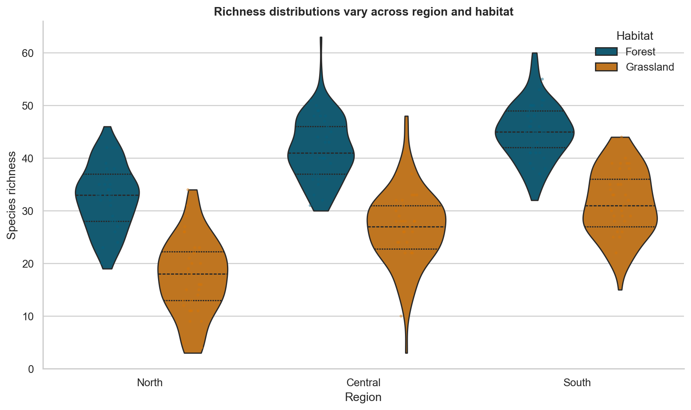
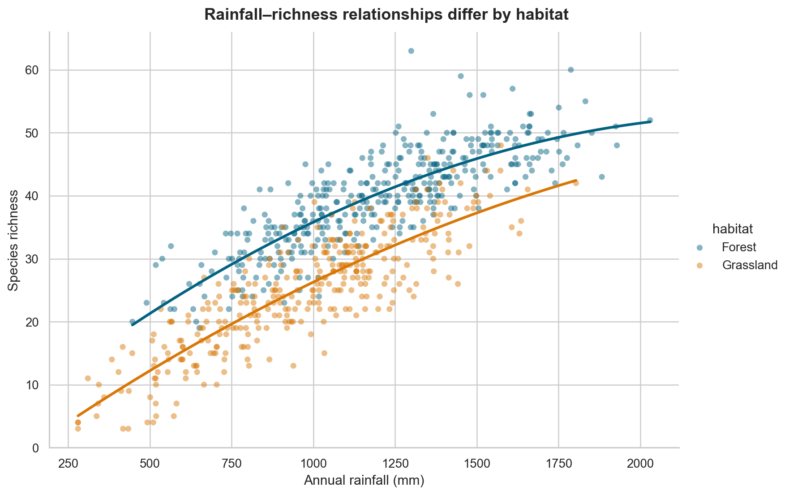
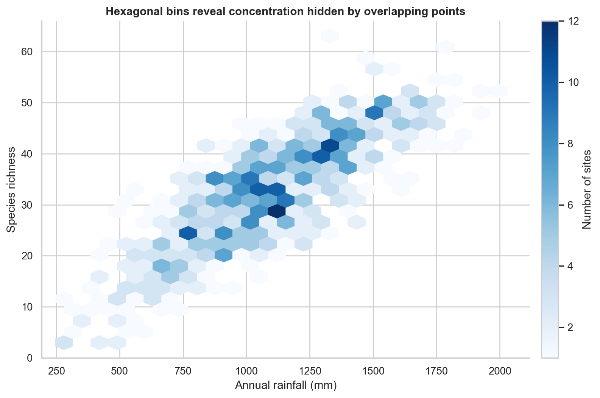
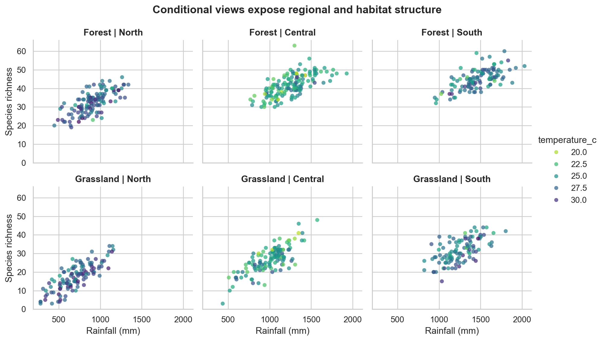

# Distributions, Relationships, and Multivariate Views {#sec-distributions-relationships-multivariate}

:::cdi-message
- **ID:** DVP-008
- **Type:** Analytical and specialized visualization
- **Audience:** Beginner-to-intermediate Python users
- **Theme:** Reveal structure before summarizing it
:::

A chart becomes analytically useful when its design matches the structure of the question. A histogram can reveal the shape of one quantitative variable. A scatter plot can expose the form of a relationship between two variables. Colour, facets, size, and small multiples can extend the view to additional variables—but every added encoding also increases the reader's cognitive load.

This chapter develops a practical workflow for choosing, constructing, and interpreting distributional, relational, and multivariate graphics. The emphasis is not on producing every possible chart. It is on revealing patterns without hiding uncertainty, sample size, overlap, or important subgroups.

By the end of the chapter, you will be able to:

- select appropriate displays for univariate and grouped distributions;
- explain how bin width, bandwidth, and axis transformations affect interpretation;
- compare groups without relying only on summary statistics;
- distinguish association, form, strength, and unusual observations in relationships;
- use colour, size, style, and facets deliberately in multivariate displays;
- reduce overplotting in dense datasets; and
- build a reproducible visual analysis from question to interpretation.

## The analytical progression

An effective visual analysis usually moves from simple views to more structured ones:

1. inspect each variable independently;
2. compare distributions across relevant groups;
3. examine pairwise relationships;
4. add a third variable only when it answers a defined question;
5. facet when separate panels are easier to compare than layered encodings; and
6. return to the data and assumptions when a pattern looks surprising.

This progression protects against a common mistake: interpreting an aggregate relationship before checking whether it is driven by skewness, outliers, unequal group sizes, or subgroup differences.

:::cdi-message
A multivariate chart should answer a multivariate question. Adding encodings simply because the columns are available usually weakens the display.
:::

## The chapter dataset

The companion script creates a synthetic environmental field-study dataset. Each row represents one sampling site and includes:

- `region`: North, Central, or South;
- `habitat`: Forest or Grassland;
- `elevation_m`: elevation in metres;
- `rainfall_mm`: annual rainfall in millimetres;
- `temperature_c`: mean temperature in degrees Celsius;
- `species_richness`: observed species count; and
- `survey_effort_h`: survey effort in hours.

The data are synthetic, so they support reproducible teaching without being mistaken for evidence about a real ecosystem. The generation process intentionally includes skew, group differences, correlated variables, and a few unusual observations.

Run the complete workflow from the repository root:

```bash
bash scripts/bash/08-generate-analytical-visuals.sh
```

The command writes the generated data to `data/processed/`, a compact summary to `results/`, and four figures to `results/figures/`.

## Visualizing one distribution

A distribution describes how values are arranged across their observed range. Four features are especially useful:

- **centre**: where typical values lie;
- **spread**: how variable the observations are;
- **shape**: whether the distribution is symmetric, skewed, multimodal, or bounded; and
- **unusual values**: observations separated from the main body of the data.

### Histograms and bin width

A histogram divides a quantitative scale into intervals and counts observations within them. It is often the best first view of a continuous variable because it preserves more structure than a mean and standard deviation.

The bin width is an analytical choice. Very wide bins can conceal multiple modes or gaps. Very narrow bins can make random variation look like structure. Compare several reasonable values, then select one that shows stable features without excessive noise.

```python
sns.histplot(
    data=sites,
    x="species_richness",
    bins=18,
    color="#036281",
    edgecolor="white",
)
```

If groups are important, avoid immediately stacking many transparent histograms. Separate panels or carefully designed density curves are usually easier to interpret.

### Density plots and bandwidth

A kernel density estimate draws a smooth representation of a distribution. Its bandwidth controls smoothness in much the same way that bin width controls a histogram. A small bandwidth follows local fluctuations; a large bandwidth suppresses them.

Density plots are useful for comparing shapes, but they do not directly show counts. They may also imply values beyond a variable's possible boundary. Pair density curves with sample-size information, and avoid using them for very small groups.

### Empirical cumulative distributions

An empirical cumulative distribution function (ECDF) shows the proportion of observations less than or equal to each value. Unlike a histogram or density plot, it does not require a bin width or bandwidth. It is particularly useful when the question concerns thresholds, percentiles, or stochastic ordering.

For example, an ECDF can answer: “What proportion of sites recorded richness no greater than 35?” Every observation contributes to the curve, although the shape may be less immediately familiar to new readers.

### Transforming a skewed scale

Positive quantities such as income, duration, concentration, and file size often have long right tails. A logarithmic axis can reveal relative differences that are compressed on a linear scale.

Use a log scale when multiplicative change is meaningful and all plotted values are positive. State the transformation clearly. Do not apply a transformation simply to make a chart look more symmetric; explain what comparisons the transformed scale supports.

## Comparing distributions across groups

Grouped comparisons should show both between-group differences and within-group variation. A bar chart of means alone hides distribution shape, sample size, overlap, and unusual values.

### Box plots

A box plot compactly displays the median, quartiles, and observations beyond a conventional whisker rule. It works well when many groups must fit in limited space. However, it does not reveal multimodality and can look overly authoritative for small samples.

### Violin plots

A violin plot mirrors an estimated density around a central axis. It makes differences in distribution shape more visible, but it inherits the bandwidth limitations of density estimation. Width normalization can also be misunderstood as sample size unless the plotting settings are made explicit.

### Points plus summaries

When group sizes are modest, jittered or beeswarm points reveal the observations directly. A median and interval can be layered on top. This combination is often more transparent than either a box plot or violin plot alone.

{#fig-grouped-distributions fig-alt="Four violins compare species-richness distributions for forest and grassland sites across selected regions, with box summaries and individual observations."}

Figure @fig-grouped-distributions shows why a distributional view is more informative than a table of group means. The forest and grassland samples overlap, but their centres and upper tails differ. The visible points also prevent the smoothed shapes from being mistaken for raw observations.

### Ordering categories

Alphabetical category order is rarely analytically meaningful. Order groups by a relevant statistic, an inherent sequence, or a deliberate reference order. For ordinal categories, preserve the real ordering rather than sorting by the observed mean.

## Examining relationships between two variables

A scatter plot is the default view for two quantitative variables. Read it in a disciplined sequence:

1. **direction**: positive, negative, or no consistent direction;
2. **form**: linear, curved, segmented, clustered, or otherwise structured;
3. **strength**: how tightly points follow the form;
4. **spread**: whether variability changes across the x-axis;
5. **subgroups**: whether colour or facets reveal distinct patterns; and
6. **unusual observations**: points that depart from the main structure.

{#fig-bivariate-relationship fig-alt="Scatter plot of rainfall against species richness. Forest and grassland sites use different colours, and each habitat has its own fitted trend line."}

In Figure @fig-bivariate-relationship, richness generally increases with rainfall, but habitat shifts the level and possibly the shape of the relationship. An overall correlation would compress these structures into one number.

### A fitted line is a model

A trend line is not a decorative element. It asserts a particular form for the conditional relationship. A straight line implies a constant rate of change. A locally smoothed curve permits the rate to vary.

Before adding a line, decide whether the purpose is description, model checking, or communication of a fitted model. Display uncertainty when it is relevant, and do not interpret the line beyond the observed x-range.

### Association is not causation

A visible relationship may reflect direct influence, reverse influence, a shared cause, selection, measurement, or chance. A scatter plot describes the observed data; it does not establish an intervention effect.

Use causal language only when the study design and assumptions support it. Prefer phrases such as “is associated with,” “varies with,” or “is higher among” for observational comparisons.

## Managing overplotting

When many points occupy the same region, a scatter plot can hide density. Several techniques address different forms of overlap:

| Technique | Best use | Important caution |
|---|---|---|
| Smaller markers | Moderate point density | Very small marks may become inaccessible |
| Transparency | Overlap with visible individual points | Dark regions depend on plotting order and opacity |
| Jitter | Discrete or rounded axes | Jitter changes position and must be described |
| Hexagonal bins | Large quantitative datasets | Individual observations are no longer visible |
| Two-dimensional density | Emphasizing concentration | Smoothing choices affect apparent structure |
| Sampling | Interactive or extremely large data | Preserve rare groups and document the method |

{#fig-overplotting-hexbin fig-alt="Hexagonal-binned plot of rainfall and species richness. Darker blue hexagons indicate more sampling sites, and a colour bar gives counts."}

Figure @fig-overplotting-hexbin replaces overlapping points with counts in hexagonal cells. This view is effective for density but should not be used when identifying individual sites is central to the question.

## Moving to multivariate views

A multivariate chart represents three or more variables. Common visual channels include:

- x and y position;
- colour hue or lightness;
- marker size;
- marker shape or line style; and
- panels created by faceting.

Position is generally the most precise quantitative channel. Colour works well for a small number of categories or an ordered numerical scale. Size supports approximate magnitude comparisons but is difficult to read precisely. Shape should be reserved for a small number of categories.

### Colour as a third variable

For categories, use a discrete palette with clearly distinguishable colours. For ordered values, use a sequential palette. For deviations around a meaningful midpoint, use a diverging palette and state the midpoint.

Avoid rainbow palettes for ordered data. They introduce artificial boundaries and are not perceptually ordered. Also check that the palette remains interpretable for readers with colour-vision differences and when printed in greyscale.

### Size requires care

If marker size represents a quantitative variable, viewers perceive area rather than radius. Use plotting functions that scale area appropriately, limit the range, and include a readable legend. Do not encode the most important quantitative comparison only through bubble size.

### Faceting for conditional comparison

Faceting creates a separate panel for each subgroup while keeping the same visual grammar. It is useful when layered colours or shapes would become crowded.

{#fig-multivariate-facets fig-alt="Six small scatter plots arrange three regions in columns and two habitats in rows. Point colour represents temperature, while common axes support comparison."}

Figure @fig-multivariate-facets separates region and habitat into panels while colour represents temperature. Shared axes make slopes, ranges, and clusters directly comparable. The panel structure also makes missing combinations or unequal coverage easier to detect.

Use free scales only when the purpose is to inspect within-panel shape and direct cross-panel magnitude comparison is not required. Shared scales are preferable for most comparisons.

## Pair plots and correlation matrices

A pair plot displays every pairwise relationship among a selected set of quantitative variables, often with univariate distributions on the diagonal. It is useful during exploration, but its size grows quickly with the number of variables. Select a small, theoretically relevant subset rather than sending the complete dataframe.

A correlation heatmap is even more compact, but it reduces each pair to one coefficient. It can hide nonlinearity, clusters, outliers, and range restrictions. Use it as an index that guides deeper inspection, not as a replacement for the underlying plots.

Remember that repeated pairwise inspection increases the chance of noticing patterns that arose by chance. Treat exploratory findings as hypotheses to validate, not confirmed results.

## A reproducible visual-analysis workflow

The companion script follows a reusable sequence.

### 1. Define the question

Write the comparison in words before choosing a chart. For example:

> How does species richness vary with rainfall, and does the pattern differ by habitat and region?

This question identifies two quantitative variables and two categorical conditioning variables.

### 2. Validate the data

Check row uniqueness, units, missingness, category values, plausible ranges, and sample sizes by group. Visualizations cannot repair a misdefined unit of observation.

### 3. Start with marginal distributions

Inspect rainfall and richness independently. Skewness, boundaries, and unusual observations affect how their relationship should be viewed.

### 4. Build the simplest relational view

Plot rainfall against richness before adding colour, size, or facets. Confirm that the axes, units, and point density are readable.

### 5. Add one analytical distinction at a time

Use colour for habitat, then facet by region if the regional comparison matters. Each addition should answer a stated question.

### 6. Stress-test the pattern

Check whether the conclusion changes with transformations, reasonable smoothing choices, exclusion of an unusual observation, or separate subgroup views. Sensitivity is part of the result.

### 7. Write an evidence-bounded interpretation

Describe visible direction, form, overlap, and subgroup differences. State what the plot cannot establish. Record the dataset, script, seed, and output paths so the result can be reproduced.

## Common mistakes and better choices

| Mistake | Why it weakens the analysis | Better choice |
|---|---|---|
| Showing only group means | Hides variation, overlap, and sample size | Show distributions or observations with summaries |
| Selecting a single convenient bin width | Can manufacture or conceal apparent modes | Compare reasonable widths and document the final choice |
| Adding many visual encodings | Produces a chart that is hard to decode | Add only variables required by the question |
| Using colour for too many categories | Makes groups difficult to distinguish | Facet, filter, aggregate, or use direct labels |
| Fitting one line across distinct groups | Can conceal conditional relationships | Inspect and model relevant groups separately |
| Interpreting correlation as causation | Ignores design and alternative explanations | Use association language and discuss design |
| Truncating a scale to dramatize separation | Exaggerates differences | Use a defensible range and disclose breaks |
| Ignoring overlapping points | Understates concentration and sample size | Use transparency, bins, density, or facets |
| Using free facet scales for comparison | Makes visual magnitudes incomparable | Keep shared scales unless within-panel shape is the goal |

## Practical checklist

Before finalizing an analytical visual, ask:

- Is the unit of observation clear?
- Does the chart type match the variable types and question?
- Are units and transformations stated?
- Can the reader see sample size, variation, and overlap?
- Are bin width, bandwidth, smoothing, and aggregation defensible?
- Does every colour, size, shape, or facet encode necessary information?
- Are legends, categories, and panels ordered meaningfully?
- Could overplotting or missing data change the apparent pattern?
- Does the interpretation distinguish observation from explanation?
- Can the figure be regenerated from a saved script?

## Chapter summary

Distributional graphics reveal centre, spread, shape, and unusual values that summary statistics can conceal. Relational graphics show direction, form, strength, spread, and subgroup structure, but they do not establish causation. Multivariate views are most effective when every encoding answers a specific analytical question and when faceting replaces cluttered layering.

The most reliable workflow begins with simple marginal views, builds toward conditional comparisons, addresses overplotting, and ends with an interpretation bounded by the data and study design. Reproducible scripts make those choices visible and testable.

:::cdi-next
The next chapter extends these principles to time-series and longitudinal visualization, where ordering, temporal resolution, seasonality, and change become central design concerns.
:::
