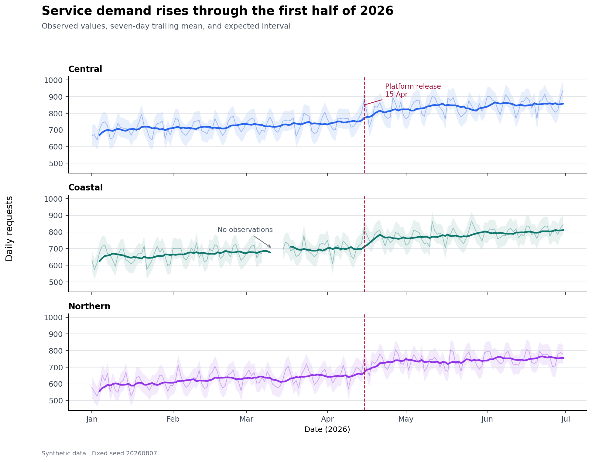
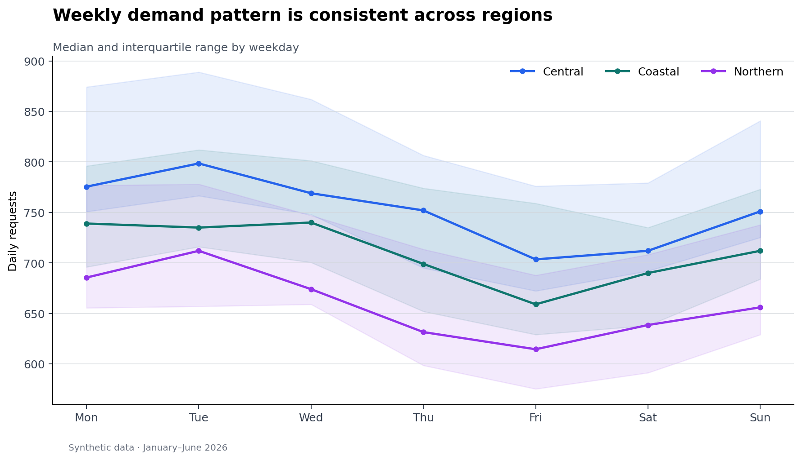

# Time Series and Event Visualization {#sec-time-series}

::: {.cdi-message}
- **ID:** DVP-009
- **Type:** Analytical Patterns
- **Audience:** Intermediate
- **Theme:** Trends, seasonality, change, and events over time
:::

Time-series graphics are arguments about **change**. A useful temporal view makes the time grain explicit, distinguishes signal from short-term variation, preserves gaps, and gives important events enough context to be interpreted without implying causality. This chapter develops those habits with a reproducible Python workflow.

## Learning Objectives

By the end of this chapter, you will be able to:

1. parse, validate, sort, and index temporal data;
2. select line, area, interval, and small-multiple views for different questions;
3. use rolling summaries and seasonal profiles without hiding the observations;
4. annotate events and regimes with appropriately cautious language;
5. expose missing periods and irregular sampling rather than connecting across them;
6. design interactive time-series views that support focused exploration; and
7. package data, plots, and a manifest as reproducible outputs.

## Preparing Temporal Data

Temporal visualization begins before plotting. A trustworthy workflow checks five properties:

- **Type:** timestamps are parsed as datetimes rather than stored as text.
- **Zone:** timezone-aware data use a documented zone; local reporting time is converted deliberately.
- **Grain:** each row represents a known interval, such as one day per region.
- **Order:** observations are sorted within each series.
- **Uniqueness:** the intended time-series key has no duplicates.

```{python}
#| eval: false
import pandas as pd

daily = pd.read_csv(
    "data/processed/09-daily-service-metrics.csv",
    parse_dates=["date"],
)

key = ["region", "date"]
assert not daily.duplicated(key).any()
daily = daily.sort_values(key)

expected = pd.date_range(daily["date"].min(), daily["date"].max(), freq="D")
coverage = (
    daily.groupby("region")["date"]
    .apply(lambda values: values.nunique() / len(expected))
    .rename("coverage")
)
```

A timestamp alone does not define the analytical meaning of a row. Record whether it is an instant, an interval start, an interval end, or a reporting date. If monthly values represent totals, plotting them at month-end is defensible; if they represent monthly averages, a centered interval or explicit month label may communicate the semantics better.

## Line, Area, and Interval Views

A line chart is the default for ordered measurements because position on a common scale supports accurate comparison. It is most effective when observations are sufficiently frequent and interpolation between adjacent points is reasonable.

Use an area chart when accumulated magnitude or composition is central. Because filled shapes emphasize volume, avoid using area merely as decoration. An interval view adds a band for uncertainty, variation, or an expected range. State what the band represents: a confidence interval, prediction interval, interquartile range, or operational threshold are not interchangeable.

{#fig-time-series-overview fig-alt="Daily request volume from January through June for three regions, with a darker seven-day average, pale expected range, a marked release date, and a visible missing-data gap."}

Figure @fig-time-series-overview layers the observations, a rolling summary, an expected interval, and an event marker. The hierarchy is intentional: raw observations provide evidence; the thicker rolling line guides attention; the pale band provides context; the annotation explains why a date matters.

## Multiple Series and Small Multiples

Overlaying several lines works when there are few series, their scales are comparable, and crossings are limited. Direct labels near line ends are often easier to follow than a distant legend. Once the display becomes tangled, small multiples provide each series with the same visual grammar while retaining a shared scale.

```{python}
#| eval: false
fig, axes = plt.subplots(
    nrows=daily["region"].nunique(),
    sharex=True,
    sharey=True,
    figsize=(10, 7),
)

for ax, (region, frame) in zip(axes, daily.groupby("region", sort=False)):
    ax.plot(frame["date"], frame["requests"], color="#2563eb", linewidth=1)
    ax.set_title(region, loc="left", fontweight="bold")
```

Keep axis limits consistent when the goal is comparison. Free scales can reveal within-series patterns but prevent direct magnitude comparison; if you use them, say so in the caption or facet labels.

## Rolling Summaries and Smoothing

Rolling statistics reduce short-term noise, but every choice encodes a judgment. A seven-day window is appropriate for daily data with a weekly cycle; it is not a universally neutral default.

```{python}
#| eval: false
daily["requests_7d"] = daily.groupby("region")["requests"].transform(
    lambda values: values.rolling(7, min_periods=4).mean()
)
```

Important decisions include:

- **window width:** which variation is treated as noise;
- **alignment:** trailing windows support monitoring, while centered windows suit retrospective description;
- **minimum periods:** whether partial windows are allowed;
- **missing values:** whether gaps interrupt, shorten, or invalidate the window; and
- **edge behavior:** where a full window cannot be computed.

Show the original data beneath the smoother when space permits. A smoothed line alone can conceal anomalies, gaps, and the actual variability experienced by users.

## Seasonality and Calendar Patterns

Seasonality is recurring structure tied to a calendar or operational cycle. A seasonal profile groups observations by a meaningful position in that cycle—hour, weekday, week of year, or month—and summarizes repeated observations.

{#fig-weekday-seasonality fig-alt="Three lines show median requests Monday through Sunday. Each has a translucent interquartile band, with weekdays generally higher than weekends."}

Figure @fig-weekday-seasonality uses medians and interquartile ranges because they are resistant to isolated spikes. Always order calendar categories semantically rather than alphabetically. Before interpreting a pattern as seasonality, check whether the time span contains enough repeated cycles and whether a trend or regime change is confounded with the calendar effect.

Calendar heatmaps are useful when both axes have temporal meaning—for example weekday by hour or week by day—but their color encodings make exact comparisons harder. Use them to reveal structure, then provide a line or table when exact values matter.

## Events, Regimes, and Annotations

Events are points in time; regimes are sustained intervals. Represent them differently:

```{python}
#| eval: false
ax.axvline(release_date, color="#be123c", linestyle="--")
ax.axvspan(incident_start, incident_end, color="#f59e0b", alpha=0.15)
```

Annotations should answer three questions: **what happened, when, and why the viewer should care**. Place labels near the evidence, avoid covering the data, and establish a clear hierarchy among primary and secondary events.

Temporal coincidence is not causal evidence. Prefer “volume increased after the release” to “the release caused volume to increase” unless the analysis supports causal attribution. Marking every potentially relevant event is also counterproductive; maintain an event table and select events using a documented rule.

## Missing Time and Irregular Intervals

A continuous line can falsely imply observations across a missing period. First distinguish among:

1. a true zero;
2. no measurement;
3. not applicable; and
4. a value suppressed by a rule.

Reindexing exposes missing periods explicitly:

```{python}
#| eval: false
complete = (
    daily.set_index("date")
    .groupby("region")["requests"]
    .apply(lambda series: series.reindex(expected))
)
```

Matplotlib and most plotting libraries break a line at `NaN`, making the gap visible. Do not fill gaps solely to make a chart look continuous. If interpolation is analytically justified, retain an imputation flag and use a distinct stroke or overlay so estimated values remain identifiable.

For irregular observations, plot against the actual timestamps. Connecting distant observations may imply unsupported continuity; points, step plots, or elapsed-time encodings may be more honest. Resampling is appropriate only after choosing and documenting the aggregation rule.

## Interactive Time-Series Exploration

Interactivity should serve a question rather than duplicate a static chart. High-value interactions include:

- a hover tooltip with exact time, value, unit, and series;
- a range selector for focusing on a period;
- linked overview-and-detail views that preserve context;
- selective highlighting instead of hiding all unselected series; and
- accessible keyboard and textual alternatives.

```{python}
#| eval: false
import plotly.express as px

fig = px.line(
    daily,
    x="date",
    y="requests",
    color="region",
    hover_data={"requests_7d": ":.1f"},
    labels={"requests": "Daily requests", "date": "Date"},
)
fig.update_xaxes(rangeslider_visible=True)
fig.write_html("results/interactive/09-time-series-explorer.html")
```

An interactive chart still needs a descriptive title, units, color-safe choices, and a useful initial state. Because interactive output may not survive printing or assistive technology, accompany it with a static figure and a concise written finding.

## Reproducible Workflow

Run the chapter workflow from the repository root:

```{bash}
python scripts/python/09-time-series-and-event-visualization.py
```

The script creates:

- `data/processed/09-daily-service-metrics.csv` — analysis-ready daily observations;
- `results/figures/09-time-series-overview.png` — layered trend and event view;
- `results/figures/09-weekday-seasonality.png` — seasonal profile;
- `results/09-time-series-summary.csv` — per-region coverage and summary statistics; and
- `results/09-time-series-figure-manifest.csv` — output provenance and accessibility text.

The synthetic data use a fixed random seed, making the workflow deterministic. The deliberate missing interval demonstrates why gaps must remain visible.

## Chapter Practice

1. Run the workflow and inspect the generated summary. Which region has incomplete coverage, and why?
2. Replace the seven-day trailing mean with a 14-day centered median. Describe what becomes easier—and harder—to see.
3. Add an interval annotation for a second operational regime. Ensure it does not obscure the observations.
4. Create monthly totals and monthly means. Explain why they answer different questions.
5. Build an interactive view with a date-range control and a tooltip, then write a two-sentence static interpretation.
6. Audit the figures for units, source, event wording, contrast, semantic weekday order, and informative alternative text.

## Key Takeaways

- Define the temporal grain, timezone, interval meaning, and unique key before plotting.
- Use lines for ordered change, areas for magnitude or composition, and bands for clearly defined intervals.
- Prefer small multiples when overlapping series become difficult to trace.
- Treat smoothing as an analytical decision and retain the raw evidence.
- Evaluate seasonality across repeated cycles and order calendar categories semantically.
- Distinguish events from regimes and avoid causal claims based only on timing.
- Preserve missing periods and identify imputed values explicitly.
- Use interactivity for focused exploration, while retaining a clear static and accessible account.

