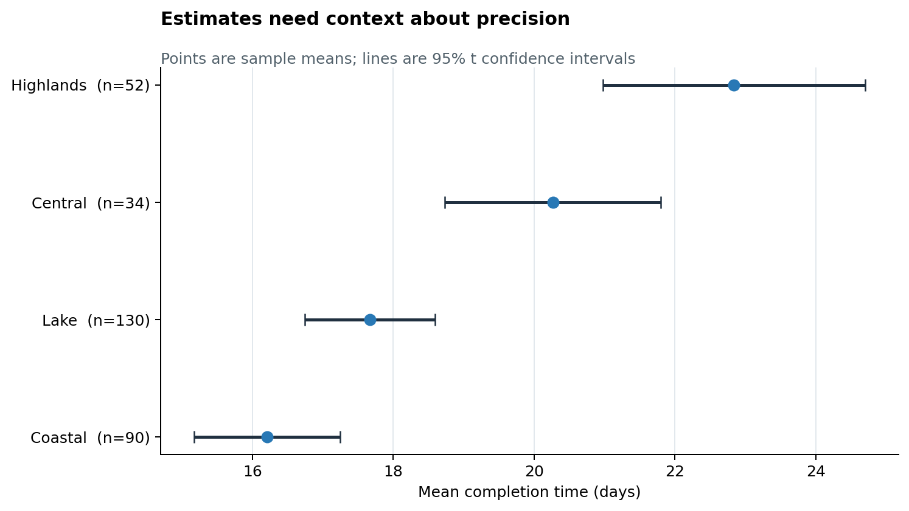
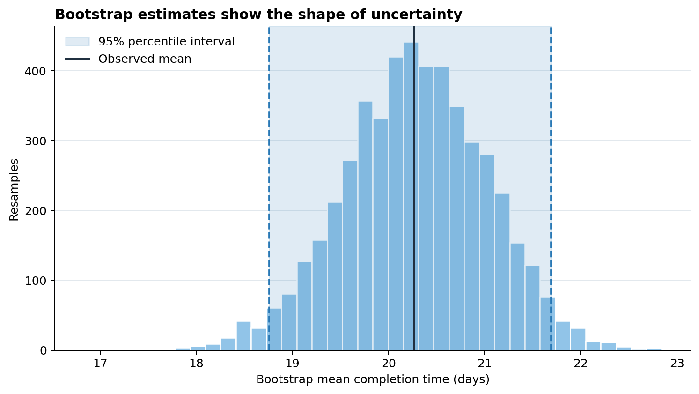
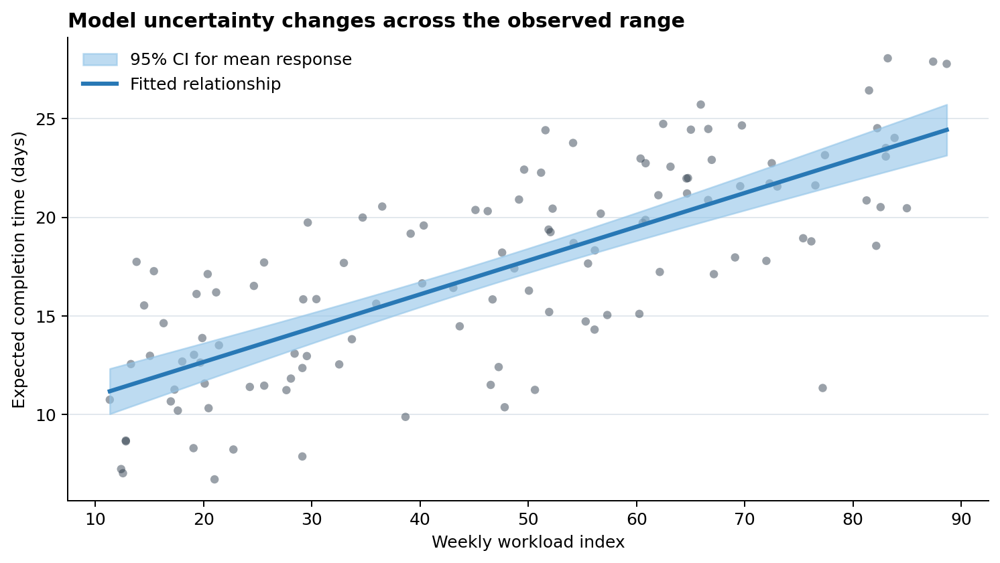

# Uncertainty and Statistical Evidence {#sec-uncertainty}

:::cdi-message
- **ID:** DVP-010
- **Type:** Analytical Patterns
- **Audience:** Intermediate
- **Theme:** Communicating estimates, variation, and uncertainty honestly
:::

## Learning Objectives

By the end of this chapter, you will be able to:

- distinguish observations, estimates, sampling variation, and confidence intervals;
- choose among error bars, interval plots, uncertainty bands, and bootstrap distributions;
- create confidence intervals for group summaries and regression predictions in Python;
- show sample size and data-quality cues alongside estimates;
- avoid visual conventions that turn continuous evidence into a binary verdict; and
- annotate charts with the assumptions and limitations needed for responsible interpretation.

## Why Uncertainty Must Be Visible

A point estimate is a compressed description of data, not an exact fact. A mean, rate, model coefficient, or forecast changes when the sample, measurement process, or model changes. Showing only the point estimate hides that instability and can make small differences look decisive.

The examples in this chapter use a reproducible fictional service-delivery study. Regions have different sample sizes and average completion times. The data are synthetic, so the chapter teaches visualization patterns without making a substantive claim about a real population.

A useful uncertainty display answers three questions:

1. **What was estimated?** For example, a mean completion time or an expected outcome.
2. **How uncertain is the estimate?** Show an interval, distribution, or band that matches the inferential method.
3. **Why is it uncertain?** Communicate sample size, variability, missingness, model assumptions, or extrapolation risk.

Uncertainty is not a decorative error bar. It is part of the result.

## Variation, Standard Error, and Confidence Intervals

Three quantities are often confused:

- **Standard deviation (SD)** describes variation among observed values.
- **Standard error (SE)** describes the sampling variability of an estimate. For a sample mean, $SE = s / \sqrt{n}$.
- **Confidence interval (CI)** gives a range produced by a procedure with a stated long-run coverage rate. A 95% CI is not a claim that 95% of observations lie inside the interval.

For a mean with unknown population variance, a two-sided interval is commonly calculated as

$$
\bar{x} \pm t_{1-\alpha/2,\,n-1}\frac{s}{\sqrt{n}}.
$$

The interval becomes narrower when the sample size grows or observations are less variable. Its validity also depends on how the sample was obtained and whether the assumptions of the procedure are reasonable. A precisely estimated biased sample remains biased.

| Visual element | Typical meaning | Appropriate question |
|---|---|---|
| Raw points | Observed values | How are individual cases distributed? |
| SD bars | Spread of observations | How variable are cases within a group? |
| SE bars | Precision of an estimate | How much would the estimate vary across samples? |
| Confidence interval | Inferential uncertainty | Which values are compatible with the procedure and data? |
| Prediction interval | Uncertainty for a future observation | Where might a new case fall? |

Always state what an interval represents. The label “error bars” alone is incomplete.

## Error Bars, Bands, and Interval Plots

Bar charts encode magnitude from a zero baseline, but they are rarely the best default for estimates. A dot-and-interval plot gives the estimate visual priority while making uncertainty easy to compare.

{#fig-group-confidence-intervals}

In @fig-group-confidence-intervals, interval width should not be read as performance. It describes precision. The chart deliberately labels $n$ because viewers otherwise have to guess why one interval is wider than another.

Use interval plots when:

- comparing a manageable number of group estimates;
- displaying coefficients or effect estimates;
- showing a reference value such as zero, a target, or a baseline; or
- interval endpoints are more important than the full sampling distribution.

Use a band when uncertainty varies continuously over time or along a predictor. Keep the band lighter than the estimated line and avoid layering so many bands that opacity becomes impossible to decode.

## Bootstrap Distributions

The bootstrap approximates sampling variation by repeatedly sampling, with replacement, from the observed data and recalculating the statistic. It is useful when an analytic standard error is unavailable or when visualizing the distribution of a derived statistic.

For one region, the accompanying script performs 5,000 bootstrap resamples of the mean using a fixed random seed. It displays the bootstrap estimates, their percentile interval, and the observed sample mean.

{#fig-bootstrap-distribution}

@fig-bootstrap-distribution reveals more than two interval endpoints: viewers can see the center, spread, and approximate shape of the bootstrap distribution. However, resampling does not repair selection bias, dependence, or poor measurement. The resampling scheme must reflect the data-generating structure; clustered or time-dependent data require methods that preserve that dependence.

## Model Estimates and Predictions

Model uncertainty should be displayed on the scale that supports the decision. A coefficient interval is helpful for parameter interpretation; a prediction band is often better for showing how an expected outcome changes with a predictor.

The example fits an ordinary least-squares line using NumPy and calculates a 95% confidence band for the **mean response**:

$$
\hat{y}(x_0) \pm t^*s\sqrt{\frac{1}{n} + \frac{(x_0-\bar{x})^2}{\sum_i(x_i-\bar{x})^2}}.
$$

{#fig-model-confidence-band}

The band in @fig-model-confidence-band is narrowest near the center of the observed predictor values and widens toward the edges. It is not a prediction interval for an individual future observation; that interval would be wider because it also includes residual variation. Do not extend a fitted line far beyond the observed data range unless extrapolation is explicitly justified.

## Sample Size and Data Quality Cues

Interval width is only one cue about evidence quality. Depending on the analysis, add:

- group sample sizes near labels or estimates;
- raw observations, jittered or summarized, when overplotting is manageable;
- missing-value counts or completion rates;
- a visual distinction for imputed, provisional, censored, or low-quality values;
- the observed range of a predictor to expose extrapolation; and
- warnings when independence, representativeness, or measurement assumptions are doubtful.

Avoid mapping sample size to an unrelated aesthetic if labels would be clearer. For example, simultaneously varying point size, color, and opacity may burden the viewer more than a concise `n = ...` annotation.

## Avoiding Dichotomous Visual Reasoning

A chart should not encourage “significant versus not significant” as the only interpretation. The conventional $p < 0.05$ threshold does not separate important effects from unimportant ones, nor does a confidence interval crossing zero prove that no effect exists.

Prefer these questions:

- What effect sizes are compatible with the data and method?
- Does the interval include values that would matter in practice?
- How precise is the estimate?
- Are estimates consistent across groups, specifications, or data sources?
- What decisions would change across the plausible range?

If a reference line is necessary, make it visually secondary. Do not color estimates bright green on one side of a threshold and red on the other unless that classification corresponds to a defensible decision rule.

## Annotating Evidence and Limitations

A compact chart note should identify:

- the estimand, such as a mean difference or expected response;
- the interval type and level, such as a 95% t interval or bootstrap percentile interval;
- the sample and analysis unit;
- weighting, clustering, adjustment, or model details that materially affect interpretation; and
- important exclusions, missingness, or limitations.

For example:

> Points show regional sample means; lines show two-sided 95% t confidence intervals. Synthetic records are independent within this teaching example. Intervals describe sampling precision, not the spread of individual completion times.

Place essential interpretation next to the visual. A reader should not need to search a distant appendix to learn what the interval means.

## Reproducing the Examples

Run the chapter script from the repository root:

```bash
python scripts/python/10-uncertainty-and-statistical-evidence.py
```

The script creates the three figures used above and writes reusable CSV summaries to `results/10-uncertainty-and-statistical-evidence/`. It uses a fixed random seed, creates output directories when needed, and records the principal estimates in a JSON run manifest.

## Chapter Practice

1. Replace the 95% group intervals with 90% and 99% intervals. Describe what changes and what does not.
2. Add raw observations behind the group interval plot. Decide whether the additional detail improves or weakens the comparison.
3. Bootstrap the median rather than the mean. Compare its distribution and interval with the mean-based result.
4. Extend the model figure with a prediction interval for a future observation and explain why it is wider than the confidence band.
5. Draft a chart note for a real dataset that states the estimand, interval method, sample size, and two important limitations.

## Key Takeaways

- Point estimates without uncertainty can imply more certainty than the analysis supports.
- Standard deviation, standard error, confidence intervals, and prediction intervals answer different questions.
- Dot-and-interval plots are strong defaults for group estimates; bands suit continuous predictors and time.
- Bootstrap distributions expose the shape of sampling uncertainty but cannot fix biased or dependent data.
- Sample size and data-quality cues help viewers understand why precision differs.
- Interpret effect sizes and plausible ranges rather than reducing evidence to a threshold decision.
- Label the interval method, confidence level, analysis unit, and material limitations directly and clearly.
