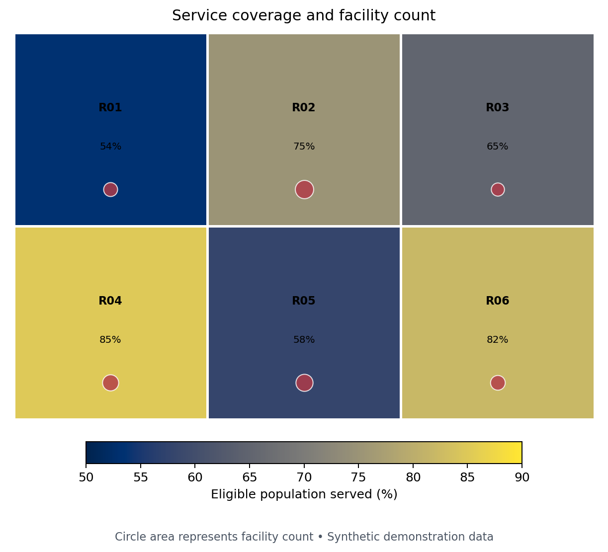
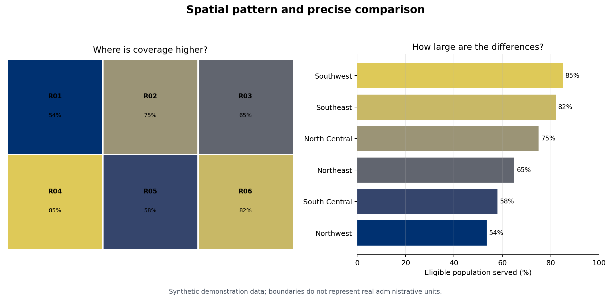

# Geospatial Visualization {#sec-geospatial}

:::cdi-message
- **ID:** DVP-011
- **Type:** Specialized Visualization
- **Audience:** Intermediate
- **Theme:** Static and interactive spatial data communication
:::

Maps connect measurements to place. Their apparent familiarity can hide consequential analytical choices: coordinate reference system (CRS), geographic unit, denominator, classification, projection, and visual hierarchy. This chapter treats a map as an analytical view—not decoration—and develops a reproducible workflow for defensible static and interactive spatial graphics.

The companion script uses a small synthetic geography so the example runs offline and does not imply that demonstration values describe real communities. In production, replace it with an authoritative, versioned boundary file and document its source and date.

## Learning Objectives

After completing this chapter, you will be able to:

- distinguish vector and raster spatial data and select an appropriate geometry;
- interpret and transform coordinate reference systems;
- join attributes to spatial features without silently losing records;
- create point, line, polygon, choropleth, and proportional-symbol maps;
- choose normalization and classification methods deliberately;
- add basemaps and interactivity without weakening the analytical message; and
- audit maps for uncertainty, accessibility, privacy, and geographic bias.

## Spatial Data Models and Coordinate Systems

### Vector and raster data

Vector data represent discrete features as **points**, **lines**, and **polygons**. A clinic can be a point, a road a line, and a district a polygon. Each geometry is attached to attributes such as name, population, or service count. Raster data divide space into cells; elevation, temperature, and satellite imagery are common examples.

Choose a model from the phenomenon, not from the file available. A continuous surface displayed as administrative polygons suggests sharp borders that may not exist. Conversely, millions of individual points can obscure an aggregate regional pattern and create privacy risk.

### A CRS is part of the data

A CRS specifies how coordinates relate to positions on Earth. Geographic coordinates such as EPSG:4326 use longitude and latitude in angular degrees. Projected systems use planar units, often metres, and are normally better for area, distance, buffers, and local cartography.

```python
import geopandas as gpd

regions = gpd.read_file("data/reference/regions.geojson")
print(regions.crs)

# Select a suitable local projected CRS before area calculations.
regions_m = regions.to_crs(regions.estimate_utm_crs())
regions["area_km2"] = regions_m.area / 1_000_000
```

Never assign a CRS merely to make an error disappear. `set_crs()` declares what coordinates already mean; `to_crs()` transforms them. Treat missing CRS metadata as a data-quality problem.

## Working with GeoPandas

A `GeoDataFrame` combines tabular columns with one active geometry column. A reliable workflow validates both sides of an attribute join before mapping.

```python
import pandas as pd
import geopandas as gpd

regions = gpd.read_file("data/reference/regions.geojson")
indicators = pd.read_csv("data/processed/11-region-indicators.csv")

assert regions["region_id"].is_unique
assert indicators["region_id"].is_unique

mapped = regions.merge(
    indicators,
    on="region_id",
    how="left",
    validate="one_to_one",
    indicator=True,
)
assert mapped["_merge"].eq("both").all(), "Unmatched spatial features"
assert mapped.geometry.is_valid.all(), "Invalid geometry found"
```

Stable identifiers are preferable to names: spelling, punctuation, language, and boundary revisions can all break name-based joins. Record counts before and after every join, inspect unmatched keys, and distinguish missing data visually from valid zeros.

## Point, Line, and Polygon Maps

Geometry carries meaning:

- **Points** show locations. Use transparency, aggregation, or sampling when they overlap.
- **Lines** show connections or routes. Width can encode magnitude, but flow direction needs arrows or animation.
- **Polygons** show areas. Use light fills for reference boundaries; heavy outlines compete with the values.

Plot layers in a deliberate order: polygons first, then lines, then points and labels. A spatial selection should also state its predicate. “Within,” “intersects,” and “nearest” answer different questions.

```python
ax = regions.plot(facecolor="#f3f4f6", edgecolor="white", linewidth=0.8)
roads.plot(ax=ax, color="#8a817c", linewidth=1.0)
clinics.plot(ax=ax, color="#8b1e3f", markersize=24, zorder=3)
ax.set_axis_off()
```

The first generated figure combines a rate choropleth with proportional facility symbols. It answers two related questions without encoding raw counts as area color.

{#fig-geospatial-choropleth fig-alt="Six synthetic regions colored from light yellow to dark blue by service coverage rate, with red circles sized by facility count."}

## Choropleths and Classification Choices

A choropleth fills polygons according to a value. Map a rate, percentage, density, or other meaningful normalized measure when geographic units differ in population or area. Raw counts usually produce a population map in disguise.

For region $i$, a coverage rate might be

$$
r_i = 100 \times \frac{y_i}{n_i},
$$

where $y_i$ is the number served and $n_i$ is the eligible population. The denominator belongs in the data dictionary and ideally in the figure note.

Classification changes the story:

| Method | Strength | Main caution |
|---|---|---|
| Continuous | Preserves ordering and detail | Exact comparison by color is difficult |
| Equal interval | Simple, comparable ranges | Skewed data can leave classes sparse |
| Quantile | Similar feature counts per class | Similar values can fall into different classes |
| Natural breaks | Follows clusters in one dataset | Breaks are unstable across time or samples |
| Domain thresholds | Supports decisions and targets | Requires justified, documented cut points |

Use fixed breaks when comparing time periods or panels. Otherwise, a region can change color even when its value barely changes because the distribution—and therefore the breaks—changed.

```python
breaks = [0, 50, 65, 80, 100]
labels = ["<50", "50–64", "65–79", "80+"]
mapped["coverage_band"] = pd.cut(
    mapped["coverage_pct"], breaks, labels=labels,
    right=False, include_lowest=True,
)
```

## Contextily Basemaps

Basemaps provide orientation but also add labels, color, network access, licensing obligations, and visual noise. Contextily expects web-map tiles in Web Mercator (EPSG:3857).

```python
import contextily as cx

ax = clinics.to_crs(3857).plot(
    color="#8b1e3f", markersize=35, alpha=0.85, figsize=(9, 7)
)
cx.add_basemap(ax, source=cx.providers.CartoDB.Positron)
ax.set_axis_off()
```

Transform the data, attribute the provider, cache tiles when permitted, and design for a graceful offline fallback. Do not use a basemap merely to fill empty space.

## Interactive Maps with Plotly and Folium

Interactivity is useful for lookup, filtering, and exploration. It should supplement—not replace—a clear default view.

```python
import plotly.express as px

fig = px.choropleth_map(
    mapped,
    geojson=mapped.__geo_interface__,
    locations="region_id",
    featureidkey="properties.region_id",
    color="coverage_pct",
    hover_name="region_name",
    hover_data={"population": ":,", "coverage_pct": ":.1f"},
    color_continuous_scale="Cividis",
    map_style="carto-positron",
    center={"lat": -6.5, "lon": 35.0},
    zoom=4.5,
)
fig.write_html("results/interactive/11-geospatial-explorer.html")
```

Keep hover content concise, label units, provide a meaningful title, and avoid requiring hover to discover the main conclusion. Folium is a strong alternative for Leaflet layers, markers, popups, and plugins; Plotly integrates naturally with analytical figures and dashboards.

## Spatial Scale, Projection, and Normalization

Spatial conclusions depend on scale and aggregation. Patterns at district level may disappear or reverse at regional level—an instance of the modifiable areal unit problem. Ecological fallacy occurs when area-level associations are interpreted as properties of individuals.

Before publishing, ask:

1. Is the geographic unit appropriate to the decision?
2. Does the denominator match the question?
3. Are boundaries and indicators from compatible dates?
4. Does the projection preserve the property important to the task?
5. Would a dot plot or ranked bar chart make comparison easier?

The second generated figure pairs a map with a sorted bar chart. The map reveals spatial arrangement; the bars make regional differences more precisely comparable.

{#fig-geospatial-ranking fig-alt="Synthetic six-region map beside a horizontal ranking of service coverage percentages."}

## Ethical and Accessible Mapping

Maps can stigmatize places, expose people, or give false certainty. Apply these safeguards:

- aggregate, jitter, grid, or suppress sensitive locations;
- state that absence of observations is not necessarily absence of the phenomenon;
- label missing values explicitly rather than using the lowest color;
- use a perceptually ordered, color-vision-deficiency-aware palette;
- avoid red–green contrasts as the only signal;
- provide text summaries and useful alternative text;
- show uncertainty or data quality where it could change interpretation; and
- name the boundary source, indicator source, period, CRS, and transformations.

For uncertain estimates, consider hatching, transparency, bivariate encodings used cautiously, or a companion uncertainty panel. If uncertainty is material, do not hide it in a tooltip.

## Chapter Practice

Run the companion program from the repository root:

```bash
python scripts/python/11-geospatial-visualization.py
```

Then complete the following tasks:

1. Replace `coverage_pct` with `facilities_per_100k` and explain how the spatial pattern changes.
2. Define fixed policy thresholds and compare them with quantile classes.
3. Add one deliberately missing region value and design an unmistakable missing-data style.
4. Write a two-sentence interpretation that does not make an ecological claim.
5. Identify the boundary, indicator, projection, privacy, and accessibility metadata needed for publication.

The script writes the two referenced PNG figures, a CSV of the synthetic indicators, a GeoJSON file usable in GeoPandas or Plotly, and a small manifest recording the outputs.

## Key Takeaways

- A CRS, boundary vintage, geographic scale, and denominator are analytical choices.
- Validate spatial joins and geometry before drawing the map.
- Choropleths generally encode normalized values, not raw counts.
- Classification schemes can materially change apparent patterns; use fixed breaks for comparison.
- Combine maps with more precise views such as ranked bars when comparison matters.
- Interactivity should improve lookup and exploration while the default view remains understandable.
- Ethical spatial communication protects privacy, distinguishes missingness, and communicates uncertainty and provenance.
