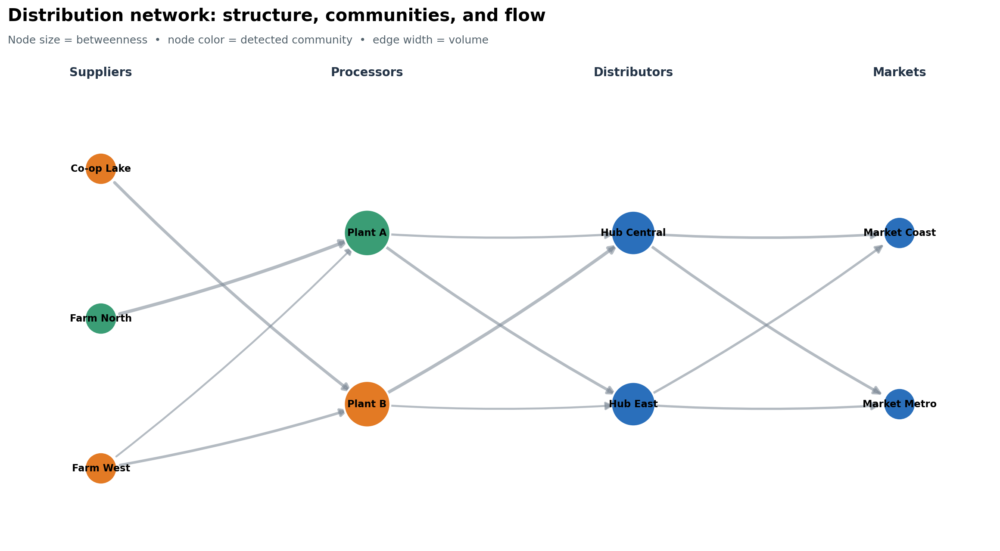
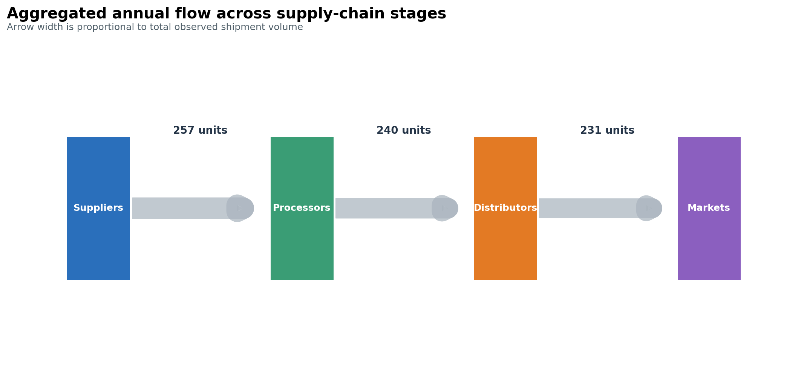

# Network and Flow Visualization {#sec-network-flow}

:::cdi-message
- **ID:** DVP-012
- **Type:** Specialized Visualization
- **Audience:** Intermediate
- **Theme:** Relationships, movement, hierarchy, and connectivity
:::

## Learning Objectives

By the end of this chapter, you will be able to:

- distinguish node-link diagrams from flow and hierarchy views;
- construct attributed graphs with NetworkX;
- choose layouts and visual encodings that support a specific analytical question;
- interpret degree, betweenness, PageRank, and community membership;
- represent directed, weighted, and bipartite relationships;
- design Sankey and treemap views without overstating precision; and
- diagnose and redesign a dense, unreadable network.

The examples use a small fictional distribution network. Products move from
suppliers through processing and distribution facilities to markets. The data
are intentionally compact enough to inspect, but the workflow scales to larger
graphs when aggregation and filtering are applied first.

:::callout-note
## A network view is an analytical model

A graph is not simply a table drawn with circles and lines. Decisions about
what becomes a node, what becomes an edge, whether direction matters, and how
repeated events are aggregated determine the claims the visualization can
support.
:::

## Nodes, Edges, and Graph Attributes

A graph, $G=(V,E)$, contains a set of **nodes** (or vertices), $V$, and a set of
**edges**, $E$. Nodes represent entities; edges represent relationships or
transactions between them.

| Component | Supply-network example | Useful attributes |
|---|---|---|
| Node | supplier, facility, or market | stage, region, capacity |
| Edge | product movement | volume, cost, lead time |
| Direction | origin $\rightarrow$ destination | source and target |
| Weight | annual shipment volume | edge width or opacity |

An edge list is usually the most convenient analytical form:

```{python}
#| eval: false
edges = [
    ("Farm North", "Plant A", {"volume": 84}),
    ("Plant A", "Hub East", {"volume": 68}),
    ("Hub East", "Market Metro", {"volume": 51}),
]
```

An adjacency matrix is useful for algebra and heatmaps, while a node table
keeps attributes separate from relationships. Preserve stable node identifiers
in all three representations; labels can change, identifiers should not.

## Building Graphs with NetworkX

NetworkX provides graph classes for common relationship structures:

- `Graph`: undirected, with at most one edge per node pair;
- `DiGraph`: directed, with at most one edge per ordered pair;
- `MultiGraph` and `MultiDiGraph`: parallel edges are retained; and
- bipartite graphs: nodes belong to two disjoint sets and edges cross sets.

```{python}
#| eval: false
import networkx as nx

graph = nx.DiGraph()
graph.add_node("Plant A", stage="processor", region="North")
graph.add_edge("Farm North", "Plant A", volume=84, lead_days=2.0)

assert nx.is_directed(graph)
print(graph.number_of_nodes(), graph.number_of_edges())
```

Choose the graph class before calculating metrics. Converting a directed graph
to an undirected graph changes the meaning of degree and paths. Likewise,
collapsing a multigraph can hide repeated transaction types unless their
weights are aggregated deliberately.

### Validate before drawing

Useful checks include:

```{python}
#| eval: false
assert all(data["volume"] > 0 for *_, data in graph.edges(data=True))
assert not list(nx.selfloop_edges(graph))
assert nx.number_weakly_connected_components(graph) == 1
```

Validation catches modeling errors while they are still recognizable in the
data. A visually plausible graph can otherwise conceal duplicate entities,
reversed edges, missing weights, or disconnected records.

## Layouts and Visual Encodings

A layout maps nodes to positions. Position usually reflects an algorithm, not
geography or a measured coordinate.

| Layout | Best suited to | Important limitation |
|---|---|---|
| Spring / force-directed | exploring clusters and bridges | stochastic unless seeded |
| Kamada–Kawai | small graphs emphasizing graph distance | slower on large graphs |
| Circular | comparing connections without implying rank | crossings accumulate quickly |
| Multipartite | stages, tiers, or ordered layers | requires a meaningful subset attribute |
| Geographic | spatial infrastructure | distance may dominate topology |

Use a fixed seed for reproducible force-directed layouts. Encode only a few
attributes at once:

- node position: stage or structural proximity;
- node color: category or community;
- node size: centrality, capacity, or total volume;
- edge width: weight;
- arrow direction: movement; and
- labels: selected nodes, not necessarily every node.

Area-based encodings require care. If a centrality value controls marker area,
pass it as the node-size value directly; do not square it again. Apply sensible
minimums so low-valued nodes remain visible.

{#fig-network-communities}

Figure @fig-network-communities separates structural encodings. Because the
horizontal tiers carry domain meaning, readers do not have to infer the supply
chain solely from arrowheads.

## Communities and Centrality

Centrality metrics answer different questions:

| Metric | Question | Caveat |
|---|---|---|
| In/out-degree | How many direct relationships enter or leave? | ignores distant structure |
| Weighted degree | How much total activity touches the node? | large volume is not influence |
| Betweenness | Which nodes lie on many shortest paths? | depends on the meaning of distance |
| PageRank | Which nodes receive links from important nodes? | sensitive to direction and damping |

For weighted shortest-path metrics, NetworkX interprets an edge weight as a
**distance or cost**. Shipment volume is the opposite: a high volume often
signals a strong connection. The accompanying script therefore calculates
betweenness on unweighted topology. In another application, create a distance
such as `1 / volume` only when that transformation has a defensible meaning.

Community detection groups nodes with relatively dense internal connections.
It is exploratory—not proof that real organizational or social groups exist.
The script applies greedy modularity to an undirected projection, then uses the
result as a categorical color encoding.

```{python}
#| eval: false
undirected = graph.to_undirected()
communities = nx.community.greedy_modularity_communities(
    undirected, weight="volume"
)
betweenness = nx.betweenness_centrality(graph, normalized=True)
pagerank = nx.pagerank(graph, weight="volume")
```

Report the graph transformation, algorithm, and weight semantics alongside the
visual. Without them, the metrics are difficult to reproduce or audit.

## Directed, Weighted, and Bipartite Networks

Direction is essential when edges represent movement, influence, citations, or
dependencies. Weighted degree in a directed graph separates incoming and
outgoing totals:

```{python}
#| eval: false
in_volume = dict(graph.in_degree(weight="volume"))
out_volume = dict(graph.out_degree(weight="volume"))
```

A bipartite graph represents relationships between two node types—for example,
products and suppliers or authors and papers. A projected supplier network
connects suppliers that share a product, but projection discards information.
Retain the original bipartite graph and document whether projected edge weights
count shared neighbors, transactions, or another quantity.

For multigraphs, decide whether parallel edges are distinct events or should be
aggregated. A defensible aggregation table might contain `source`, `target`,
`total_volume`, `shipment_count`, and `median_lead_days`, preserving more
information than a single summed weight.

## Sankey and Alluvial Views

Node-link diagrams emphasize connectivity. **Sankey diagrams** emphasize the
magnitude of flows between stages, with link width proportional to quantity.
Alluvial diagrams are closely related and are often used to show changes in
membership or composition across categorical dimensions.

```{python}
#| eval: false
import plotly.graph_objects as go

figure = go.Figure(go.Sankey(
    node={"label": labels},
    link={"source": source_ids, "target": target_ids, "value": volumes},
))
figure.update_layout(title="Annual product flow")
figure.show()
```

Before constructing the chart, map labels to integer indices and validate that
all values are non-negative. Aggregate small flows when they obscure the main
paths. If conservation is expected, test it: for an intermediate node, incoming
flow should equal outgoing flow after accounting for inventory, loss, or
transformation.

{#fig-stage-flow}

The static flow view in @fig-stage-flow is designed for reports and print. The
same aggregated values can drive an interactive Sankey chart when hover detail
and path tracing add genuine value.

:::callout-warning
## Flow width is quantitative

Do not manually adjust link widths to improve appearance. If thin links are
unreadable, aggregate, filter, annotate, or provide a companion table rather
than distorting the quantities.
:::

## Hierarchies and Treemaps

Trees are graphs with one unique path between connected nodes. Common hierarchy
views include:

- node-link trees for ancestry and reporting lines;
- dendrograms for merge sequences or clustering;
- treemaps for part-to-whole composition; and
- sunbursts for nested composition with explicit levels.

A treemap encodes magnitude by rectangle area and hierarchy by enclosure. It is
space-efficient but poor for precise comparison, especially among small or
non-adjacent rectangles. Sort consistently, keep hierarchy depth modest, and
provide numeric labels or tooltips. Use a bar chart when accurate ranking is
the main task.

Never force a general network into a tree: nodes with multiple parents or
cycles will be misrepresented. Check the topology first with functions such as
`nx.is_tree()` or `nx.is_directed_acyclic_graph()`.

## Avoiding Network Hairballs

A network hairball contains so many overlapping nodes, edges, and labels that
structure disappears. More pixels rarely solve the underlying analytical
problem.

Redesign in this order:

1. Restate the question: identify hubs, compare groups, trace a path, or measure
   flow.
2. Filter to a relevant ego network, time window, edge type, or weight range.
3. Aggregate nodes into defensible groups or flows between stages.
4. Highlight a subgraph and mute context instead of labeling everything.
5. Switch views: adjacency matrix for dense connectivity, Sankey for volume,
   bar chart for centrality, or table for exact values.

Always disclose filtering thresholds. Removing low-weight edges can make a
network appear more fragmented and centralize the remaining nodes.

:::callout-tip
## Small multiples can beat interaction

Faceting networks by time, region, or relationship type often makes structural
change easier to compare than an animation. Keep node positions stable across
panels so movement does not masquerade as topological change.
:::

## Chapter Practice

The reproducible practice script builds the fictional distribution network,
computes community and centrality measures, aggregates stage-to-stage flows,
and saves both figures and summary tables.

Run it from the repository root:

```bash
python scripts/python/12-network-and-flow-visualization.py
```

Expected outputs:

- `results/figures/12-network-communities.png`;
- `results/figures/12-stage-flow.png`;
- `results/12-network-node-summary.csv`;
- `results/12-stage-flow-summary.csv`; and
- `results/12-network-figure-manifest.csv`.

### Exercises

1. Replace node size with weighted in-degree. Which facilities become visually
   prominent, and why?
2. Remove edges with volume below 20. Compare weak connectivity, community
   assignments, and betweenness before and after filtering.
3. Add a second market and rebalance outgoing hub flows. Test conservation at
   every intermediate node.
4. Build an interactive Sankey chart from the stage-flow summary. Add useful
   hover text without duplicating labels already visible.
5. Create a bipartite product–supplier graph, project it onto suppliers, and
   explain exactly what information the projection loses.

### Review checklist

- [ ] Node and edge meanings are explicit.
- [ ] Direction and weight semantics match the phenomenon.
- [ ] Layout choice supports the question and is reproducible.
- [ ] Centrality metrics are named and interpreted narrowly.
- [ ] Visual encodings have legends or direct labels.
- [ ] Filtering and aggregation rules are disclosed.
- [ ] A simpler chart was considered.

## Key Takeaways

- Model the relationship correctly before choosing a layout.
- Treat position in algorithmic layouts as structure, not measured geography.
- Use centrality and community algorithms as question-specific summaries, not
  universal rankings or discovered truth.
- Prefer Sankey views for quantities moving through stages and treemaps for
  compact hierarchical composition.
- Reduce, aggregate, or change the visual form when a network becomes a
  hairball.
- Keep graph construction, transformations, metrics, and figure generation in
  a reproducible script so the published visual can be audited.
