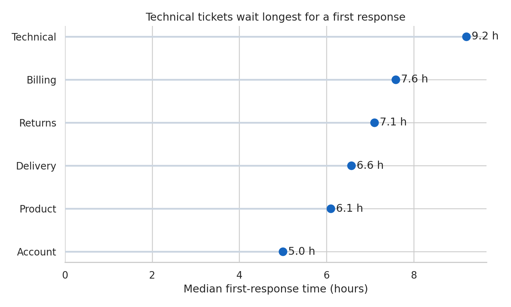
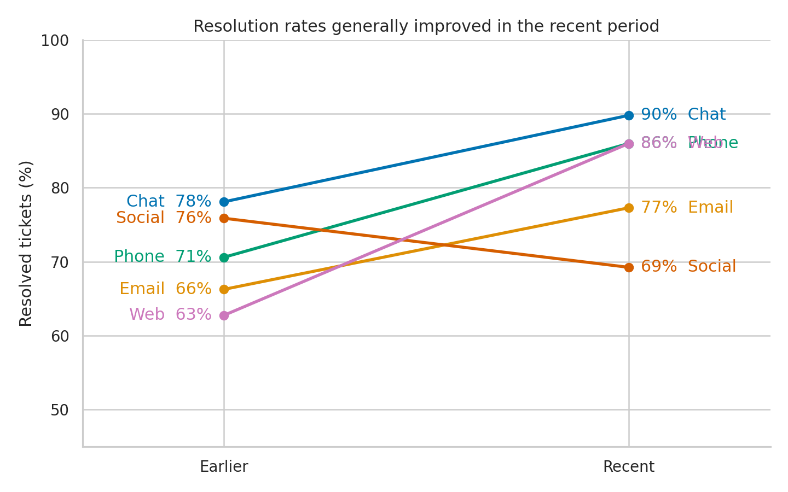
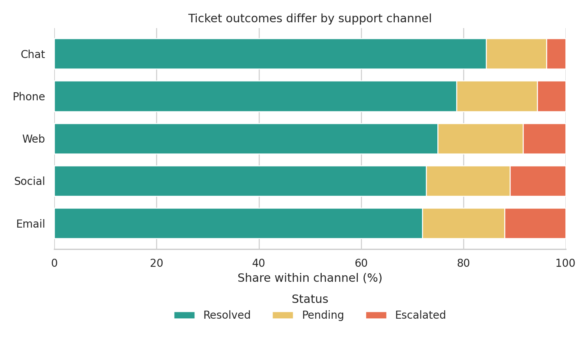
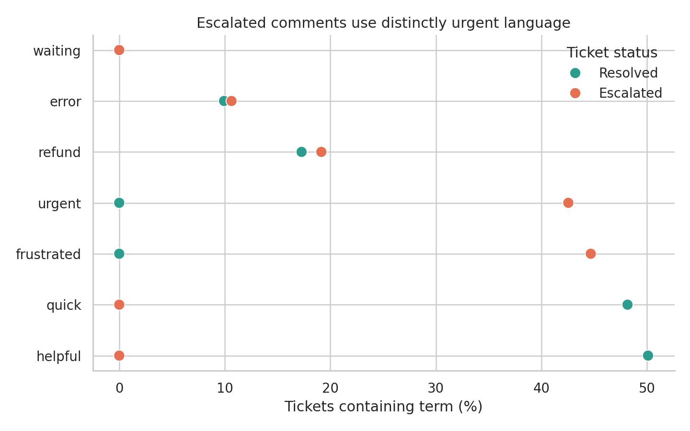
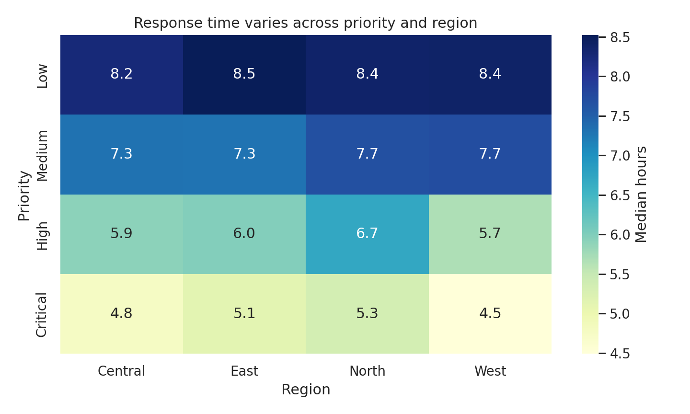

# Text, Categorical, and Compositional Visualization {#sec-text-categorical}

:::cdi-message
- **ID:** DVP-013
- **Type:** Specialized Visualization
- **Audience:** Intermediate
- **Theme:** Frequencies, rankings, language, and part-to-whole structure
:::

Many datasets describe *what kind*, *how much of each kind*, or *which words occur together*. These questions look different, but they share a design problem: categories have no automatic visual position. The analyst must choose an order, a denominator, and a level of aggregation before drawing the chart.

This chapter uses a small synthetic survey of 600 support tickets. Each record has a region, priority, channel, resolution status, response time, and short customer comment. The data are generated by `scripts/python/13-text-categorical-compositional.py`, so every figure and summary can be reproduced without an external download.

## Learning Objectives

After completing this chapter, you will be able to:

- order categorical displays by magnitude, meaning, or a fixed business sequence;
- choose between bars, dots, lollipops, and slope charts;
- distinguish counts from within-group proportions;
- compare term frequencies without treating text as decoration;
- build interpretable co-occurrence and category-term matrices;
- explain when composition charts, heatmaps, and direct labels are appropriate; and
- recognize why word clouds are usually weak analytical evidence.

## Ordered Categorical Comparisons

An unordered bar chart makes readers repeatedly search for the largest and smallest values. Sorting converts that search into a visual pattern. Figure @fig-13-category-ranking ranks ticket topics by median first-response time and uses horizontal marks so the labels remain readable.

{#fig-13-category-ranking fig-alt="Horizontal dot plot ranking billing, account, delivery, product, returns, and technical ticket topics by median first-response time."}

The correct order depends on the question:

- **Magnitude order** supports ranking and comparison.
- **Semantic order** preserves sequences such as low, medium, high, and critical.
- **Chronological order** is required for weekdays, months, and lifecycle stages.
- **Reference order** can foreground a baseline or policy target.

Never sort categories mechanically when their sequence carries meaning. A severity scale displayed as `critical, low, medium, high` is numerically tidy but conceptually broken.

## Dot, Lollipop, and Slope Charts

Bars encode values by length from a zero baseline and remain the safest choice for absolute magnitudes. Dot plots reduce visual ink and work well when the main task is comparing positions on a common scale. Lollipop charts add a line from the baseline to each dot; they can help connect a value to its label, but many lollipops become busier than bars.

A slope chart answers a different question: how did each category change between two conditions? Figure @fig-13-channel-slope compares resolution rates by channel in two periods. The important encoding is the direction and size of each line, not the rank at either endpoint.

{#fig-13-channel-slope fig-alt="Slope chart comparing earlier and recent resolution rates for chat, email, phone, social, and web support channels."}

Use a slope chart when there are two meaningful endpoints and a manageable number of series. With many categories, crossings and labels overwhelm the signal; a sorted difference plot is then more effective.

## Composition and Part-to-Whole Views

Composition requires an explicit denominator. “Thirty percent unresolved” may mean 30% of all tickets, 30% within one region, or 30% within one channel. Figure @fig-13-channel-composition normalizes each channel to 100%, making within-channel status distributions comparable even though channel volumes differ.

{#fig-13-channel-composition fig-alt="One-hundred-percent stacked horizontal bars showing resolved, pending, and escalated ticket shares within each support channel."}

Part-to-whole choices have distinct strengths:

| Question | Effective display | Main caution |
|---|---|---|
| What is the overall share of a few parts? | Bar or 100% stacked bar | Keep the denominator visible |
| How does composition differ across groups? | 100% stacked bars | Middle segments lack a shared baseline |
| How do both totals and parts differ? | Regular stacked bars | Large totals can hide proportional change |
| How does a hierarchy divide? | Treemap | Area is difficult to compare precisely |
| How did share change over time? | Lines or small multiples | Avoid stacked areas for exact comparisons |

Pie and donut charts can communicate a simple two- or three-part split, but bars support more precise comparison and scale better when categories multiply.

## Text Frequency and Term Comparison

Text visualization begins with a transparent counting rule. The chapter script lowercases comments, extracts alphabetic tokens, removes a short documented stop-word list, and counts each term once per ticket. Counting document presence rather than raw repetition prevents a single repetitive comment from dominating the result.

Figure @fig-13-term-comparison compares the prevalence of selected terms in resolved and escalated tickets. The horizontal axis reports the percentage of documents containing the term, so differently sized groups remain comparable.

{#fig-13-term-comparison fig-alt="Grouped dot plot comparing the percentage of resolved and escalated comments containing selected customer-service terms."}

Term frequency is descriptive, not automatically meaningful. Frequent terms may reflect template language, collection practices, or common background vocabulary. Preserve the underlying comments, document preprocessing decisions, and inspect examples before interpreting a term as a theme.

## Co-Occurrence and Topic Views

Two terms co-occur when they appear in the same defined context, such as a sentence, document, or sliding window. That context is an analytical choice. Document-level co-occurrence is easy to explain here: each pair receives one count per ticket containing both terms.

The strongest pairs are saved in `results/13-term-cooccurrence.csv`. A network can be useful when relationships and clusters matter, but it should be pruned deliberately and accompanied by exact values. Dense “hairball” networks often communicate little beyond dataset size.

Topic models introduce additional assumptions about tokenization, topic count, and probabilistic structure. Treat topics as exploratory summaries: label them after inspecting high-weight terms and representative documents, and report the model settings. Do not present an automatically assigned topic name as observed truth.

## Heatmaps and Matrix Displays

A heatmap is a table whose cell values are encoded by color. It is effective when the repeated two-dimensional structure is the message. Figure @fig-13-priority-region-heatmap shows median response time for each priority-region combination.

{#fig-13-priority-region-heatmap fig-alt="Annotated heatmap of median first-response hours for low, medium, high, and critical priority tickets across four regions."}

The sequential color scale has a clear low-to-high direction. A diverging scale would be justified only if a meaningful midpoint existed, such as deviation from a service-level target. Annotations provide exact values, while color exposes the broader pattern. Reorder rows and columns when doing so reveals structure, but retain semantic orders such as priority severity.

## Why Word Clouds Are Usually Weak Evidence

Word clouds map frequency to area or font size, scatter terms across two dimensions that carry no quantitative meaning, and often rotate words. Readers cannot compare areas accurately, recover exact values, or see denominators. Layout can also change when the algorithm or canvas changes even when the data do not.

For analysis, prefer a sorted bar or dot plot with counts or rates. For relationships, use a matrix or a carefully filtered network. A word cloud may be acceptable as a decorative orientation device, but it should not carry the evidential burden of a result.

## Choosing Labels and Ordering Categories

Labels should let the reader identify the mark and interpret the measure without reverse-engineering the chart.

- Use sentence case and human-readable category names.
- State whether values are counts, percentages, rates, or model estimates.
- Put units in the axis title or direct label.
- Label endpoints directly when a legend would force repeated lookup.
- Combine rare categories only when the rule is defensible and disclosed.
- Keep category colors consistent across related figures.

The script writes `results/13-category-summary.csv` and `results/13-run-summary.json` so plotted values and generation settings can be audited independently of the images.

## Chapter Practice

Run the complete workflow from the repository root:

```bash
bash scripts/bash/13-run-text-categorical-compositional.sh
```

Then complete the following tasks:

1. Rebuild the ranking chart using ticket counts rather than response time. Explain why the category order changes.
2. Replace the 100% stacked chart with regular stacked counts. Write one sentence describing the different question it answers.
3. Change the co-occurrence context from a complete ticket to adjacent token pairs. Compare the five strongest relationships.
4. Recalculate term prevalence by channel and identify one term whose apparent importance depends on the denominator.
5. Remove the numeric heatmap annotations. Ask another reader to identify the largest two cells, then decide whether color alone is sufficient.

## Key Takeaways

- Category order is part of the analysis, not a cosmetic afterthought.
- Bars are dependable for magnitude; dots reduce ink; slopes emphasize two-point change.
- Every compositional claim must identify its denominator.
- Text frequencies depend on tokenization, filtering, and counting rules.
- Co-occurrence shows association within a chosen context, not semantic equivalence or causation.
- Heatmaps work best for repeated matrix structure and require a scale matched to the data.
- Sorted, labeled displays usually provide stronger evidence than word clouds.

