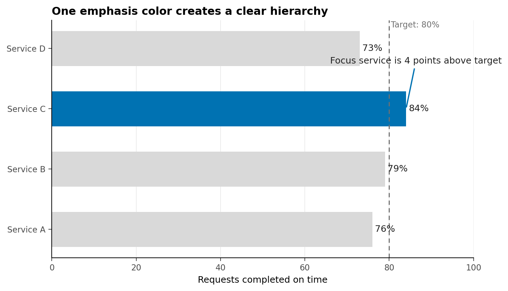
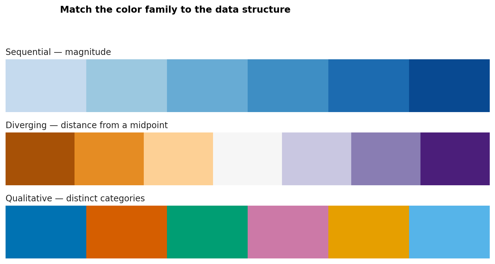
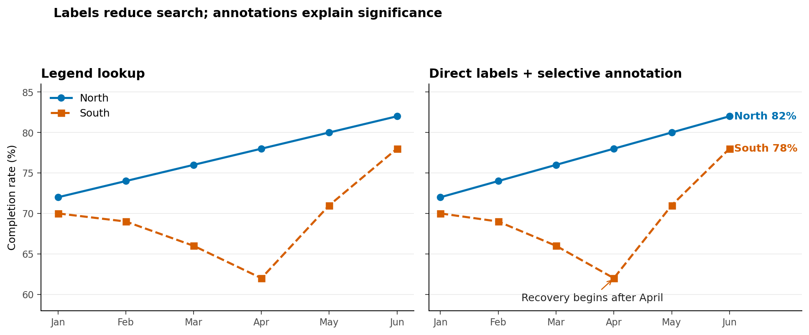
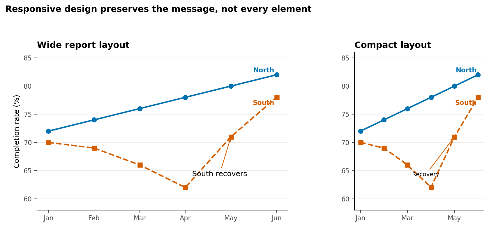

# Color, Layout, Annotation, and Accessibility {#sec-accessible-design}

:::cdi-message
- **ID:** DVP-014
- **Type:** Design and Communication
- **Audience:** Beginner / Intermediate
- **Theme:** Inclusive visual design and purposeful emphasis
:::

## Learning Objectives

By the end of this chapter, you will be able to:

- use visual hierarchy to guide attention without distorting the data;
- select sequential, diverging, and qualitative color schemes for the analytical task;
- evaluate color contrast and avoid color-only encodings;
- improve charts through typography, spacing, direct labels, and concise annotations;
- write useful alt text and text equivalents for static and interactive graphics; and
- test whether a visualization remains understandable across sizes, formats, and viewing conditions.

Accessible design is not a decorative step applied after analysis. It is part of analytical quality. A chart fails if its intended audience cannot perceive the distinctions, identify the comparison, or recover the main result.

## Visual Hierarchy and Attention

A viewer usually notices position, size, contrast, and enclosure before reading every label. Visual hierarchy deliberately orders those signals. A practical hierarchy has three levels:

1. **Primary:** the evidence that answers the question;
2. **Secondary:** scales, labels, and reference values needed to interpret it; and
3. **Tertiary:** grid lines, borders, sources, and supporting notes.

The primary layer should be the strongest, but strength does not require many bright colors. In most analytical charts, neutral context plus one emphasis color is more effective than giving every mark equal visual weight.

```{python}
#| echo: false
#| eval: false
# The generated version of this figure is included in the chapter package.
```

{#fig-visual-hierarchy fig-alt="Horizontal bars for four services. Only Service C is blue; it reaches 84 percent, four points above the 80 percent target."}

In @fig-visual-hierarchy, color identifies the focus, position carries the quantitative comparison, and the annotation explains why the highlighted mark matters. The reference line remains visible but subordinate.

### A hierarchy checklist

Before polishing a figure, ask:

- What should the viewer notice first?
- Which visual property creates that priority?
- Can the context recede without disappearing?
- Does emphasis correspond to analytical importance rather than aesthetics?

## Sequential, Diverging, and Qualitative Color

Color schemes encode different structures. Selecting the wrong family can imply order, distance, or a meaningful midpoint that the data do not contain.

| Palette family | Data structure | Typical question | Design rule |
|---|---|---|---|
| Sequential | Ordered values from low to high | Where is incidence greatest? | Vary lightness monotonically |
| Diverging | Values around a meaningful center | Which areas are above or below target? | Reserve the strongest contrast for opposite extremes |
| Qualitative | Unordered categories | Which series represents each region? | Use distinct hues with comparable visual weight |

{#fig-palette-families fig-alt="Three labeled palette strips: light-to-dark blue sequential colors, blue-to-light-to-orange diverging colors, and six distinct qualitative colors."}

The midpoint of a diverging palette must mean something: zero change, parity, a benchmark, or another defensible reference. Do not use a diverging scheme merely because it looks balanced.

Qualitative palettes have a practical category limit. When a chart needs many categories, consider grouping minor categories, faceting, direct labels, line style, or small multiples rather than adding more hues.

## Perceptually Uniform Palettes

A perceptually uniform palette changes in a way that viewers experience as approximately even. This matters because common rainbow palettes contain abrupt lightness shifts that create false boundaries and can hide real ones.

For ordered data, palettes such as `viridis`, `cividis`, `magma`, and `plasma` provide a more reliable progression than a rainbow scale. Their lightness structure also tends to survive grayscale conversion more successfully.

Use these checks:

- inspect the palette in grayscale;
- confirm that lightness moves consistently for ordered data;
- compare adjacent colors at the actual mark size; and
- verify extremes against the chart background.

Perceptual uniformity does not automatically make every chart accessible. Very small marks, low contrast, or excessive categories can still obscure the encoding.

## Color-Vision Accessibility

Color-vision differences affect how some hue combinations are distinguished. Red and green are a familiar risk, but accessibility is broader than substituting a different palette.

Use redundant encoding whenever color carries essential meaning:

- combine color with position, shape, line style, pattern, or direct labels;
- avoid legends that require repeated color matching when direct labels fit;
- use sufficient lightness contrast between adjacent marks;
- keep status language explicit—for example, label **Delayed** rather than relying on red; and
- test the rendered chart, not only the palette swatches.

### Contrast as a measurable property

For two sRGB colors, relative luminance is calculated from linearized red, green, and blue components:

$$
L = 0.2126R + 0.7152G + 0.0722B.
$$

The contrast ratio between lighter and darker colors is:

$$
\text{contrast ratio} = \frac{L_{\text{lighter}} + 0.05}{L_{\text{darker}} + 0.05}.
$$

WCAG guidance commonly uses a ratio of 4.5:1 for normal text and 3:1 for large text and meaningful graphical objects. These thresholds are useful audit criteria, although a complete accessibility review also considers context, mark size, redundancy, and interaction.

The chapter script evaluates its foreground and background pairs and saves the results to `results/14-contrast-audit.csv`.

## Typography, Spacing, and Layout

Typography establishes reading order. A chart generally needs fewer typographic styles than a report page:

- one clear title aligned with the plotting area;
- an optional subtitle that frames the comparison;
- readable axis and direct labels;
- a compact source or methods note; and
- consistent number formatting.

Write a message-oriented title only when the evidence supports a stable conclusion. During exploration, a descriptive title such as *Monthly completion rate by region* leaves room for discovery.

Spacing separates ideas without adding ink. Increase space between the title and plot, between facets, or around an annotation before adding borders and boxes. Align related elements to a common edge. For dashboards, consistent gutters and repeated card structures help viewers scan across panels.

Layout should reflect task order. Put the overview before the detail and the decision-relevant metric before diagnostics. Avoid placing panels merely to fill a rectangular canvas.

## Direct Labels and Annotations

Direct labels reduce the memory burden of moving between marks and a legend. They are especially useful for line endpoints, a small number of bars, and highlighted observations.

{#fig-direct-labels fig-alt="Side-by-side monthly line charts for North and South. The improved chart labels each line at its endpoint and marks the South region's recovery after April."}

An annotation should answer at least one of four questions:

- What happened?
- Where did it happen?
- Why is it relevant?
- What comparison should the viewer make?

Keep annotation text close to the evidence and use a connector only when proximity is insufficient. Do not annotate every fluctuation. Select the observation that changes interpretation.

## Alt Text and Text Equivalents

Alt text communicates the content and purpose of a graphic to people who cannot access it visually. It should not reproduce every pixel or begin with “image of.” A useful structure is:

1. **Chart form and topic:** what kind of display and what it measures;
2. **Main pattern:** the most important relationship or trend;
3. **Key values:** only values required to support the conclusion; and
4. **Notable exception:** an outlier, reversal, or limitation when relevant.

For @fig-direct-labels, useful alt text could be:

> Two monthly line series compare North and South completion rates. North rises gradually from 72% to 82%. South falls to 62% in April, then recovers to 78% in June.

Complex charts may need a short alt description plus a nearby data table or longer text explanation. Interactive charts must expose the same essential information without requiring mouse hover. Keyboard access, visible focus, meaningful control labels, and a downloadable table are valuable complements.

Alt text is contextual. If the surrounding paragraph already states the conclusion, the alt text can focus on the evidence instead of repeating the prose verbatim.

## Testing at Different Sizes and Formats

A figure designed at desktop width may fail in a narrow report column or presentation thumbnail. Test at the sizes in which the audience will encounter it.

{#fig-responsive-layouts fig-alt="Wide and compact versions of the same two-series trend chart. Both preserve direct labels and the April recovery annotation; the compact chart displays fewer month labels."}

Use the following review loop:

1. Render at intended desktop, report, and mobile widths.
2. Check title wrapping, clipped text, legend placement, and annotation collisions.
3. Inspect a grayscale version and, where possible, simulate common color-vision differences.
4. Export to the final raster or vector format and inspect the actual file.
5. Zoom to 200% and then view as a thumbnail.
6. Ask another person to state the main message without coaching.

Raster output is appropriate for web previews and image-based workflows. Vector output is preferable for many reports and presentations because text and lines remain sharp when resized. Always check whether the destination preserves embedded fonts and accessibility metadata.

## Chapter Practice

Run the reproducible example from the repository root:

```bash
bash scripts/bash/14-run-accessible-design.sh
```

The script generates four figures and a contrast audit. Then complete these tasks:

1. Change the highlighted service in the hierarchy chart without changing the data.
2. Replace one accessible text color with a low-contrast gray and inspect the failed audit row.
3. Rewrite one figure title for exploration and another for communication.
4. Draft alt text for the palette figure without listing every hexadecimal value.
5. Add a third line to the trend chart and decide whether direct labels still work.
6. Render the compact chart at half its current width and resolve any collisions.

### Design review rubric

| Criterion | Question |
|---|---|
| Purpose | Is the analytical question evident? |
| Hierarchy | Does attention reach the important evidence first? |
| Encoding | Does color represent the correct data structure? |
| Redundancy | Can essential distinctions be recovered without color? |
| Contrast | Are text and meaningful graphical objects distinguishable? |
| Language | Are labels, annotations, and alt text concise and informative? |
| Robustness | Does the chart work at its final size and format? |

## Key Takeaways

- Accessibility strengthens analytical communication; it is not an optional styling layer.
- Visual hierarchy should emphasize the evidence that answers the question while keeping context available.
- Sequential, diverging, and qualitative palettes encode different data structures.
- Perceptually uniform palettes reduce misleading lightness variation, but still require testing.
- Color should not be the only channel for essential distinctions.
- Typography, spacing, direct labels, and selective annotations reduce cognitive effort.
- Useful alt text states the chart's purpose, main pattern, and only the key values needed for interpretation.
- A visualization is finished only after it has been tested in its intended sizes and formats.

