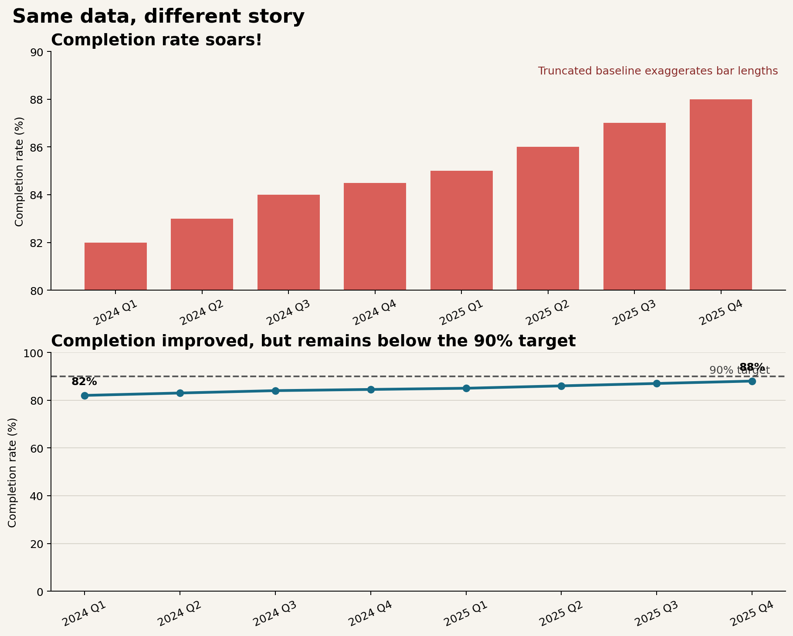

# Data Storytelling and Visual Critique {#sec-storytelling-critique}

:::cdi-message
- **ID:** DVP-015
- **Type:** Design and Communication
- **Audience:** Intermediate
- **Theme:** Turning analysis into defensible visual narratives
:::

Charts do not simply display data. They select evidence, direct attention, and imply a conclusion. A defensible visual story makes those choices visible: readers should be able to distinguish what the data show, what the analyst infers, and what remains uncertain.

This chapter uses a quarterly service-completion example to connect storytelling, critique, and ethical redesign. The aim is not to make every chart dramatic. It is to make the intended message easy to see without making the evidence appear stronger than it is.

## Learning Objectives

After completing this chapter, you will be able to:

- define a visual story in terms of audience, purpose, evidence, and action;
- choose appropriately between exploratory and explanatory graphics;
- organize a sequence of charts so that each view advances one argument;
- write titles, captions, and annotations that clarify rather than overclaim;
- separate direct observations from interpretations and recommendations;
- critique charts systematically using a repeatable framework; and
- redesign a misleading chart while preserving the underlying data.

## Audience, Purpose, and Message

Begin with a communication brief before opening a plotting library. Four questions constrain the design:

1. **Who is the audience?** What do they already know, and what terminology is safe to use?
2. **What decision is supported?** A chart for diagnosis differs from a chart for resource allocation.
3. **What is the one-sentence message?** If it requires several unrelated claims, the story is not yet focused.
4. **What evidence would change the conclusion?** This question exposes uncertainty and guards against advocacy disguised as analysis.

For the case study, imagine an operations review. The audience is a service-delivery team, the decision is whether to investigate recent performance, and the provisional message is:

> Completion rates improved gradually, but the latest quarter remains below the 90% target.

The statement identifies a direction, a current state, and a benchmark. It avoids causal language because the quarterly aggregates do not explain *why* performance changed.

## Exploratory and Explanatory Graphics

Exploratory graphics help the analyst ask questions. They often include many variables, alternative encodings, distributions, and diagnostic detail. Explanatory graphics help a defined audience understand a selected finding. They remove irrelevant structure and emphasize the evidence required for a particular decision.

| Dimension | Exploratory graphic | Explanatory graphic |
|---|---|---|
| Primary user | Analyst or collaborator | Defined decision-maker |
| Main purpose | Discover patterns and anomalies | Communicate a supported conclusion |
| Typical density | High; several comparisons | Selective; one dominant message |
| Annotation | Notes for investigation | Context, benchmark, and takeaway |
| Acceptable ambiguity | Useful when it prompts questions | Reduced where it obstructs the decision |

The distinction concerns intent, not quality. A dense diagnostic plot can be excellent exploratory work and still be unsuitable for an executive briefing. Conversely, a polished explanatory chart is not a substitute for checking distributions, denominators, missingness, and alternative explanations.

## Narrative Sequence and Visual Flow

A visual story commonly moves through three stages:

- **Context:** establish the measure, time span, population, and benchmark;
- **Evidence:** reveal the comparison or change that matters; and
- **Implication:** explain the decision relevance and the limits of the claim.

For a multi-chart sequence, give each chart a distinct job. A useful progression might show the long-term trend, then the subgroup responsible for the latest change, then the operational decision. Repeating the same pattern with different decoration does not advance the story.

Within a single figure, visual flow is created through hierarchy. Readers usually encounter the title, dominant marks, direct labels or annotations, axes, and source note in roughly that order. Use contrast sparingly so that the most salient object is also the most important one. Muted context plus one purposeful highlight is often stronger than a palette in which every category demands equal attention.

## Titles, Captions, and Takeaway Statements

A topic title names a subject: **Quarterly completion rate**. A takeaway title states the supported finding: **Completion improved, but remains below the 90% target**. The latter reduces the work required to interpret the chart, provided that the marks genuinely support it.

Captions should supply context that does not fit naturally into the plot:

- the population and time window;
- the definition and denominator of the metric;
- material exclusions or transformations;
- the source and retrieval date; and
- uncertainty or comparability limitations.

Avoid titles such as “Performance soars” when the plotted change is modest, the axis magnifies it, or sampling variation is unknown. A good takeaway statement is specific enough to test against the chart and restrained enough to survive scrutiny.

## Separating Evidence from Inference

Evidence, inference, and recommendation occupy different logical layers:

| Layer | Case-study example | Appropriate language |
|---|---|---|
| Evidence | Completion rose from 82% to 88% across eight quarters. | “increased,” “was,” “remained below” |
| Inference | Process changes may have contributed to the increase. | “may,” “is consistent with,” “suggests” |
| Recommendation | Investigate the remaining gap before changing staffing. | “investigate,” “test,” “consider” |

The chart directly supports the evidence statement. It does not identify the mechanism. If a program launched during the period, temporal alignment alone does not establish causation. A transparent story can still be useful: state the observed pattern, label the hypothesis, and identify the additional evidence needed to test it.

## A Structured Critique Framework

Critique should evaluate how design choices affect interpretation, not merely whether the reviewer likes the style. Use the **CLAIM** framework:

- **C — Claim:** What conclusion does the chart invite? Is it explicit and supportable?
- **L — Link:** Do the title, annotations, and visual emphasis point to the same evidence?
- **A — Accuracy:** Are scales, denominators, intervals, categories, and transformations represented honestly?
- **I — Inclusion:** Is essential context present, including benchmarks, uncertainty, sources, and exclusions?
- **M — Meaning:** Can the intended audience understand the chart and act without confusing observation with explanation?

A critique becomes actionable when it links a problem to its consequence and a revision. For example: “The 80% baseline magnifies a six-point change, which may be read as a fourfold increase; use a zero baseline for bars or encode the values as positions on a line chart.”

## Misleading Charts and Ethical Redesign

Figure @fig-storytelling-critique compares two displays of the same quarterly values. The upper panel uses bars with a truncated vertical axis and an emphatic headline. Because bar length is decoded relative to a baseline, omitting zero exaggerates the apparent growth. The lower panel uses a line chart, labels the endpoints, adds the decision-relevant 90% target, and uses language proportionate to the evidence.

{#fig-storytelling-critique fig-alt="Two-panel chart. The top panel uses red bars and a y-axis from 80 to 90 percent, visually exaggerating an increase from 82 to 88 percent. The bottom panel uses a blue line on a broader scale, directly labels 82 and 88 percent, and shows a dashed 90 percent target."}

The redesign does not hide improvement. It places the six-percentage-point change in an honest frame and introduces the benchmark required for action. A narrow axis is not automatically unethical—position encodings in analytical line charts sometimes require detail—but the scale, mark type, and rhetorical framing must not combine to create a false impression.

Common warning signs include:

- truncated axes used with bars or areas;
- unequal intervals presented as equal spacing;
- dual axes that imply a relationship through arbitrary scaling;
- totals compared without population or exposure denominators;
- cherry-picked start and end dates;
- three-dimensional effects that distort length or area; and
- color scales whose midpoint or ordering contradicts the meaning of the data.

## Building a Visual Story

The companion script provides a small, reproducible workflow:

```bash
python scripts/python/15-build-visual-story.py
```

It writes the source data to `results/15-quarterly-completion.csv`, records an evidence–inference–recommendation worksheet in `results/15-story-claims.csv`, and generates Figure @fig-storytelling-critique. Keeping the values, claims, and figure generation together makes the communication choices reviewable.

A practical production sequence is:

1. validate the measure and denominator;
2. write a provisional evidence statement;
3. choose the comparison and benchmark needed to assess it;
4. create the simplest accurate encoding;
5. add hierarchy, annotation, and accessible alternatives;
6. apply the CLAIM critique from the audience's perspective; and
7. revise the title and caption after inspecting the final chart.

Accessibility is part of the story, not a final cosmetic check. Do not depend on color alone; use direct labels, line style, position, or shape as redundant cues. Maintain readable text, sufficient contrast, logical reading order, and meaningful alternative text that conveys the main pattern rather than listing every decorative feature.

## Chapter Practice

### Exercise 1: Identify the rhetorical choices

Apply CLAIM to the upper panel of Figure @fig-storytelling-critique. For every criterion, record the design choice, its likely interpretive effect, and a specific revision.

### Exercise 2: Rewrite the message

Draft three titles for the case study:

1. a neutral topic title;
2. an evidence-led takeaway title; and
3. an intentionally overstated title.

Explain which words make the third title indefensible.

### Exercise 3: Separate claim layers

Choose a chart from your own project and write one evidence statement, one inference, and one recommendation. Under each statement, list the data or study design required to support it. Revise any causal verb that the evidence cannot justify.

### Exercise 4: Produce an ethical redesign

Find a chart with a distorted scale, missing denominator, confusing category order, or inaccessible color encoding. Recreate it with the same underlying values, then change only the design and context. Write a short critique explaining how the redesign changes interpretation.

## Key Takeaways

- A visual story aligns audience, decision, message, and evidence.
- Exploratory graphics support discovery; explanatory graphics support a defined communication task.
- Titles and annotations should direct attention without claiming more than the chart can establish.
- Evidence, inference, and recommendation should be written as distinct layers.
- CLAIM turns subjective reactions into a systematic, actionable critique.
- Ethical redesign preserves the data while correcting framing that distorts magnitude or meaning.
- Reproducible scripts and accessible descriptions make visual communication easier to audit, reuse, and trust.

