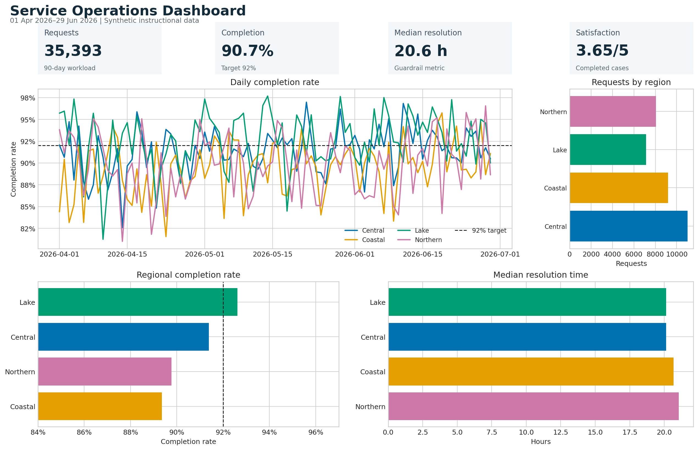

# Dashboards and Linked Views {#sec-dashboards}

:::cdi-message
- **ID:** DVP-016
- **Type:** Interactive Communication
- **Audience:** Intermediate
- **Theme:** Focused dashboards for monitoring and exploration
:::

Dashboards compress many observations into a decision surface. Their value is
not the number of charts they contain, but the speed and confidence with which
a reader can answer a small set of recurring questions. This chapter develops a
reproducible service-operations dashboard and uses it to connect metric design,
layout, interaction, accessibility, performance, and testing.

## Learning Objectives

After completing this chapter, you will be able to:

1. decide when a dashboard is more appropriate than a report or exploratory notebook;
2. translate decision needs into metrics, comparisons, and diagnostic views;
3. organize a dashboard using a clear information hierarchy;
4. build a Quarto dashboard with value boxes, plots, and tabbed content;
5. coordinate linked views through shared selections and filters;
6. design responsive, accessible interactions; and
7. test dashboard data, behavior, performance, and presentation.

## When a Dashboard Is Appropriate

A dashboard is appropriate when users revisit a changing system and make a
repeatable class of decisions. Examples include detecting a service-level
breach, locating a regional bottleneck, or deciding whether a recent change
requires investigation. A dashboard is a weak fit when the argument is mainly
linear, the analysis is a one-time investigation, or the evidence needs lengthy
qualification. In those cases, a report or data story is usually clearer.

Before creating any chart, write a dashboard contract:

| Contract element | Service-operations example |
|---|---|
| User | Operations lead |
| Decision | Where should the team investigate first? |
| Frequency | Daily review, with weekly trend checks |
| Freshness | Data updated through the previous day |
| Primary outcome | Completion rate |
| Guardrail | Median resolution time |
| Diagnostic dimensions | Region, channel, and date |
| Action threshold | Completion below 92% |

The contract prevents an attractive collection of charts from becoming a
substitute for a useful decision tool.

## Metrics, Context, and Decision Needs

A metric without context is only a number. A useful headline metric normally
needs at least one comparison: a target, a previous period, a benchmark, or an
uncertainty interval. The chapter workflow calculates four headline measures:

- **Requests:** workload during the selected period;
- **Completion rate:** completed requests divided by requests;
- **Median resolution time:** the typical time to completion;
- **Satisfaction:** the mean post-resolution score.

The completion rate is paired with a 92% service target. Resolution time acts
as a guardrail: a higher completion rate is not necessarily an improvement if
cases are being closed carelessly or delayed excessively.

Keep denominators visible in the data model. Rates should be derived from
counts rather than averaged across already aggregated percentages. The
companion script follows this rule when it creates daily and regional metrics.

## Layout and Information Hierarchy

Readers usually scan a dashboard from summary to explanation. A practical
three-level hierarchy is:

1. **Status:** What is happening now?
2. **Trend:** Is the situation improving, stable, or worsening?
3. **Diagnosis:** Where and for whom is the pattern concentrated?

Place a compact filter bar before the headline indicators, put the main trend
in the largest visual region, and move supporting breakdowns into smaller cards
or tabs. Use whitespace and alignment to express hierarchy instead of relying
on decoration. Every card should answer a distinct question.

{#fig-dashboard-preview fig-alt="A dashboard preview with four metric cards, a completion-rate trend by region, request volume bars, and a regional performance comparison."}

The preview in @fig-dashboard-preview retains meaning when printed or viewed
without interaction. This is important because interactive dashboards are
often shared as screenshots, PDFs, or presentation images.

## Quarto Dashboards

Quarto supports dashboard pages with rows, columns, cards, tabsets, value boxes,
and sidebars. A minimal executable dashboard begins with dashboard format in
the YAML header:

```yaml
---
title: "Service Operations"
format:
  dashboard:
    orientation: rows
execute:
  echo: false
---
```

The body can then assign content to cards and value boxes:

````markdown
```{python}
#| content: valuebox
#| title: "Completion rate"
dict(value=f"{completion_rate:.1%}", icon="check-circle")
```

## Row

```{python}
#| title: "Daily completion rate"
fig.show()
```
````

Keep data preparation outside the presentation file when it is substantial.
This separation makes the calculations testable and lets more than one output
reuse the same processed data.

## Interactive Components and Linked Views

Linked views coordinate multiple charts through a shared selection. Selecting
a region in one view can highlight the same region elsewhere; selecting a time
interval can update summaries and distributions. The interaction should answer
a question that would otherwise require mental matching.

The generated HTML artifact links three Plotly views using a region selector:

- a daily completion-rate trend;
- daily request volume; and
- a regional comparison of completion rate and resolution time.

Run the workflow and open `results/interactive/16-linked-dashboard.html` to try
the linked view. The selector includes an **All regions** state so a user can
always recover the overview.

A linked dashboard has three conceptual layers:

| Layer | Responsibility |
|---|---|
| Data | Stable keys, valid measures, and aggregation rules |
| Selection | The active region, category, date range, or point set |
| Encoding | How selected and unselected marks change |

Use stable identifiers rather than display labels as join keys. A renamed label
should not silently break the connection between views.

## Filters, Inputs, and Tooltips

Filters reduce the data considered by every relevant component. Highlights
preserve the overall context while emphasizing a subset. Prefer highlighting
when comparison with the whole is important; prefer filtering when unrelated
marks would create clutter.

Good controls have a clear label, a useful default, a visible current state,
and a simple reset path. Avoid cascading controls whose valid options change in
surprising ways. If a filter changes a denominator, make that fact explicit.

Tooltips are best for precise secondary detail—not for the only copy of an
essential value. Include the mark identity, formatted value, time period, unit,
and denominator where relevant. Keep tooltip content in a predictable order.

## Responsive and Accessible Design

Accessibility applies to both perception and operation:

- provide a meaningful title and short dashboard description;
- use a colorblind-safe palette and pair color with position, line style, text,
  or symbols;
- maintain adequate foreground/background contrast;
- label controls and support keyboard navigation;
- preserve visible focus indicators;
- do not require hover to access essential information;
- use concise alternative text for static exports; and
- provide a table or downloadable data view when exact values matter.

Responsive design is prioritization, not merely shrinking. On narrow screens,
stack cards vertically, keep the primary metric and trend first, simplify
legends, and allow secondary detail to move into tabs. Test common widths and
at least one real mobile device or browser emulator.

## Dashboard Performance and Testing

Performance influences interpretation. Slow feedback makes users repeat clicks
or assume a filter failed. Aggregate data before rendering, request only needed
columns, cache stable computations, and avoid sending raw high-frequency data
to the browser when a summarized view answers the question.

Test the dashboard at four levels:

| Level | Example checks |
|---|---|
| Data | Unique keys, valid dates, nonnegative counts, bounded rates |
| Calculation | Rates use the correct denominator; empty groups are handled |
| Interaction | Controls update every intended view and reset correctly |
| Presentation | No clipping, readable labels, keyboard access, useful fallback |

The workflow writes `results/16-dashboard-validation.txt`. A successful run
checks schema, row uniqueness, ranges, missingness, and expected regions before
it creates the visual artifacts.

## Reproduce the Chapter Workflow

From the repository root, run:

```bash
bash scripts/bash/16-run-dashboard.sh
```

The runner creates or refreshes:

- `data/processed/16-service-operations.csv`;
- `results/figures/16-dashboard-preview.png`;
- `results/interactive/16-linked-dashboard.html`;
- `results/16-dashboard-summary.csv`;
- `results/16-dashboard-validation.txt`; and
- `results/16-dashboard-manifest.json`.

The Python script accepts `--seed` and `--days` arguments, so the workflow can
be varied while remaining reproducible.

## Chapter Practice

1. **Change the decision.** Rewrite the dashboard contract for a regional
   manager rather than an operations lead. Identify one metric to add and one
   to remove.
2. **Add a threshold.** Introduce a target for median resolution time. Make the
   target visible without relying on red and green alone.
3. **Create a second link.** Add a date-range control and make it update the
   headline metrics as well as the charts.
4. **Test an edge case.** Remove one region from the final seven days and decide
   whether the dashboard should show zero, missing, or no mark. Document the
   choice.
5. **Audit accessibility.** Navigate the interactive artifact without a mouse,
   inspect the focus order, and write three concrete improvements.

## Key Takeaways

- Start with a recurring decision and a named user, not a chart inventory.
- Pair headline metrics with targets, prior periods, or guardrails.
- Organize the page from status to trend to diagnosis.
- Use linked views only when coordinated interaction reduces comparison effort.
- Treat filters, defaults, empty states, and reset behavior as part of the analysis.
- Preserve a useful static fallback and an exact-value data route.
- Validate data and calculations before testing interaction and presentation.
- Optimize response time because dashboard performance affects user confidence.

