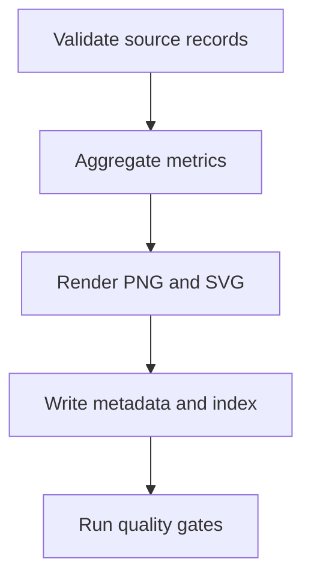
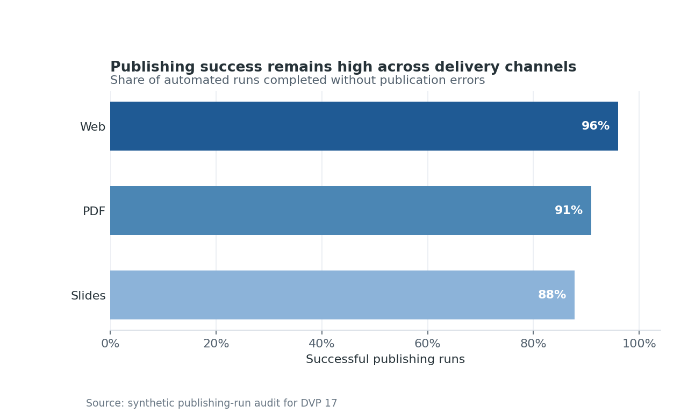

# Publishing, Automation, and Figure Governance {#sec-publishing-governance}

:::cdi-message
- **ID:** DVP-017
- **Type:** Reproducible Delivery
- **Audience:** Intermediate
- **Theme:** Reliable visual assets across reports, notebooks, and projects
:::

Making a chart is not the end of a visualization workflow. The chart must also be exported at an appropriate size, named predictably, connected to its source data and code, checked for defects, and published without manual repair. This chapter treats figures as governed project assets rather than disposable screenshots.

The practical example creates a small figure release containing a PNG, an SVG, the summarized data behind the chart, a metadata sidecar, a figure index, and a validation report. All outputs can be regenerated with one command.

## Learning Objectives

After completing this chapter, you will be able to:

- select output formats for documents, web pages, presentations, and downstream editing;
- control dimensions, resolution, transparency, and typography at export time;
- design deterministic names and repository-relative output paths;
- record provenance, accessibility text, and technical properties in metadata;
- generate and validate a collection of figures in a batch;
- distinguish structural quality checks from visual regression tests; and
- publish governed figures through a Quarto project and an automated pipeline.

## Static, Interactive, and Document Outputs

An output format is a delivery decision. Choose it from the needs of the final channel, not from the plotting library's default.

| Output | Best use | Strength | Important limitation |
|---|---|---|---|
| PNG | web pages, slides, raster-heavy plots | predictable rendering | becomes soft when enlarged |
| SVG | web, diagrams, line and text-heavy charts | scalable and editable | very dense marks can create large files |
| PDF | print and archival documents | scalable and page-oriented | browser embedding varies |
| HTML | interactive exploration | tooltips, filtering, zoom | requires JavaScript and an accessible fallback |

Interactive figures should have a static fallback when the publication may be printed, converted to PDF, viewed offline, or used with assistive technology. The fallback does not need to reproduce every interaction; it must preserve the main analytical claim. A nearby data table or download can expose values that are difficult to retrieve from marks alone.

## Resolution, Dimensions, and File Formats

Pixels are determined by physical size and dots per inch:

$$
\text{pixels} = \text{inches} \times \text{DPI}.
$$

A $7 \times 4$ inch figure exported at 160 DPI is $1120 \times 640$ pixels. Set the physical dimensions first to establish composition and text scale, then select enough resolution for the target. Increasing DPI after a cramped layout does not repair overlapping labels.

The example script centralizes export properties rather than scattering them across plotting calls:

```python
EXPORT = {
    "width_inches": 8.0,
    "height_inches": 4.8,
    "dpi": 160,
    "background": "white",
}
```

Use `bbox_inches="tight"` carefully. It is useful for preventing clipped labels, but it can produce slightly different canvas dimensions when labels change. Fixed canvases are preferable when visual regression comparisons require exact pixel geometry.

## Reproducible Naming and Output Paths

A useful figure name communicates identity without encoding every implementation detail. This chapter uses:

```text
results/figures/17-publishing-success-rate.png
results/figures/17-publishing-success-rate.svg
```

The name has a chapter prefix and a stable semantic slug. It does not include `final`, `new`, or a date that changes on every run. Version history belongs in Git or in release metadata.

Paths are resolved from the repository root, not from the caller's current directory. Consequently, the same command works from a terminal, a task runner, or continuous integration:

```bash
bash scripts/bash/17-run-publishing-governance.sh
```

Separate source data, generated figures, and machine-readable results. Generated files should never be silently written beside source code.

## Figure Metadata and Indexes

A figure cannot explain its own provenance. A metadata sidecar can. The generated JSON records:

- a stable figure identifier and title;
- repository-relative paths to code, data, and outputs;
- dimensions, DPI, format, file size, and SHA-256 digest;
- generation time and relevant software versions;
- accessible alternative text; and
- the quality-check result.

The CSV index provides one row per output format. This is intentionally easy to inspect, filter, and combine across chapters. A project-wide index can become the source for a gallery, release manifest, or documentation audit.

Hashes are evidence that a particular artifact was produced; they do not prove that the chart is analytically correct. Regeneration may also change hashes when fonts, renderers, or compression libraries change. Record the environment alongside the digest and interpret differences deliberately.

## Batch Generation with Scripts

The Python program in `scripts/python/17_generate_governed_figures.py` follows a small build pipeline:



The wrapper establishes a writable Matplotlib cache, invokes the generator, and prints the governed outputs. The generator writes files atomically where practical, uses a fixed category order, and removes time from the analytical data so that repeated runs produce the same marks.

Run it with:

```bash
bash scripts/bash/17-run-publishing-governance.sh
```

To verify without regenerating outputs:

```bash
python scripts/python/17_validate_figure_release.py
```

## Themes, Templates, and Brand Consistency

A theme should encode design decisions that ought to recur: font families, hierarchy, grid treatment, color roles, line weights, and export background. It should not prevent a chart from adapting to its analytical purpose.

The example keeps theme values in one Python mapping and uses a restrained blue palette with direct percentage labels. For a larger repository, move shared settings into a module such as `scripts/python/visual_theme.py`. Pin fonts available in the publishing environment; font substitution can change wrapping and geometry even when the code and data are unchanged.

Consistency is not sameness. A categorical comparison and a geospatial density map need different encodings, but their titles, captions, typography, accessible descriptions, and output contracts can still follow the same system.

## Visual Regression and Quality Checks

Quality checks operate at several levels:

| Level | Example check | Detects |
|---|---|---|
| Data | rates lie between 0 and 1 | invalid analytical inputs |
| Structural | expected files exist and are non-empty | broken generation paths |
| Technical | PNG dimensions meet minimums; SVG has a root element | unsuitable or corrupt exports |
| Governance | metadata includes alt text, source, digest, and status | incomplete provenance |
| Visual regression | rendered output differs from an approved baseline | unexpected layout or style change |

Pixel-perfect comparison is often too brittle across operating systems. Prefer perceptual thresholds, normalized environments, or selected structural assertions. When a baseline changes, review the image and the analytical reason before accepting it. Never update a baseline merely to make a pipeline pass.

The included validator checks the data summary, manifest paths, file digests, minimum raster dimensions, SVG structure, alternative text, and the declared status. Its result is written to `results/17-figure-validation.json`, making the check available to both people and automation.

## Publishing with Quarto

Quarto should consume repository-relative assets that already satisfy the figure contract. The generated chart can be embedded as follows:

```markdown
{#fig-publishing-success-rate fig-alt="Horizontal bars show publishing success rates of 96% for Web, 91% for PDF, and 88% for Slides."}
```

{#fig-publishing-success-rate width=90% fig-alt="Horizontal bars show publishing success rates of 96 percent for Web, 91 percent for PDF, and 88 percent for Slides. Web has the highest rate."}

Figure @fig-publishing-success-rate is the governed raster output. The SVG version is available for scalable web use and downstream editing.

A publishing pipeline should run generation and validation before `quarto render`. A minimal CI sequence is:

```yaml
- name: Generate governed figures
  run: bash scripts/bash/17-run-publishing-governance.sh
- name: Render book
  run: quarto render
```

Decide whether generated figures are committed or built during publication. Committing them improves reviewability and allows rendering without the full analytical environment. Building them reduces repository churn. Either policy can work if it is explicit, enforced, and paired with traceable inputs.

## Chapter Practice

1. Run the batch wrapper and inspect the PNG, SVG, CSV, and JSON outputs.
2. Change one success count in the source records, regenerate, and identify which digests change.
3. Add a new delivery channel and confirm that ordering, labels, alt text, and validation still make sense.
4. Introduce an empty alt-text value and verify that the validator fails.
5. Extend the index with an `owner` and `review_status` field suitable for your project.
6. Draft a repository policy stating when baselines may be updated and who reviews them.

## Key Takeaways

- Treat every published figure as a versioned asset with code, data, metadata, and a delivery target.
- Choose dimensions and formats from the publication context; DPI alone does not create a good layout.
- Stable semantic names and repository-relative paths make automation portable.
- Indexes and sidecars connect visual outputs to provenance, accessibility, and validation evidence.
- Combine data, structural, technical, governance, and visual checks; no single check establishes correctness.
- Generate and validate before publication so that a Quarto render consumes known-good assets.

