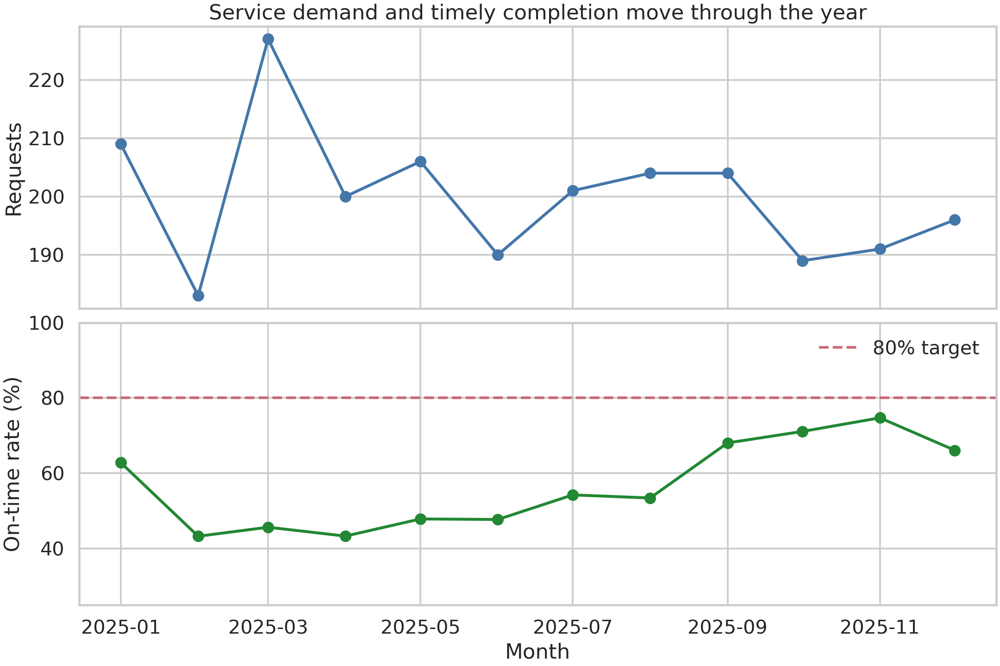
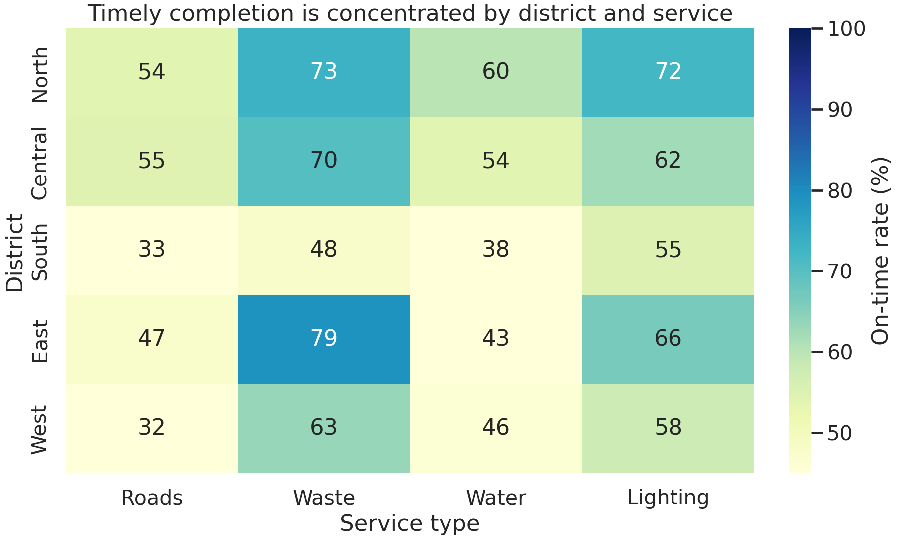
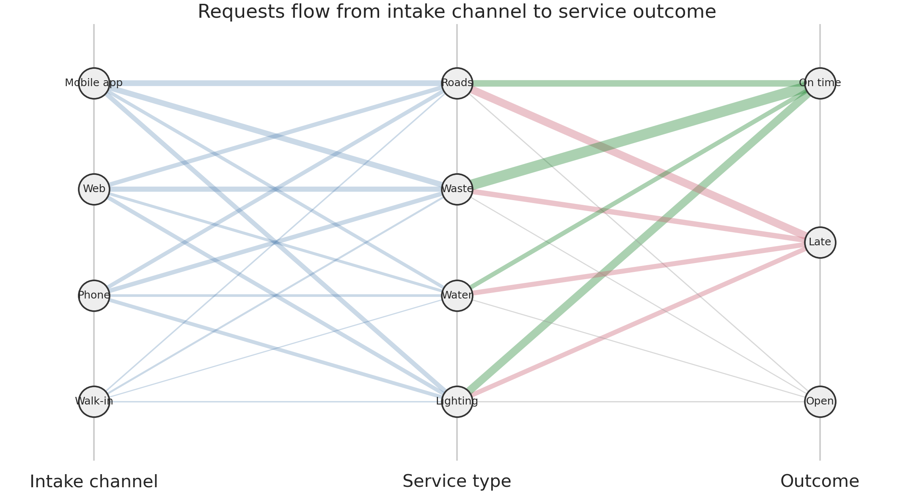

# End-to-End Visualization Case Study {#sec-end-to-end-case-study}

:::cdi-message
- **ID:** DVP-018
- **Type:** Case Study
- **Audience:** Intermediate
- **Theme:** From raw data to a defensible multi-format visual product
:::

## Learning Objectives

By the end of this chapter, you will be able to:

1. translate a broad stakeholder question into a sequence of analytical and visual decisions;
2. audit, clean, and document a dataset before encoding it in charts;
3. combine exploratory, explanatory, interactive, and specialized views without duplicating their roles;
4. apply accessibility, validation, and figure-governance checks; and
5. publish a reproducible visual product with traceable source data and exports.

## Case Study Question and Audience

The City Operations Office has received service requests through four channels: a mobile app, a web form, telephone calls, and walk-in desks. Managers want to know:

> Where and when does service performance fall short, which request types drive the gap, and what should operations teams investigate first?

The primary audience is a monthly performance meeting attended by service managers, district leads, and a public-information officer. They need a concise story, but analysts also need enough detail to challenge the result. The final product therefore has two layers:

- an **explanatory briefing** for the meeting; and
- an **interactive explorer** for follow-up questions.

The synthetic dataset is generated by `scripts/python/18-end-to-end-visualization-case-study.py`. Each row represents one request and contains its opening date, district, service type, intake channel, priority, target duration, completion duration, completion status, and satisfaction score. A fixed random seed makes the example reproducible.

## Data Audit and Preparation

The analysis begins with the row-level grain and explicit quality rules. A request is *on time* when it is completed and its duration is no greater than its service-level target. Open requests are retained for workload counts but excluded from completion-time and satisfaction calculations.

The script performs five checks before plotting:

1. request identifiers are unique;
2. dates and durations are in valid ranges;
3. categorical values belong to controlled vocabularies;
4. open records do not contain completion durations; and
5. the prepared dataset has the expected number of rows.

It writes the prepared data to `data/processed/18-service-requests.csv` and records audit metrics in `results/18-data-audit.csv`. This separation prevents charts from silently applying different cleaning rules.

| Field | Analytical role | Quality rule |
|---|---|---|
| `opened_date` | weekly and monthly trend | valid date in the study period |
| `district` | operational comparison | one of North, Central, South, East, West |
| `service_type` | demand composition | controlled service taxonomy |
| `resolution_hours` | speed of service | non-negative; missing only if open |
| `target_hours` | service-level benchmark | positive value |
| `satisfaction` | resident experience | integer 1–5; missing only if open |

## Visual Analysis Plan

Each visual has a distinct job:

| Question | View | Why it fits |
|---|---|---|
| Is performance changing? | monthly line chart | emphasizes direction and timing |
| Which district and service combinations lag? | annotated heatmap | supports compact two-dimensional comparison |
| How do typical and high-end delays compare? | interactive summary explorer | reveals median and 90th-percentile differences on demand |
| How does work move from channel to outcome? | alluvial-style flow | exposes composition across stages |

The sequence moves from overview to diagnosis. Counts are always shown alongside rates in the supporting tables so a small denominator cannot masquerade as a major operational signal.

## Exploratory Static Views

The monthly view combines request volume with the on-time completion rate. The two measures use aligned panels rather than a dual axis, preserving independent scales and making the operational trade-off easier to inspect.

{#fig-dvp18-monthly width=95%}

The district-by-service heatmap then localizes the broad pattern. Every cell is annotated, and the common scale permits valid comparison across the matrix.

{#fig-dvp18-heatmap width=90%}

Figure @fig-dvp18-monthly answers *when* performance moved, while Figure @fig-dvp18-heatmap answers *where* the shortfall is concentrated. Neither chart alone supports both conclusions.

## Interactive Exploration

The interactive summary in `results/interactive/18-resolution-time-explorer.html` lets analysts select a district and compare request counts, median duration, 90th-percentile duration, and satisfaction. It is an analytical companion—not the primary evidence in the briefing—because a meeting audience should not have to discover the main conclusion by interacting.

The HTML is self-contained and can be opened without a running Python process. Its accessible fallback is `results/18-service-summary.csv`, which contains the same district and service groupings in tabular form.

## Specialized Visual Component

The flow view connects intake channel, service type, and final outcome. Link widths encode request counts; colors distinguish on-time, late, and still-open outcomes.

{#fig-dvp18-flow width=95%}

This view is useful for pathway composition, not precise lookup. Exact counts are therefore exported to `results/18-flow-summary.csv`.

## Explanatory Story and Dashboard

The briefing follows a three-part claim–evidence–action structure:

1. **Claim:** the system-wide rate varies as workload changes. **Evidence:** the monthly overview.
2. **Claim:** the shortfall is concentrated rather than uniform. **Evidence:** the district-service heatmap.
3. **Action:** inspect the channel and service pathways feeding late work. **Evidence:** the flow view and interactive distribution.

A dashboard implementation should retain that hierarchy: headline indicators first, the trend second, the diagnostic matrix third, and filters last. Filters should update a visible subtitle and denominator so screenshots remain interpretable outside the dashboard.

## Accessibility and Quality Review

The visual system uses a colorblind-safe palette, but color is never the only carrier of meaning. Rates are annotated, targets use a distinct dashed line, outcomes retain text labels, and every figure has a descriptive caption. Small text is avoided in exported images, and the interactive chart has a CSV fallback.

Automated checks verify that:

- rates stay between 0 and 1;
- grouped request counts reconcile to the prepared dataset;
- every figure listed in the manifest exists and is non-empty; and
- figure dimensions are adequate for publication.

Human review remains necessary. The reviewer should check reading order, clipped labels, contrast at the actual display size, and whether the captions communicate the intended conclusion without overstating causality.

## Export, Figure Index, and Reproduction

Run the complete workflow from the repository root:

```bash
bash scripts/bash/18-run-end-to-end-visualization-case-study.sh
```

The Python script accepts `--output-root` for testing or alternate build locations. It creates all missing output directories and overwrites only its own numbered artifacts. `results/18-figure-manifest.csv` records each output's identifier, path, format, dimensions, and purpose.

```text
data/processed/18-service-requests.csv
results/18-data-audit.csv
results/18-monthly-performance.csv
results/18-service-summary.csv
results/18-flow-summary.csv
results/18-figure-manifest.csv
results/figures/18-monthly-service-performance.png
results/figures/18-district-service-heatmap.png
results/figures/18-request-flow.png
results/interactive/18-resolution-time-explorer.html
```

## Final Interpretation and Limitations

The generated example typically shows meaningful variation by month, district, and service type, with high-priority requests completed faster but not necessarily producing uniformly high satisfaction. The defensible conclusion is that performance gaps are concentrated and deserve operational investigation. The charts do **not** establish that channel, district, or workload caused a delay.

Important limitations include synthetic data, no staffing or weather covariates, no resident-level demographic analysis, and no uncertainty interval around the displayed rates. A production analysis should add denominator thresholds, confidence intervals, privacy review, and documented decisions about reopened or duplicate requests.

## Case Study Deliverables

The package contains:

- this completed Quarto chapter;
- a deterministic Python workflow and shell runner;
- one prepared row-level dataset and four analytical/quality tables;
- three publication-ready PNG figures;
- one self-contained interactive HTML chart; and
- a machine-readable figure manifest.

## Key Takeaways

1. Begin with the decision and audience, not a preferred chart type.
2. Give each view one analytical job and preserve a tabular route to exact values.
3. Separate preparation from presentation so definitions remain consistent.
4. Treat accessibility, manifests, and validation as part of analysis—not post-production decoration.
5. End-to-end visualization is complete only when another person can reproduce, inspect, and responsibly interpret the product.
